# 🧭 Gestão de Projetos PM IA BSC DashBoard (Build and Analyze Your Own AI Portfolio Projects)

<p align="center">
  
</p>

🌐 [Português](README.md) · [English](README.en.md) · [Español](README.es.md) · [Français](README.fr.md) · [Deutsch](README.de.md) · [中文](README.zh.md) · [한국어](README.ko.md) · [हिन्दी](README.hi.md) · [עברית](README.he.md) · [Svenska](README.sv.md) · [Русский](README.ru.md) · **Suomi**


### 💸 Maksat tekoälystä joka kuukausi. Mutta maksaako tekoäly **sinulle** takaisin?

Joka kerta kun **ChatGPT, Claude, Copilot, Gemini, Perplexity, DeepSeek, Kimi, Qwen…** veloittaa korttia, jää
**miljoonien** kysymys vastaamatta: **missä on tuotto?** Kuinka monta henkilötyötuntia todella säästyi? Kuinka
paljon rahastasi **haihtui** hallusinaatioon, uudelleentekemiseen ja odottamiseen? Mikä tekoälyprojekti **ansaitsee
skaalata tänään** — ja mikä **vuotaa kassaa**, kun taputat "innovaatiolle"?

Sinulla ei ole tekoälykustannusta. Sinulla on **hiljainen vuoto** — silmät sidottuina. Sillä *"mitä ei mitata, sitä
ei voi johtaa eikä parantaa"* — ja markkina mittaa sen puolestasi ja lähettää laskun.

**Tämä kehys sytyttää valon.** Se muuttaa tekoälytilaustesi **näkymättömät menot** **mitattavaksi, vertailukelpoiseksi
ja auditoitavaksi tuotoksi** — **Balanced Scorecardin** (Kaplan & Norton), **Wall Streetin tason
investointianalyysin** ja **monikriteeripäätöksen** tarkkuudella. Se on ero *toivomisen* ja *tietämisen* välillä.
Tekoälystä maksamisen ja sillä **ansaitsemisen** välillä.

> *"Mitä ei mitata, sitä ei voi johtaa eikä parantaa."* — Kaplan & Norton

> *"Joka mittaa tarkkuudella, rakentaa erinomaisuudella."* — Pierre Vernier

> *Kun rukoilet ja opiskelet, älä anna [sanojeni] jättää sinua. Jokaisen huuliltasi lähtevän sanan ja ilmauksen kanssa pidä mielessä Ykseyden toteuttaminen.* — Aryeh Kaplan

> *Puhdas metafysiikka, joka olemukseltaan sijaitsee kaikkien muotojen ja kaikkien satunnaisuuksien yläpuolella ja tuolla puolen, ei ole itäinen eikä läntinen: se on universaali.* — René Guénon

> *Itsensä tunteminen on oman sukujuurensa ja oman voimansa tuntemista.* — Harvey Spencer Lewis

> *Scientia es Lux Lucis* ∞ Sapere Aude S∴A∴☬ ☿

> 🐺 **Lopeta tekoälystä MAKSAMINEN pimeässä.** Kun markkina tilaa tekoälyä uskolla — ja muuttuu **Gartnerin**
> tilastoksi (≥30 % GenAI-projekteista hylätään pilotin jälkeen) — **sinä** mittaat jokaisen tokenin, valitset
> voittajaprojektin ja muutat näkymättömät menot **auditoitavaksi tuotoksi**: NPV · IRR · MIRR · EAA · 70+ KPI ·
> monikriteeripäätös · johtotason dashboard **12 kielellä**. **Tekoäly on jo sinun. Tee siitä nyt KANNATTAVA** —
> ilmaiseksi, omalla koneellasi, **5 minuutissa**: `./run_all.sh --mock && npm run dev` 🔥

> 📖 **Päädokumentaatio:** **[`foundations/README.md`](foundations/README.md)** ·
> ⚙️ **Asennus (tuo omat avaimesi):** [`foundations/pipeline/SETUP.md`](foundations/pipeline/SETUP.md) ·
> 📊 **KPI:t:** [`foundations/KPIs.md`](foundations/KPIs.md) / [`foundations/KPIs_README.md`](foundations/KPIs_README.md)

---

## 📑 Sisällys

- [🌅 Miksi tämä muuttaa pelin](#-miksi-tämä-muuttaa-pelin)
- [📈 Todisteet (Gartner · IDC · PwC · McKinsey · MIT)](#-todisteet-gartner--idc--pwc--mckinsey--mit)
- [💥 Toimimattomuuden hinta](#-toimimattomuuden-hinta-tee-laskelma-jota-kukaan-ei-tee)
- [✨ Ominaisuudet](#-ominaisuudet)
- [📸 Kuvakaappaukset (anonyymi dashboard)](#-kuvakaappaukset-anonyymi-dashboard)
- [🚀 Pikaopas](#-pikaopas-demo-ilman-langfusea)
- [🏗️ Arkkitehtuuri](#️-arkkitehtuuri)
- [📊 KPI-luettelo](#-kpi-luettelo-70)
- [💰 Investointitason talousanalyysi](#-investointitason-talousanalyysi)
- [🏆 Monikriteeripäätös + Dossier](#-monikriteeripäätös-ahp-topsis-2n--kruununjalokivi-dossier)
- [🎲 Monte Carlo — riski, jonka keskiarvo kätkee](#-monte-carlo--riski-jonka-keskiarvo-kätkee)
- [🧮 Viisi päätöksenteon koulukuntaa. Yksi tuomio.](#-viisi-päätöksenteon-koulukuntaa-yksi-tuomio)
- [🔬 Signaali on ylävirrassa — ja siellä asuu vipuvarsi](#-signaali-on-ylävirrassa--ja-siellä-asuu-vipuvarsi)
- [🎓 Perusteet: mikä on Monte Carlo ja mikä on monikriteeripäätös](#-perusteet-mikä-on-monte-carlo-ja-mikä-on-monikriteeripäätös)
- [🌐 12 kieltä](#-12-kieltä)
- [🙋 Vastaväitteet (kysymykset, joita kysyt itseltäsi juuri nyt)](#-vastaväitteet-kysymykset-joita-kysyt-itseltäsi-juuri-nyt)
- [🧩 Mukana tulevat Skillit](#-mukana-tulevat-skillit-build--analyze-your-own)
- [📚 Resurssit & viitteet](#-resurssit--viitteet-awesome)
- [🗺️ Tiekartta](#️-tiekartta)
- [🧰 Vaiheittainen asennus (paikallisesti, tyhjästä)](#-vaiheittainen-asennus-paikallisesti-tyhjästä)
- [🤝 Osallistuminen](#-osallistuminen)
- [📄 Lisenssi & tekijyys](#-lisenssi--tekijyys)

---

## 🌅 Miksi tämä muuttaa pelin

**Tekoälyaikakaudella on kahdenlaisia ihmisiä.** Ensimmäiset tilaavat kaiken, kuluttavat isosti ja **rukoilevat**,
että se toimii — ja paisuttavat julmaa tilastoa projekteista, jotka kuolevat pilottiin. Toiset tekevät sen, mitä
Wall Street tekee jokaiselle vakavalle omaisuuserälle: he **mittaavat, vertailevat, priorisoivat ja kohdentavat
uudelleen** — ja muuttavat jokaisen tilausdollarin **korkoa korolle -tuotoksi**. Ainoa ero heidän välillään **ei ole
lahjakkuus eikä budjetti. Se on instrumentointi.**

Generatiivinen tekoäly loi uuden toistuvien menojen luokan — **tilaukset ja tokenit** — ja sen mukana vuosikymmenen
kalleimman tuhlauksen: **näkymättömän.** Mitä et näe, sitä et korjaa. Mitä et mittaa, sitä et skaalaa. Ja mitä et
todista, sitä hallitus ei hyväksy.

**Tämä projekti siirtää sinut ensimmäisestä heimosta toiseen.** Se instrumentoi jokaisen tekoälyprojektin
**rahoitusomaisuutena** ja mittaa sitä **Balanced Scorecardin**, **investointianalyysin (NPV, IRR, MIRR, EAA, PI,
takaisinmaksuaika)** ja **Lean Six Sigman** alla — ja jopa **valitsee salkkusi parhaan projektin**
monikriteerimallilla (**AHP-TOPSIS 2n**). Läpinäkymätön kuukausilasku muuttuu **auditoitavaksi investointiteesiksi**:
saat numeroin selville, missä skaalata, missä leikata, missä tilaus maksaa itsensä takaisin **viikoissa** — ja missä
se vuotaa ilman katetta.

Olemme uuden alueen **edelläkävijöitä** — **tekoälyn ja korkean arvon taloudellisen älyn välisen rajan**. Kuten tutkimusmatkailijat,
jotka kartoittavat vielä kartoittamatonta maata, tämä kehys on **kompassi** (🧭), joka muuttaa tilausten sumun
**selkeiksi tuottoreiteiksi**: jokainen token maili; jokainen projekti retkikunta kohti voittoa. Missä oli sokea
kustannus, syntyy **mitattava mahdollisuus**; missä oli kuollut taulukko, kukkii **elävä investointiteesi**.

### 🚀 Micro-SaaS-, SaaS-, startup- ja solopreneur-yrittäjille

Tätä kukaan ei kertonut, kun upotit tekoälyn tuotteeseesi: **siirsit juuri tekoälyn markkinointibudjetista
myytyjen tuotteiden kustannuksiin (COGS).** Ja COGS, joka kasvaa käytön mukana, ei ole kulu — se on **kiinnitys
bruttokatteeseesi**. Jokainen uusi käyttäjä maksaa nyt tokeneita. Jokainen hallusinaation aiheuttama uusintayritys
polttaa katteen kahdesti. Ja lasku ilmestyy vasta kuun lopussa, kun mitään ei enää voi perua.

| Olet… | Kipu, jota kukaan ei mittaa | Mitä kehys antaa takaisin |
|---|---|---|
| **Solopreneur** | sinä *olet* tiimi; tuntisi on kallein olemassa oleva omaisuuserä | **tornado** osoittaa muuttujan, joka liikuttaa tulosta — eli **mihin sijoitat seuraavan tuntisi** |
| **Micro-SaaS** | tokenkustannus kasvaa käytön mukana ja syö katteen hiljaa | jakauma, joka on **sovitettu oikeisiin tokeneihisi**, + **CVaR**: huonolla kuukaudella on hinta *ennen* sen saapumista |
| **Skaalautuva SaaS** | jokainen tekoälyominaisuus on projekti, joka taistelee samasta tiekartasta | **viisi menetelmää** valitsee, mikä julkaistaan — ja **robustius** kertoo, kestääkö ykkössija 2 prosenttiyksikön virheen painossa |
| **Rahoitusta hakeva startup** | sijoittaja ei osta *"me käytämme tekoälyä"* | hän ostaa **NPV:n, IRR:n, takaisinmaksuajan ja `P(NPV<0)`:n** — ja **pitch deck tulee valmiina**, LaTeXilla |

**Mikä oikeasti muuttuu.** Bruttokatteesi lakkaa olemasta arvio ja muuttuu **jakaumaksi, jonka häntä on
hinnoiteltu**. Runwaysi lakkaa olemasta yksinkertainen jakolasku ja saa **VaR**:n: *"19:ssä skenaariossa 20:stä
kassani riittää vähintään N kuukautta."* Ja kun board deck tai due diligence koittaa, et avaa taulukkoa, jota
kukaan ei voi toistaa — avaat luvun, jolla on **kiinteä siemen** ja jonka kuka tahansa perustajakumppani,
sijoittaja tai tilintarkastaja ajaa uudelleen ja saa **täsmälleen saman**.

> **Raaka uudelleenasemointi:** solopreneur alkaa päättää kuin talousjohtaja. Ja talousjohtaja alkaa päättää
> solopreneurin nopeudella.

> **Lupaus:** muuttaa se, joka *maksaa tekoälystä*, siksi, joka *ansaitsee tekoälyllä* — ja se, joka *käyttää
> tekoälyä*, siksi, joka **edelläkävijänä hallitsee, mittaa ja moninkertaistaa sitä**. Numeroin, ei uskolla.

---

## 📈 Todisteet (Gartner · IDC · PwC · McKinsey · MIT)

Älä usko minua. **Usko instituutteja, jotka ovat tutkineet tätä vuosikymmeniä** — joiden tuomio on yksimielinen:
**tekoäly luo valtavaa arvoa, mutta antaa sen vain niille, jotka mittaavat ja hallitsevat.** Ne, jotka "käyttävät
tekoälyä hallitsematta sitä", muuttuvat hylkäystilastoksi; ne, jotka instrumentoivat tuoton, **pitävät palkinnon**.

- 🧭 **Gartner** — ennusti, että **≥ 30 % generatiivisen tekoälyn projekteista hylätään konseptitodistuksen jälkeen
  vuoden 2025 loppuun mennessä**, keskeisenä syynä **epäselvä liiketoiminta-arvo** (lisäksi huono data, nousevat
  kustannukset ja heikot kontrollit). *→ ilman mittausta projekti kuolee pilottiin.*
- 🔬 **MIT** (raportti *"The GenAI Divide / State of AI in Business 2025"*, NANDA-aloite) — laajasti raportoitu, että
  **valtaosa yritysten GenAI-piloteista ei tuota mitattavaa vaikutusta tulokseen**; vähemmistö, joka tuottaa arvoa,
  yhdistää tekoälyn **prosessiin ja mittaukseen**. *→ ero on mittaamisessa, ei käyttöönotossa.*
- 💵 **IDC** (tutkimus *"The Business Opportunity of AI"*, Microsoftin tukema) — organisaatiot, jotka **mittaavat ja
  optimoivat**, raportoivat tuoton suuruusluokkaa **useita dollareita jokaista sijoitettua 1 US$** kohti, suurella
  hajonnalla johtajien ja jälkeenjääneiden välillä. *→ ROI on olemassa — ja suosii instrumentoijia.*
- 🌍 **PwC** (*"Sizing the Prize"*) — arvioi, että tekoäly voi lisätä jopa **~15,7 biljoonaa US$** maailmantalouteen
  vuoteen 2030 mennessä; mutta palkinto menee niille, jotka **kaappaavat** arvon, ei vain kuluttaville. *→ kakku on
  jättimäinen; siivu kuuluu mittaaville.*
- 🏆 **McKinsey** (*"The State of AI"*) ja **BCG × MIT Sloan** — vähemmistöryhmä **"AI high performers"** kaappaa
  suhteettoman tuoton; käännekohta tulee, kun tekoäly kytketään **mittareihin, hallintoon ja uudelleensijoittamiseen**
  siellä, missä tuotto on todistettu. *→ voittajat mittaavat, priorisoivat ja kohdentavat uudelleen.*

> **Juuri tämän kuilun tämä kehys ylittää:** se siirtää sinut puolelta, joka *luovuttaa pilotissa*, puolelle, jolla
> on **todellisia, todistettuja tuloksia** — BSC:llä, investointianalyysillä ja monikriteeripäätöksellä.

> ⚠️ **Rehellisyyshuomautus (lue):** yllä olevat luvut heijastavat näiden instituuttien todellisia otsikoita, mutta
> **raportit ja prosentit päivittyvät** — varmista tarkat arvot ja vuosi **alkulähteistä** (Gartner Newsroom;
> IDC/Microsoft *Business Opportunity of AI*; PwC *Sizing the Prize*; McKinsey *State of AI*; MIT *State of AI in
> Business*) ennen kuin siteeraat niitä virallisessa materiaalissa. Tässä ne toimivat **suuntaa antavana perustana**,
> eivät numeraalisena takuuna.

---

## 💥 Toimimattomuuden hinta (tee laskelma, jota kukaan ei tee)

**PRO-tekoälytilaus** maksaa **20–200 US$ kuukaudessa per paikka**. Kerro tiimisi henkilömäärällä. Kerro 12
kuukaudella. Sovella nyt sitä, minkä instituutit ovat jo **todistaneet**: **Gartner** ennustaa **≥ 30 % hylkäystä**
ja **MIT** osoittaa, että **valtaosa piloteista ei tuota**. Valtava osa tuosta summasta ei ole investointi — se on
**puhdasta verenvuotoa**.

> **Suora esimerkki (vaihda omat lukusi):** 10 paikkaa × 30 US$/kk × 12 = **3 600 US$/vuosi**. Jos ~30 % muuttuu
> näkymättömäksi tuhlaukseksi, se on **~1 080 US$/vuosi haihtumassa** — YHDESTÄ pienestä tiimistä, YHDESSÄ vuodessa.
> Omalla oikealla luvullasi järkytys on suurempi.

Ja tässä se osa, joka sattuu: **tämä kustannus kertyy korkoa korolle eikä odota.** Jokainen mittaamaton kuukausi on
kuukausi vuotoa, joka **ei palaa** — kun taas kilpailija, joka instrumentoi, jo **kohdentaa pääomaa siihen, mikä
tuottaa**. Edelläkävijän etu rakennetaan varhain: **se, joka mittaa ensin, skaalaa ensin.**

Halvin hetki aloittaa oli eilen. Toiseksi paras on **nyt** — ja se maksaa **0 US$** ja **5 minuuttia**. Kysymys ei
ole *"onko minulla varaa mitata?"*. Se on ***"kuinka kauan minulla vielä on varaa OLLA mittaamatta?"***

---

## ✨ Ominaisuudet

- **📊 KPI:t (4 BSC-näkökulmaa) + API-talous:** kypsyys, inhimillinen pääoma, taloudellinen ja token-tehokkuus —
  `IEET`, `IOLI`, `ITR`, `IITA`, `PEUC`, `ICCA`, `IDLS`, `IBMT` — sekä **EVM** (CPI/SPI/EAC).
- **🪙 Rajakäsitteet:** **VRT/kTR** (tokenisoitava kustannustenpalautusyksikkö — *"Gitmanin m²"*) ja **PSR** (Project
  Score 0–5 ⭐) kunkin projektin terveyden luokitteluun.
- **🔬 Operatiivinen diagnostiikka:** **VRT 5 lohkossa**, **HCI** (kriittinen keskeytystunti), **Lean Six Sigma
  -hukat** (painotetut tokenit) ja **hallusinaatio-RCA promptitaksonomian mukaan** (pullonkaula per projekti +
  leikkaus).
- **💰 Täysi talouspaketti:** **NPV, IRR, MIRR, EAA (ekvivalentti annuiteetti), PI, takaisinmaksuaika** (yksinkertainen
  & diskontattu), **dollarisointi** ja vertailu **SELIC**-korkoon ja **USA:n korkoon**.
- **🏆 Monikriteeripäätös:** **AHP-TOPSIS 2n** (kaksoisnormalisointi) valitsee salkun **parhaan projektin**
  **robustisuustestillä** — ja luo **hallinnollisen dossierin** (SWOT, PESTELC, 5W4H, Pareto, GUT, Radar).
- **🗺️ Johtotason visuaalit:** **interaktiivinen 5D-kartta**, syvyysdonitsit, kestävyyskvadrantti, trendit ja
  LaTeX-**pitch deckit** kelpoisille projekteille.
- **⚙️ Todellinen putki:** **Langfuse → SQLite → Evidence**, **asynkronisella samanaikaisella** synkronoinnilla ja
  **Rustissa (PyO3)** kiihdytetyllä luokittelulla.
- **💳 Tekoäly-FinOps:** **tilaussuunnitelmien** luettelo (OpenAI, Anthropic, Google, Perplexity, xAI, Mistral,
  DeepSeek, Kimi, Qwen…) **valuuttakurssilla + IOF** ja jakoperusteella (burn rate).
- **🌐 12 kieltä** dashboardissa **ja kaavioiden kuvien sisäisessä tekstissä** (ml. devanagari, heprea ja CJK).
<!-- eixo-execucao -->
- **📅 Monte Carlo -aikataulu (PERT) + Gantt:** sama Monte Carlo -moottori kohdistettuna **tehtävien kestoihin** — valmistumispäivän jakauma, **P80** (PMI:n suosittelema sitoumus), `P(ajallaan)` ja **kriittinen polku** sekä **kriittisyysindeksi** (kuinka monessa prosentissa 10 000 simulaatiosta tehtävä on kriittinen — sen minkä deterministinen CPM piilottaa).
- **📐 Earned Value Management + Earned Schedule:** **SPI · CPI · EAC · ETC · VAC · TCPI** ja **S-käyrä** (PV/EV/AC). Yhdistää **kustannuksen + aikataulun + laajuuden** yhteen kuvaan. **SPI(t)** korjaa SPI:n tunnetun vian: se lähestyy ykköstä lopussa vaikka projekti myöhästyisi.
- **⚙️ Tekoälyn suoritusterveys ajassa:** viive **p50/p95/p99** suhteessa **SLO**:hon, **token-budjetin burndown**, **laaturegressio** (SPC-tyyppinen sääntö) ja **mallin ajautuminen** **Kolmogorov-Smirnovilla** — kaikki **oikeista** Langfuse-lokeista.
- **🚨 Riskirekisteri + Todennäköisyys × Vaikutus -matriisi:** se *laadullinen* riski, jota jokainen PMO vaatii — omistaja, laukaisin ja lievennys. Todennäköisyydet on **ankkuroitu oikeisiin signaaleihin** (SLO-rikkeet, CPI, ajautuminen), ei arvattu.
- **🌊 Virtausmittarit (Kanban):** **CFD**, **läpimenoaika P50/P85** (ennuste persentiilillä, ei arvaamalla), **läpäisy** ja **WIP**.

---

## 📸 Kuvakaappaukset (anonyymi dashboard)

> 100 % anonyymi demo (projektit näytetään muodossa *Project A…J*). Todellinen data/nimet eivät koskaan tule paketin mukana.

**🌐 Salkun 5D-kartta** — 5 ulottuvuutta per projekti: **X**=tokenit · **Y**=PEUC (laatu) · **Z**=PSR (terveys) ·
**koko**=Burn Rate · **väri**=ICCA (kestävyys). *Missä skaalata? Oikealla/takana, korkealla ja vihreänä. Missä
leikata? Suuri ja punainen.*


**🏆 "Kruununjalokivi"-dossier** (AHP-TOPSISin valitsema projekti) — luotu samanaikaisella Python-putkella:

| SWOT | Kilpailututka |
|---|---|
|  |  |

| PESTELC (makroympäristö) | GUT-matriisi (priorisointi) |
|---|---|
|  |  |

| 5W4H (toimintasuunnitelma) | Vika-Pareto (80/20) |
|---|---|
|  |  |

### 📅 Suoritusakseli — aikataulu, tuotettu arvo, tekoälyn terveys, riski ja virtaus

**Gantt kriittisellä polulla** — punaiset palkit ovat kriittinen polku; **%** kussakin tehtävässä on *kriittisyysindeksi*: kuinka monessa prosentissa 10 000 simulaatiosta tehtävä määräsi määräajan.

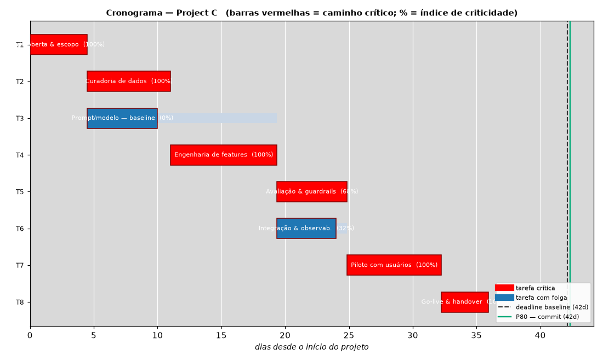

**Aikatauluriski** — valmistumispäivän jakauma, määräaika, **P50** ja **P80** merkittyinä. Sitoudu P80:aan, älä deterministiseen arvioon (optimistinen yhtymäharhan takia).

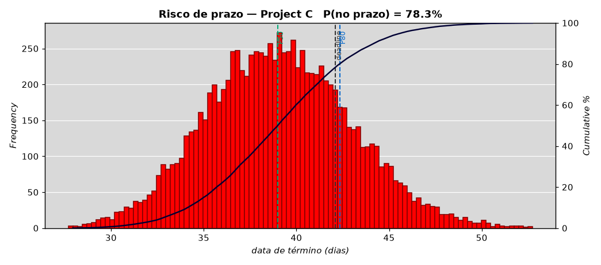

**EVM:n S-käyrä** — PV (suunniteltu) · EV (tuotettu) · AC (todelliset kustannukset). EV alle PV:n = myöhässä; AC yli EV:n = yli budjetin.

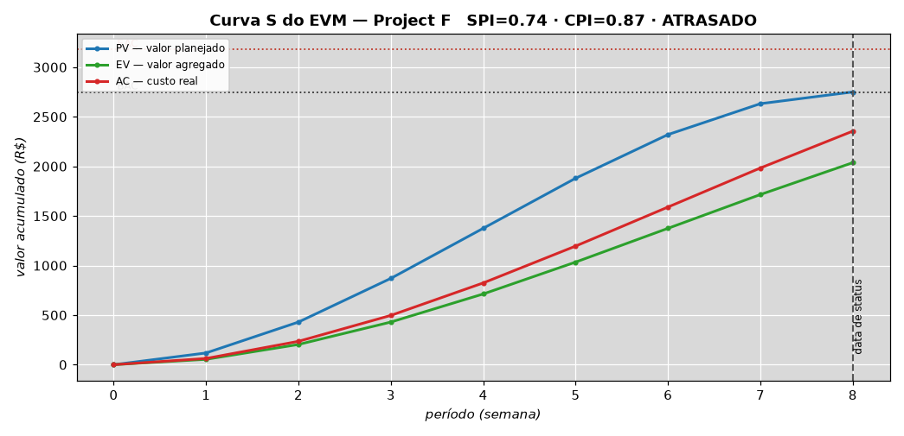

**Viive SLO:n alla** — p50/p95/p99 päivittäin, oikeista lokeista. Viivan ylitys = palvelu heikentyi.

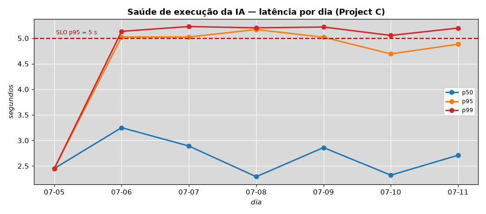

**Riskimatriisi T × V** — kupla = altistus (T×V). Todennäköisyys ankkuroitu projektin oikeisiin signaaleihin.

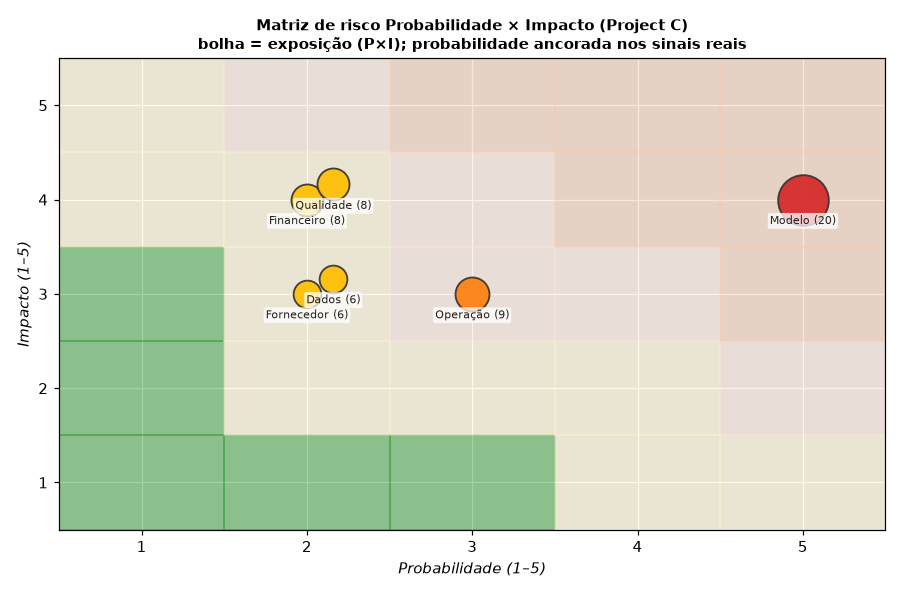

**Kumulatiivinen virtauskaavio (CFD)** — rinnakkaiset kaistat = terve virtaus; paksuuntuva kaista = pullonkaula / jumittunut WIP.

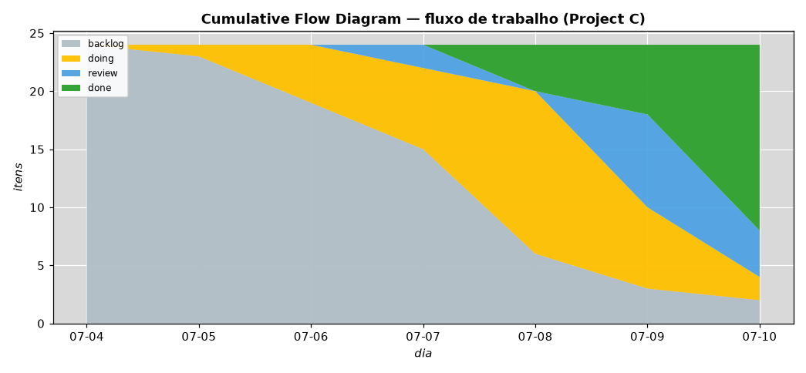

---

## 🚀 Pikaopas (demo, ilman Langfusea)

**Nolla riskiä. Nolla kustannusta. 5 minuuttia.** Aja se omalla koneellasi ja näe koko dashboard anonyymillä datalla:

```bash
cd foundations/pipeline
pip install -r requirements.txt
cd ../evidence && npm install && cd ../pipeline
./run_all.sh --mock          # anonyymi data (Project A..J) -> KPI -> NPV/MIRR/EAA -> 5D -> pitch deckit -> dashboard
cd ../evidence && npm run dev # http://localhost:3000
```

**Todellista dataa** varten täytä `foundations/pipeline/.env` **omilla** Langfuse-avaimillasi (ks.
[`SETUP.md`](foundations/pipeline/SETUP.md)) ja aja `./run_all.sh`. Jokainen käyttäjä käyttää **omaa tiliään** —
tekijän avaimet eivät tule paketin mukana.

---

## 🏗️ Arkkitehtuuri

```
   Sinun tekoälysovelluksesi   Havainnoitavuus         Analytics-as-Code           Sinä
 (ChatGPT, Claude, API…)   ┌──────────────┐   ┌──────────────────┐   ┌──────────────────────┐
        │ traces           │   Langfuse   │   │  SQLite (schema  │   │  Evidence (BI as     │
        └─────────────────▶│  (SDK v4)    │──▶│  + KPI-kyselyt)  │──▶│  Code) · 12 kieltä   │
                           └──────────────┘   └──────────────────┘   └──────────┬───────────┘
   asynkroninen samanaikainen synk.     luokittelu Rustissa (PyO3)              │
                                                                    ┌───────────┴───────────┐
                                                                    │ AHP-TOPSIS · Dossier  │
                                                                    │ 5D · Pitch deckit(TeX)│
                                                                    └───────────────────────┘
```

**Pino:** Python 3.13 · SQLite/DuckDB · Evidence.dev (SvelteKit) · Rust + PyO3 + maturin · matplotlib ·
tectonic (LaTeX) · Noto/WenQuanYi-fontit kuvien i18n:ää varten.

---

## 📊 KPI-luettelo (70+)

Otos (koko luettelo tiedostossa [`foundations/KPIs_Lean6s_BSC.md`](foundations/KPIs_Lean6s_BSC.md)):

| Lyhenne | Nimi | Mihin vastaa |
|---|---|---|
| **PSR** | Project Score Rating (0–5) | Tekoälyprojektin yleisterveys |
| **PEUC** | Hyödyllinen tuotos per kulutus % | Kuinka paljon menoista muuttui hyödylliseksi tuotokseksi |
| **IITA** | Hallusinoitujen tokenien esiintyvyysindeksi | Hallusinaation/uudelleentekemisen % |
| **IDLS** | Lean-hukkaindeksi | Muda (vakavuudella painotetut tokenit) |
| **VRT/kTR** | Tokenisoitava palautusarvo | "Gitmanin m²" — kustannus per 1k tokenia |
| **ICCA** | Tilauskustannusten kattavuusindeksi | Kattaako kustannuksen? (>3× terve) |
| **CPP** | Kustannus per edistymispiste | Pääindikaattori (mitä pienempi, sitä parempi) |

---

## 💰 Investointitason talousanalyysi

Jokaisesta projektista tulee **investointiteesi**: kassavirrastasi (CSV) kehys laskee **NPV**:n, **IRR**:n, **MIRR**:n
**(uudelleensijoittaa projektin kustannuksella)**, **EAA**:n **(NPV:n ekvivalentti annuiteetti)**, **PI**:n
**(kannattavuusindeksi)** ja **takaisinmaksuajan** (yksinkertainen/diskontattu) — **dollarisoiden** virran ja
vertaillen **SELIC**-korkoon ja **USA:n korkoon**. Se luo LaTeX-**pitch deckin** jokaiselle projektille, jonka **NPV
> 0 ja PI > 1** sekä BRL:ssä **että** USD:ssä. Tavoite on raa'an käytännöllinen: **selvittää, maksaako tekoälytilauksesi
itsensä takaisin — ja kuinka nopeasti.**

---

## 🏆 Monikriteeripäätös (AHP-TOPSIS 2n) + Kruununjalokivi-dossier

Kun projekteja on useita, minkä skaalata ensin? **AHP-TOPSIS 2n** -malli painottaa indikaattorit kriteereinä (painot
**AHP**:lla johdonmukaisuussuhteella **CR ≤ 0,10**) ja järjestää **TOPSIS**illä **kahdella normalisoinnilla** (vektori
+ min-max), raportoiden **robustisuuden** (normalisointien välinen yhtäpitävyys). Voittaja — **"Kruununjalokivi"** —
saa täyden **hallinnollisen dossierin** (SWOT · PESTELC · 5W4H · Pareto · GUT · Radar), joka luodaan tyhjästä koodilla,
johtotason **Bottom-Linen** ja rehellisten **johtotason oivallusten** kera. **Et esitä taulukkoa. Esität tuomion.**

---

## 🎲 Monte Carlo — riski, jonka keskiarvo kätkee

**Keskimäärin** positiivinen NPV ei suojaa ketään. Keskiarvo on rahoituksen mukavin valhe: se kuvaa skenaariota, jota
ei ehkä koskaan tule. Kohtalosi ratkaisee **häntä** — se huono päivä.

Tämä kehys simuloi **10 000 tulevaisuutta** jokaiselle projektille: jokainen kassavirta muuttuu **satunnaismuuttujaksi** ja koko salkku lasketaan uudelleen
iteraatio kerrallaan. Lopussa sinulla ei ole lukua — sinulla on **rahojesi koko jakauma**:

- **`P(NPV < 0)`** — todellinen tappion todennäköisyys. Se luku, jota kukaan ei näytä sinulle.
- **VaR 5 %** — pahin uskottava skenaario: *"19:ssä tulevaisuudessa 20:stä ansaitsen vähintään tämän."*
- **CVaR 5 %** — kun katastrofi todella iskee, paljonko se keskimäärin maksaa.
- **Herkkyystornado** — monimuuttujaregressio ja Pearsonin korrelaatio: mikä muuttuja todella liikuttaa NPV:täsi.
- **20 syötejakaumaa**, validoitu **korrelaatiomatriisi** (Iman-Conover, joka säilyttää reunajakaumat täsmälleen) ja
  **prosenttipisteet 1 %:sta 99 %:iin**, sekä 100 luokan histogrammi.

Kiinteä siemen: aja uudelleen ja saat **täsmälleen** saman tuloksen. Auditoitavaa — ei "taikuutta".

> **Käännekohta:** lakkaat valitsemasta korkeimman NPV:n projektia ja alat valita **sitä, joka selviää huonosta
> skenaariosta**. Se on riskienhallintaa — se erottaa sijoittajan pelurista.


| NPV:n kertymäjakauma | Herkkyystornado |
|---|---|
|  |  |

---

## 🧮 Viisi päätöksenteon koulukuntaa. Yksi tuomio.

Yksi menetelmä voi erehtyä. Viisi samaa mieltä olevaa menetelmää ei.

Seuraten **Johnin (2025)** arkkitehtuuria — *Integration of DEMATEL with Other MCDM Methods* — **DEMATEL** kartoittaa
kriteerien välisen syy-rakenteen ja erottaa **syyt** (vivut, joihin tarttua) **seurauksista** (jo tehdyn lämpömittarit).
Näistä vaikutussilmukoista syntyvät **painot**: ei mielivaltaisesti asetettuja, vaan **ongelman rakenteesta johdettuja**.
Ne ruokkivat neljää kilpailevaa koulukuntaa:

| Menetelmä | Koulukunta | Mitä se kysyy |
|---|---|---|
| **ELECTRE I** | Ylivertaisuus | "Kuka ylittää kenet — ja kuka selviää hallitsemattomana?" |
| **PROMETHEE II** | Ylivertaisuus | "Mikä on kunkin projektin nettopreferenssivirta?" |
| **MAUT** | Hyöty | "Mikä maksimoi riskiä karttavan päättäjän hyödyn?" |
| **MCDA-C** | Konstruktivistinen | "Kuka on *Hyvä*-tason yläpuolella — ja kuka *Neutraalin* alapuolella?" |
| **AHP-TOPSIS 2n** | Etäisyys ideaaliin | "Kuka on lähinnä ideaaliratkaisua molemmissa normalisoinneissa?" |

Voittaja nousee viiden **Borda-konsensuksesta**, jo Monte Carlolla **riskikorjattuna**. Ja kun menetelmät ovat **eri
mieltä**, dashboard näyttää erimielisyyden — sillä sekin on informaatiota: valinta on herkkä päätöskoulukunnalle ja
ansaitsee päättäjän silmän.

| DEMATEL — syyt × seuraukset | Sijoitus menetelmittäin |
|---|---|
|  |  |

### 💼 Mikä muuttuu arjessasi — freelancerista konserniin

Sillä ei ole väliä, maksatko **20 US$ PRO-tilauksesta** vai **200 000 US$ yrityssopimuksista**: hukan matematiikka on
sama — vain nollien määrä muuttuu.

| | **Pk-yritys / freelancer** | **Suuryritys** |
|---|---|---|
| **Todellinen kipu** | 3 tilausta, nolla näkyvyyttä, tiukka kassa | 40 tekoälypilottia, yhtäkään ei ole kohdennettu tulokseen |
| **Monte Carlo antaa** | *"tällä projektilla on 12 % todennäköisyys tappiolle, ja huono kuukausi maksaa 3 400 US$"* | VaR/CVaR liiketoimintayksiköittäin: koottu, auditoitava riski — ei anekdootti |
| **MCDM antaa** | minkä kolmesta projektista skaalaat **ensin** olemassa olevalla rahalla | mikä 40 pilotista muuttuu tuotteeksi — puolustettavissa komiteassa, menetelmä näkyvissä |
| **Hyöty jo huomenna** | irtisano tilaus, joka ei maksa itseään takaisin — jo tällä viikolla | kohdenna budjetti **näytön** perusteella, ei sisäpolitiikan |

**Käytännössä:** **tornado** osoittaa muuttujan, joka liikuttaa tulosta — eli **mihin sijoitat seuraavan työtuntisi**.
**DEMATEL** paljastaa, että hallusinaation vähentäminen (IITA) on **syy**, ei oire: toimi siellä, niin NPV, IRR ja riski
paranevat *yhdessä*. Näin tekoälyn hallinnasta lakkaa olemasta mielipide ja tulee **insinööritaitoa**.


---

## 🔬 Signaali on ylävirrassa — ja siellä asuu vipuvarsi

Löysin tämän mittaamalla itse kehystä: NPV:n herkkyystornado palautti **täsmälleen**
`1,0 · 0,9091 · 0,8264 · 0,7513…` — diskonttaustekijät `1/(1+i)ᵗ`. Koska NPV on **lineaarinen** kassavirroissa,
pelkkien virtojen simulointi ei kerro mitään korkoa enempää. **Todellinen satunnaissignaali on ylävirrassa:
tokeneissa.**

### 1️⃣ Lopeta jakauman arvaaminen. Sovita se dataasi.

Yksitoista ehdokasjakaumaa sovitetaan **suurimman uskottavuuden** menetelmällä todelliseen tokenien
kulutussarjaasi (`logs_langfuse`). Voittaa se, jolla on **pienin AIC** — AIC rankaisee jokaisesta ylimääräisestä
parametrista ja estää ylisovituksen — ja **Kolmogorov-Smirnov**-testi mittaa sopivuutta. Tämä on klassinen
*jakaumien sovitus dataan*, ja juuri se paljastaa kulutuksen **raskaan hännän**: jotkin promptit maksavat 10×
tyypillisen, ja juuri se häntä räjäyttää budjetin — näkymätön sille, joka käyttää keskiarvoja.

**Ja kun sovitus on huono, kehys huutaa.** Jos KS:n p-arvo putoaa alle 0,05:n, ruutu varoittaa `HEIKKO SOPIVUUS`
punaisella sen sijaan, että teeskentelisi tarkkuutta. Rehellinen luku voittaa kauniin.


### 2️⃣ Kestääkö rankingisi 2 prosenttiyksikön virheen painossa?

Jokainen monikriteerimenetelmä palauttaa voittajan **implisiittisellä 100 %:n varmuudella**. Mutta kriteerien painot
ovat arvioita, eivät ilmoitettuja totuuksia. Jos kaksi prosenttiyksikköä IITA:n painossa vaihtaa 1. ja 2. sijan,
"voittaja" on kalibroinnin artefakti.

Siksi häiritsemme DEMATELin painoja **Dirichlet'llä** — `w' ~ Dir(κ·w)`, joka elää täsmälleen simplexillä ja säilyttää
`E[w'] = w`, eli häiritsee **vinouttamatta** — ja järjestämme uudelleen **2 000 kertaa**. Tuomion luonne muuttuu:

> *"Project C on paras"* ⟶ **"Project C voittaa 99,9 %:ssa uskottavista preferenssiuniversumeista"**

Se on **luottamusväli itse päätökselle**. Ja se paljastaa, mitä konsensus kätki: alla olevassa ruudussa
**PROMETHEE II valitsee johtajan vain 25,4 %:ssa universumeista**. Neljä koulukuntaa on samaa mieltä; yksi on
suoraan eri mieltä. Se ei ole kohinaa — se on varoitus siitä, että valinta riippuu siitä, suositko *ylivertaisuutta*
vai *hyötyä*. Yksikään yksittäinen ranking ei kertoisi sitä.


### ⚡ Konkreettinen vipuvarsi

| Resurssi | Ennen | Jälkeen |
|---|---|---|
| **Aika** | viikkoja väittelyä siitä, mikä projekti skaalataan | tuomio saapuu todennäköisyyden kera — väittely päättyy yhteen kokoukseen |
| **Laskenta** | 10 000 iteraatiota × 10 projektia, vektoroituna NumPyllä | sekunteja, omalla koneellasi, ilman pilveä ja ilman kustannusta |
| **Pääoma** | budjetti jaettu vakaumuksen mukaan | jaettu `P(voitto)`:n ja `VaR`:n mukaan — pahin tapaus jo hinnoiteltu |
| **Maine** | *"minusta tämä on paras"* | *"se voittaa 99,9 %:ssa skenaarioista; ja tässä on eri mieltä oleva menetelmä, ja miksi"* |
| **Auditoitavuus** | taulukko, jota kukaan ei voi toistaa | kiinteä siemen: kuka tahansa ajaa uudelleen ja saa **täsmälleen** saman luvun |

### 💼 20 dollarin tilauksesta 200 000 dollarin sopimukseen

**Jos olet freelancer tai pk-yritys:** sovitettu jakauma kertoo, **mitä huono tokenikuukausi maksaa** ennen kuin se
saapuu — ja robustius kertoo, kannattaako todella siirtää panostus toiseen projektiin, vai ovatko molemmat tasoissa
virhemarginaalin sisällä. Lakkaat optimoimasta pimeässä tiukalla kassalla.

**Jos olet suuryritys:** `P(voitto)` on investointikomitean puuttuva pala. Se muuttaa *"tiimi A ajaa projektia X"*
muotoon **"projekti X voittaa 99,9 %:ssa puolustettavista painokalibroinneista, ja ainoa eri mieltä oleva koulukunta
on ylivertaisuus, kriteerillä Y"**. Poliittisesta väittelystä tulee **tekninen väittely** — ja talousjohtaja saa
luvun, joka kestää tilintarkastuksen.

> **Viimeinen käänne:** kehys lakkaa mittaamasta **rahan** riskiä ja alkaa mitata **itse päätöksen** riskiä.
> Hyvin harvat paikat maailmassa tekevät tämän.

---

## 🎓 Perusteet: mikä on Monte Carlo ja mikä on monikriteeripäätös

### 🎲 Matemaattinen Monte Carlo -simulaatio

#### 📖 Käsite

Monte Carlo on numeerinen menetelmä, joka vastaa epävarmoja järjestelmiä koskeviin kysymyksiin **satunnaisotannalla**. Ajatus
kääntää matemaatikon vaiston nurin: sen sijaan että vastaus johdettaisiin **suljetussa muodossa** — ratkaisten integraalin,
kombinatoriikan, differentiaaliyhtälön — rakennetaan **malli**, arvotaan tuhansia epävarmojen muuttujien realisaatioita ja
yksinkertaisesti **lasketaan, mitä tapahtui**. Lopputulos ei ole luku: se on **tuloksen todennäköisyysjakauma**.

Kaksi lakia kannattelee sitä. **Suurten lukujen laki** takaa, että simulaatioiden keskiarvo suppenee kohti todellista arvoa.
**Keskeinen raja-arvolause** kertoo, kuinka nopeasti: keskivirhe pienenee kuin `1/√N`. Seuraus on rehellinen ja hieman julma —
**tarkkuuden kaksinkertaistaminen vaatii iteraatioiden nelinkertaistamisen**. Monte Carlo ei ole nopea. Sen hyve on muualla:
virhe **ei riipu ongelman ulottuvuudesta**. Deterministiset kvadratuurimenetelmät kärsivät *ulottuvuuden kirouksesta* ja
romahtavat kymmenillä muuttujilla; Monte Carlo ei. Se voittaa juuri siellä, missä analyyttinen matematiikka kuolee.

#### 📖 Missä ja milloin se syntyi

**Los Alamos, New Mexico, 1946.** Puolalainen matemaatikko **Stanisław Ulam** toipui aivotulehduksesta ja vietti päivänsä
pasianssia pelaten. Hän mietti, mikä oli todennäköisyys voittaa peli. Hän kokeili kombinatoriikkaa ja luovutti: mahdotonta.
Sitten hänen mieleensä juolahti jotain niin yksinkertaista, että se näytti huijaukselta — **pelaa sata peliä, laske voitot ja
jaa**. Hän tajusi heti, ettei tämä ollut korttitemppu: se oli **yleinen integrointimenetelmä** ongelmiin, joita kukaan ei
osannut ratkaista.

Hän vei ajatuksen **John von Neumannille**, joka näki heti sen sovelluksen ongelmaan, joka heitä Manhattan-projektissa
askarrutti: **neutronidiffuusioon** fissiilissä materiaalissa. Tuhansien neutronien satunnaiskulun **simulointi** — sironta,
absorptio, fissio — oli mahdollista; kuljetusyhtälön ratkaiseminen ei. **Nicholas Metropolis** ehdotti nimeä **"Monte Carlo"**
Monacon kasinon mukaan, jossa Ulamin setä lainasi rahaa pelatakseen. **ENIAC** teki ensimmäiset laskelmat mahdollisiksi, ja
**1949** Metropolis ja Ulam julkaisivat *"The Monte Carlo Method"* -artikkelin *Journal of the American Statistical
Association* -lehdessä.

Menetelmä syntyi kirjaimellisesti **korttipelin** ja **atomipommin** kohtaamisesta. Harvalla tieteellisellä ajatuksella on yhtä
hämmentävä syntymätodistus.

#### 📖 Metodologia viidessä askeleessa

1. **Mallinna.** Kirjoita tuotos syötteiden funktiona: `y = f(x₁, …, xₙ)`.
2. **Anna jakaumat.** Jokainen epävarma syöte saa jakauman. Jos **historiadataa** on, se *sovitetaan* siihen; jos ei, se
   asetetaan — ja se on **ilmoitettava**.
3. **Otanta.** Arvo `N` skenaariota. Jos muuttujat ovat **korreloituneita**, otannan on kunnioitettava tuota rakennetta:
   riippumaton arpominen siellä, missä todellinen riippuvuus vallitsee, on menetelmän yleisin virhe.
4. **Etene.** Laske `f` jokaisessa skenaariossa. Tässä syötteiden epävarmuus **muuttuu** tuotoksen epävarmuudeksi ilman
   minkäänlaista lineaarista approksimaatiota.
5. **Analysoi.** Tutki jakaumaa: keskiarvo ja hajonta, **prosenttipisteet**, tapahtumien todennäköisyydet (`P(y < 0)`), **häntä**
   (VaR, CVaR) ja **herkkyys** (mikä `xᵢ` liikuttaa `y`:tä).

#### 📖 Käyttö ja sovellukset maailmalla

- **Rahoitus:** eksoottisten optioiden hinnoittelu (kun suljettua muotoa ei ole), salkkujen **VaR** ja **CVaR**, sääntelyn
  stressitestit (Basel), luottoriski.
- **Tekniikka:** rakenteellinen luotettavuus, valmistustoleranssit, monimutkaisten järjestelmien vikaanalyysi.
- **Projektinhallinta:** aikataulu- ja kustannusriski (PERT:n todennäköisyyspohjainen kehitys), valmistumisen S-käyrät.
- **Fysiikka ja kemia:** hiukkaskuljetus, säteilysuojaus, tilastollinen mekaniikka.
- **Operaatiot ja toimitusketjut:** jonot, varastot, kapasiteetti epävarman kysynnän alla.
- **Epidemiologia:** tautien leviäminen ja politiikkojen arviointi epävarmuudessa.
- **Tekoälyn sisällä:** **MCMC** (bayesilainen päättely), **MCTS** — puuhaku, joka vei AlphaGon Lee Sedolin ohi — ja
  *Monte Carlo dropout* neuroverkkojen epävarmuuden arviointiin.

#### 🔒 Metodologia, käyttö ja sovellus YKSINOMAAN tässä projektissa

Täällä Monte Carlo ei ole akateeminen koriste: se on salkun **riskimoottori**.

- **Syötteet.** Jokaisesta jaksottaisesta kassavirrasta tulee **kolmiojakautunut** muuttuja (`min`, `moodi`, `max`), moodi
  deterministisessä arvossa ja hännät ±30 %:ssa. Sen sijaan **tokenien kulutusta** — ainoaa aidosti raskashäntäistä muuttujaa —
  **ei aseteta**: yksitoista ehdokasjakaumaa **sovitetaan suurimman uskottavuuden menetelmällä** todelliseen
  `logs_langfuse`-sarjaasi, **pienimmän AIC:n** omaava voittaa, ja sopivuus mitataan **Kolmogorov-Smirnovilla**. Jos p-arvo
  putoaa alle 0,05:n, ruutu tulostaa `HEIKKO SOPIVUUS` punaisella sen sijaan, että teeskentelisi tarkkuutta.
- **Korrelaatio.** Kun virrat ovat riippuvia, otanta käyttää **Iman-Conoveria**, joka pakottaa järjestyskorrelaation
  **säilyttäen reunajakaumat täsmälleen**. Matriisi validoidaan ensin: symmetrinen, ykkösdiagonaali, positiivisesti definiitti.
- **Eteneminen.** **10 000 iteraatiota** projektia kohden, **kiinteällä siemenellä (42)**: aja uudelleen ja saat täsmälleen saman
  luvun. Se ei ole yksityiskohta — se tekee tuloksesta **auditoitavan** kumppanille, sijoittajalle tai tilintarkastajalle.
- **Tuotokset.** Ei vain NPV: simuloimme **NPV:n, IRR:n, MIRR:n, EAA:n, PI:n** ja **tokenkustannuksen**, kunkin kymmenellä
  klassisella tunnusluvulla (vinous ja huipukkuus Excelin määritelmin), **prosenttipisteillä 1 %:sta 99 %:iin** ja **100 luokan
  histogrammilla**.
- **Riski, jolla on väliä.** `P(NPV < 0)` on todellinen tappion todennäköisyys. **VaR 5 %** on pahin uskottava skenaario —
  *"19:ssä tulevaisuudessa 20:stä ansaitsen vähintään tämän"*. **CVaR 5 %** vastaa siihen, mitä kukaan ei kysy: kun katastrofi
  iskee, **paljonko se keskimäärin maksaa**.
- **Herkkyys.** **Tornado** lasketaan molemmissa klassisissa muodoissa: **monimuuttujaregression beetat** (yhden yksikön lisäyksen
  vaikutus syötteessä NPV:hen) ja **Pearsonin korrelaatio** (kuinka paljon kyseisen syötteen epävarmuus sanelee NPV:n
  epävarmuuden). Ne ovat toisiaan täydentäviä lukutapoja; dashboard näyttää molemmat.
- **Kehyksen löydös itsestään.** Itseään mitatessaan tornado palautti beetat, jotka olivat **täsmälleen diskonttaustekijät**
  `1/(1+i)ᵗ` — koska NPV on *lineaarinen* kassavirroissa. Pelkkien virtojen simulointi ei siis kerro mitään korkoa enempää.
  **Todellinen satunnaissignaali on ylävirrassa, tokeneissa.** Juuri tämä havainto motivoi jakaumien sovittamisen todelliseen
  dataan.
- **Riski ruokkii päätöstä.** Kaksi Monte Carlon tuotosta menee **kriteereinä** monikriteerimalliin: `P(NPV<0)`
  **kustannus**kriteerinä ja **VaR 5 %** **hyöty**kriteerinä. Lopullinen valinta syntyy siis jo **riskikorjattuna**, ei vain
  odotusarvon suhteen.


**Mikä se on.** Menetelmä, joka vastaa vaikeisiin kysymyksiin **arpomalla**. Sen sijaan että ratkaisisit epävarman
järjestelmän matematiikan suljetussa muodossa — usein mahdotonta — annat syötemuuttujille
**todennäköisyysjakaumat**, arvot tuhansia skenaarioita, lasket tuloksen kussakin ja katsot tulosten **koko
jakaumaa**. Suurten lukujen laki takaa suppenemisen; virhe pienenee kuin `1/√N`, eli **iteraatioiden
nelinkertaistaminen puolittaa virheen**.

**Miten se syntyi.** Los Alamos, 1946. **Stanisław Ulam**, toipuessaan sairaudesta, pelasi pasianssia ja mietti,
mikä olisi todennäköisyys voittaa. Hän tajusi, että kombinatoriikan ratkaiseminen oli raakaa — mutta satojen
pelien **simulointi** ja pelkkä laskeminen oli triviaalia. Hän vei idean **John von Neumannille**, ja he sovelsivat
sitä ongelmaan, joka heitä Manhattan-projektissa askarrutti: **neutronidiffuusioon** fissiilissä materiaalissa.
**Nicholas Metropolis** nimesi menetelmän "Monte Carloksi" Monacon kasinon mukaan, jossa Ulamin setä pelasi.
**ENIAC** teki ensimmäiset laskelmat mahdollisiksi. Menetelmä syntyi kirjaimellisesti korttipelin ja atomipommin
kohtaamisesta.

**Missä sitä käytetään nykyään.** Optioiden hinnoittelu ja **VaR** rahoituksessa; rakenteellinen luotettavuus
tekniikassa; aikataulu- ja kustannusriski projektinhallinnassa; hiukkasfysiikka; toimitusketjut; epidemiologia.
Ja tekoälyn sisällä: **MCMC** (bayesilainen päättely) ja **MCTS** — puuhaku, joka vei AlphaGon Lee Sedolin ohi.

**Miten se palvelee meitä täällä.** Jokainen projektisi kassavirta muuttuu satunnaismuuttujaksi, ja tokenien
kulutus saa jakauman, joka on **sovitettu oikeaan dataasi**. Ajamme 10 000 skenaariota, ja lopussa sinulla ei ole
NPV:tä — sinulla on **rahojesi jakauma**: `P(NPV < 0)` (todellinen tappion todennäköisyys), **VaR 5 %** (pahin
uskottava skenaario), **CVaR 5 %** (mitä katastrofi maksaa) ja **tornado** (mikä muuttuja todella liikuttaa
tulosta). Keskiarvo valehtelee; häntä ratkaisee.

### 🧮 Monikriteerinen päätösanalyysi (MCDA)

#### 📖 Käsite ja mihin sitä tarvitaan

Projektien välillä valitseminen on vaikeaa kahdesta syystä, joita mikään taulukkolaskenta ei ratkaise. Ensiksi kriteerit **ovat
ristiriidassa**: korkeimman NPV:n projekti on yleensä riskialttein. Toiseksi ne ovat **yhteismitattomia**: ei ole rehellistä
aritmetiikkaa, joka laskisi yhteen eurot, hallusinaatioprosentin ja uudelleentekemisen tunnit.

MCDA (*Multi-Criteria Decision Analysis*) on ala — syntynyt 1960-70-luvuilla operaatiotutkimuksen ja päätösteorian rajapinnalla —
joka kohtaa juuri tämän. Se **ei lupaa oikeaa vastausta.** Se lupaa jotain hyödyllisempää: tehdä valinnasta **eksplisiittisen,
auditoitavan ja puolustettavan**.

Sen perustava teesi on epämukava ja vapauttava yhtä aikaa: **"parasta" ei ole tyhjiössä.** On paras *annetulla
preferenssijärjestelmällä, jonka joku on tehnyt eksplisiittiseksi*. Jokainen päättäjä toimii jo jonkin preferenssijärjestelmän
varassa — ero on siinä, että ilman MCDA:ta se on **implisiittinen, epäjohdonmukainen ja auditoimaton**. Hiljaisen mielipiteen
vaihtaminen eksplisiittiseen malliin: siinä on koko hyöty.

#### 📖 Käyttö ja sovellukset maailmalla

Toimittajavalinta ja salkun priorisointi; energiateknologioiden valinta (aurinko × tuuli × biomassa); tehtaiden, sairaaloiden ja
kaatopaikkojen sijoittaminen; ympäristövaikutusten arviointi; julkinen politiikka ja budjettijako; henkilövalinta; kunnossapidon
priorisointi; ja — yhä useammin — nousevien teknologioiden **teknistaloudellinen arviointi**, mikä on juuri tekoälyprojektisalkun
tapaus.

#### 📖 Kolme päätöksenteon koulukuntaa

- **Amerikkalainen koulukunta (arvo ja hyöty).** Kokoaa kaiken **yhdeksi luvuksi**. Olettaa, että huono arvosana yhdessä
  kriteerissä voidaan **kompensoida** loistavilla arvosanoilla muissa. Yksinkertaista, voimakasta — ja toisinaan vaarallista.
  `AHP`, `MAUT`.
- **Eurooppalainen koulukunta (ylivertaisuus).** Perustaja **Bernard Roy**. Hyväksyy, että kaksi vaihtoehtoa voivat olla
  **vertailukelvottomia**, ja sallii **veton**: katastrofaalista suoritusta yhdessä kriteerissä **ei osteta pois** erinomaisuudella
  muualla. Se mallintaa päättäjän todellista epäröintiä **kynnysten** avulla. `ELECTRE`, `PROMETHEE`.
- **Konstruktivistinen koulukunta.** Mallia ei *löydetä*, se **rakennetaan yhdessä päättäjän kanssa**, ongelman jäsentämisen ja
  viitetasoihin ankkuroitujen asteikkojen kautta. `MCDA-C`.

#### 📖 1. DEMATEL — *Decision-Making Trial and Evaluation Laboratory*

**Mikä se on.** Loivat **Gabus & Fontela** **Battelle Memorial Institutessa** (Geneve, 1972-73) tutkiakseen monimutkaisia,
kietoutuneita maailmanongelmia. Se **ei järjestä vaihtoehtoja**: se kartoittaa **kriteerien välisen syy-rakenteen**.

**Miten se toimii.** Asiantuntijat täyttävät **suoran suhteen matriisin** `Z` (kuinka paljon kriteeri *i* vaikuttaa *j*:hin,
0–4). Normalisoidaan `s = max(suurin rivisumma, suurin sarakesumma)`, mistä saadaan **kokonaissuhdematriisi** `T = X(I − X)⁻¹`,
joka summaa suoran vaikutuksen **ja kaikki epäsuorat** mitä tahansa polkua pitkin. Siitä seuraavat `R` (rivisummat) ja `C`
(sarakesummat): **`R+C` on näkyvyys** (merkitys järjestelmässä) ja **`R−C` on suhde** (positiivinen = **syy**; negatiivinen =
**seuraus**).

**Yleinen käyttö.** Kestävät toimitusketjut, teknologian omaksumisen esteet, systeemisen riskin analyysi.

**🔒 Tässä projektissa.** DEMATEL vastaa kysymykseen, joka **edeltää** järjestystä: *"missä minun pitäisi toimia?"*. Se paljastaa,
että **IITA (hallusinaatio), PSR (terveys) ja IDLS (Lean-hukka) ovat SYITÄ**, kun taas **NPV, IRR, PI ja riskimittarit ovat
SEURAUKSIA**. Se on vastaintuitiivista ja vapauttavaa: NPV:n perässä juokseminen on turhaa — se on **lämpömittari**. Vaikuta
hallusinaatioon, ja NPV, IRR ja riski paranevat *yhdessä*. Lisäksi kriteerien **painoja** ei aseteta: ne **johdetaan
vaikutusrakenteesta**, kaavalla `wᵢ ∝ √((R+C)ᵢ² + (R−C)ᵢ²)`. Nämä painot ruokkivat **muita viittä menetelmää** — Johnin (2025)
kuvaama integraatiomalli.

#### 📖 2. AHP-TOPSIS 2n — *Analytic Hierarchy Process* + *Technique for Order Preference by Similarity to Ideal Solution*

**Mikä se on.** **Saaty (1977)** esitti AHP:n: painot johdetaan kriteerien **parivertailuista**, mukana **johdonmukaisuustesti**,
joka paljastaa ristiriitaiset arviot (`CR ≤ 0,10`). **Hwang & Yoon (1981)** esittivät TOPSIS:n: paras vaihtoehto on se, joka on
**lähinnä ideaaliratkaisua** ja **kauimpana anti-ideaalista**.

**Miten se toimii.** Päätösmatriisi normalisoidaan, sarakkeet kerrotaan painoilla, lasketaan euklidiset etäisyydet ideaali- ja
anti-ideaaliratkaisuihin, ja **läheisyyskerroin** `Ci = d⁻/(d⁺+d⁻)` järjestää kaiken.

**Yleinen käyttö.** Maailman käytetyin pari MCDM:ssä — toimittajavalinnasta suorituskyvyn arviointiin.

**🔒 Tässä projektissa.** Ajamme TOPSIS:n **kahdella normalisoinnilla** — vektorilla (euklidinen) ja min-max:lla (lineaarinen) —
tästä **"2n"**. Kukin projekti saa kaksi kerrointa ja lopullinen järjestys on niiden keskiarvo. Voitamme mittarin, jota lähes
kukaan ei raportoi: **normalisointien välisen yksimielisyyden**. Kun ne ovat eri mieltä projektin sijoituksesta, sen tulos on
**hauras mielivaltaiselle tekniselle valinnalle** — ja dashboard näyttää sen. Tämän projektin Saaty-matriisin `CR = 0,0119`,
selvästi alle 0,10 rajan.

#### 📖 3. ELECTRE I — *ÉLimination Et Choix Traduisant la REalité*

**Mikä se on.** **Bernard Roy (1968)**, konsulttiyhtiö SEMA:ssa Pariisissa. Se on eurooppalaisen ylivertaisuuskoulukunnan
nollapiste. Kysymys ei ole *"mikä on kunkin arvosana?"* vaan *"onko **a** vähintään yhtä hyvä kuin **b**?"*.

**Miten se toimii.** Kullekin parille `(a, b)` lasketaan kaksi indeksiä. **Konkordanssi** `C(a,b)` summaa niiden kriteerien painot,
joissa `a` on vähintään yhtä hyvä kuin `b`. **Diskordanssi** `D(a,b)` mittaa `a`:n **suurimman haitan** suhteessa `b`:hen. Sanotaan,
että `a` **ylittää** `b`:n, jos konkordanssi on korkea **ja** diskordanssi matala. Niiden vaihtoehtojen joukko, joita **kukaan ei
ylitä**, on **ydin** (*kernel*) — puolustettavien valintojen valikko.

**Yleinen käyttö.** Julkiset ja ympäristöpäätökset, joissa katastrofaalisen kriteerin kompensoiminen olisi kestämätöntä.

**🔒 Tässä projektissa.** ELECTRE on menetelmä, joka **kieltäytyy valehtelemasta mukavuuden vuoksi**. Projekti, jonka NPV on
stratosfäärinen mutta hallusinaatio häpeällinen, **ei osta** paikkaansa: **diskordanssi** estää sen. Kehys raportoi **ytimen** —
projektit, joita mikään muu ei hallitse — ja käyttää pisteenä **netto-ylivertaisuusastetta** (kuinka montaa se hallitsee,
vähennettynä sillä, kuinka moni hallitsee sitä). Se on myös ainoa kuudesta, joka saa sanoa: *"nämä kaksi projektia ovat
yksinkertaisesti **vertailukelvottomia**"*.

#### 📖 4. PROMETHEE II — *Preference Ranking Organization METHod for Enrichment Evaluation*

**Mikä se on.** **Jean-Pierre Brans (1982)**, hiottu yhdessä **Bernard Mareschalin ja Philippe Vincken (1985)** kanssa. Myös
ylivertaisuutta, mutta tyylikkäällä käänteellä: binäärisen kynnyksen sijaan mitataan, **kuinka paljon** `a` on `b`:tä
mieluisampi.

**Miten se toimii.** Kunkin kriteerin osalta erotus `d = g(a) − g(b)` kulkee **preferenssifunktion** läpi, joka muuntaa sen asteeksi
välillä 0–1. Brans esitti **kuusi yleistettyä funktiota** (tavallinen, kvasikriteeri, preferenssikynnys, taso, lineaarinen
yhdentekevyydellä, gaussinen), jotka parametroidaan **yhdentekevyyskynnyksellä `q`** (jonka alapuolella ero on merkityksetön) ja
**preferenssikynnyksellä `p`** (jonka yläpuolella preferenssi on täydellinen). Painotetut asteet summataan: `φ⁺` on se, kuinka
paljon `a` hallitsee muita, `φ⁻` kuinka paljon sitä hallitaan, ja **nettovirta** `φ = φ⁺ − φ⁻` tuottaa **täydellisen esijärjestyksen**
(PROMETHEE II).

**Yleinen käyttö.** Energia, logistiikka, terveydenhuolto — aina kun preferenssin **voimakkuuden** asteikointi on tärkeää.

**🔒 Tässä projektissa.** Käytämme **lineaarista yhdentekevyydellä** -funktiota, jossa `q` ja `p` estimoidaan kunkin kriteerin
havaittujen poikkeamien 10 %:n ja 90 %:n kvantiileista. PROMETHEE vastaa kysymykseen *"kuinka paljon parempi voittaja on?"*, ei vain
*"onko se parempi?"*. Ja juuri se tuotti salkun kiinnostavimman löydön: robustiusanalyysissä **PROMETHEE II valitsee konsensuksen
johtajan vain 25,4 %:ssa preferenssiuniversumeista** — kun neljä muuta koulukuntaa ovat samaa mieltä. Konsensus **peitti
koulukuntien välisen erimielisyyden**.

#### 📖 5. MAUT — *Multi-Attribute Utility Theory*

**Mikä se on.** **Ralph Keeney & Howard Raiffa (1976)**, von Neumannin ja Morgensternin suorat perilliset. Se on amerikkalainen
koulukunta aksiomaattisessa muodossa: jos preferenssisi noudattavat tiettyjä rationaalisuusaksioomia, niitä esittävä **hyötyfunktio**
on olemassa, ja päättäminen tarkoittaa **odotetun hyödyn maksimointia**.

**Miten se toimii.** Kukin kriteeri saa **hyötyfunktion** `uⱼ`, joka kuvaa suorituksen tyytyväisyydeksi. Kokonaishyöty on
additiivinen: `U(a) = Σ wⱼ · uⱼ(a)` — pätee **additiivisen riippumattomuuden** vallitessa. Ratkaisevaa on funktion **muoto**:
**konkaavi** `u` edustaa **riskin karttamista** (toinen miljoona on vähemmän arvokas kuin ensimmäinen); lineaarinen on neutraalius;
konveksi riskihakuisuus.

**Yleinen käyttö.** Lääketieteelliset päätökset, energiapolitiikka, neuvottelut — mikä tahansa yhteys, jossa suhtautuminen riskiin on
**tehtävä näkyväksi ja puolustettava**.

**🔒 Tässä projektissa.** Käytämme **eksponentiaalista** hyötyä `u(z) = (1 − e^(−r·z)) / (1 − e^(−r))` karttamiskertoimella `r = 2`.
Se on **julistettu eettinen valinta**: kehys on **konservatiivinen**. Epävarma voitto on arvoltaan vähemmän kuin varma voitto samalla
odotusarvolla — juuri niin kuin varovainen talousjohtaja sen arvioisi. Siinä missä TOPSIS kohtelee kaikkia voittoja vaihtokelpoisina,
MAUT **rankaisee korkeasta ja epävarmasta lupauksesta**.

#### 📖 6. MCDA-C — *Monikriteerinen päätöksenteon tuki — konstruktivistinen*

**Mikä se on.** Formalisoivat **Leonardo Ensslin, Gilberto Montibeller ja Sandra Noronha (2001)**, juuret Royssa ja Bana e
Costassa. Lähtökohta on filosofinen: malli **ei ole olemassa ennen** päättäjää. Se **rakennetaan hänen kanssaan** kolmessa
vaiheessa — **jäsentäminen** (kognitiiviset kartat, deskriptorit), **arviointi** (arvofunktiot, korvaussuhteet) ja **suositukset**.

**Miten se toimii.** Kukin kriteeri saa **deskriptorin**, jossa on tasoja, ja kaksi niistä on ankkureita: **Neutraali**-taso (jonka
alapuolella suoritus vaarantaa) ja **Hyvä**-taso (jonka yläpuolella vallitsee erinomaisuus). Arvofunktio on ankkuroitu: `V = 0`
Neutraalissa, `V = 100` Hyvässä, ja se **ekstrapoloi** vapaasti välin ulkopuolelle.

**Yleinen käyttö.** Organisaation suorituskyvyn arviointi, julkinen hallinto, tilanteet joissa päättäjän on **opittava** omasta
ongelmastaan.

**🔒 Tässä projektissa.** Koska jäsentämisistuntoa päättäjän kanssa ei ole, ankkuroimme tasot salkun **havaittuihin
kvartiileihin**: `Neutraali = Q1`, `Hyvä = Q3`. Tämä säilyttää MCDA-C:n ainutlaatuisuuden — se ei vain **järjestä**, se
**luokittelee**: `V < 0` on **vaarantava**, `0 ≤ V ≤ 100` on **kilpailukykyinen**, `V > 100` on **erinomaisuus**. Projekti voi olla
listan kärjessä ja silti sijaita vaarantavalla kaistalla. Mikään muu tämän joukon menetelmä ei kertoisi sitä sinulle.

#### 📖 Miksi viisi menetelmää eikä yksi

Koska **jokainen koulukunta erehtyy eri tavalla**, ja yksinäinen menetelmä palauttaa voittajan **implisiittisellä 100 %:n
varmuudella** — mikä on aina valhe. AHP-TOPSIS ylikompensoi; ELECTRE kieltäytyy toisinaan päättämästä; MAUT riippuu hyödyn muodosta;
MCDA-C ankkureista.

Ajamme kaikki viisi **samoilla painoilla** (DEMATELin) ja päätämme **Borda-konsensukseen**. Silloin niiden välinen erimielisyys
lakkaa olemasta haitta ja muuttuu **informaatioksi**: kun neljä on samaa mieltä ja yksi on suoraan eri mieltä, se ei ole kohinaa — se
on varoitus siitä, että valintasi **riippuu päätöskoulukunnasta**, jonka olet implisiittisesti omaksunut.

#### 📖 Viimeinen kysymys: kestääkö tuomio?

Koko yllä oleva rakennelma lepää **painojen** varassa, ja painot ovat **arvioita**. Jos kaksi prosenttiyksikköä IITA:n painossa
vaihtaa 1. ja 2. sijan, "voittaja" on **kalibroinnin artefakti**, ei salkun tosiasia.

Siksi häiritsemme DEMATELin painoja **Dirichlet'llä** — `w' ~ Dir(κ·w)`, joka elää täsmälleen simplexillä ja säilyttää `E[w'] = w`,
eli häiritsee **vinouttamatta** — ja järjestämme uudelleen **2 000 kertaa**. Tuomion luonne muuttuu:

> *"Project C on paras"* ⟶ **"Project C voittaa 99,9 %:ssa uskottavista preferenssiuniversumeista"**

Se on **luottamusväli itse päätökselle**. Sen myötä kehys lakkaa mittaamasta vain **rahan** riskiä ja alkaa mitata **päätöksen**
riskiä.


**Mikä se on ja mihin sitä tarvitaan.** Kun valitset projektien välillä, kriteerit **ovat ristiriidassa** (korkea
NPV tulee yleensä korkean riskin kera) ja ovat **yhteismitattomia** (miten lasket euroja yhteen
hallusinaatioprosentin kanssa?). MCDA on ala, joka tekee tuosta valinnasta eksplisiittisen, auditoitavan ja
puolustettavan. Sen perustava teesi on epämukava ja vapauttava: **"parasta" ei ole tyhjiössä.** On paras *annetulla
preferenssijärjestelmällä, jonka teit eksplisiittiseksi*. Implisiittisen mielipiteen vaihtaminen eksplisiittiseen
malliin — siinä on koko hyöty.

**Kolme koulukuntaa.** **Amerikkalainen**, arvon ja hyödyn (AHP, MAUT): kokoaa kaiken yhdeksi luvuksi.
**Eurooppalainen**, ylivertaisuuden (ELECTRE, PROMETHEE), Bernard Royn: hyväksyy, että kaksi vaihtoehtoa voivat olla
**vertailukelvottomia**, ja sallii **veton** — surkeaa arvosanaa yhdessä kriteerissä ei osteta pois loistavilla
muualla. **Konstruktivistinen** (MCDA-C): mallia ei löydetä, se **rakennetaan yhdessä päättäjän kanssa**.

| Menetelmä | Alkuperä | Keskeinen kysymys | Mitä vain se tuo | Tekoälysalkussa |
|---|---|---|---|---|
| **DEMATEL** | Gabus & Fontela, Battelle (1972-73) | *"Kuka vaikuttaa keneen?"* | erottaa **syyn** **seurauksesta** ja johtaa **painot** itse vaikutusrakenteesta | näyttää, että hallusinaation vähentäminen (IITA) on **syy** — toimi siellä, niin NPV, IRR ja riski paranevat yhdessä |
| **AHP-TOPSIS 2n** | Saaty (1977) · Hwang & Yoon (1981) | *"Kuka on lähinnä ideaaliratkaisua?"* | painot parivertailuista **johdonmukaisuustestin** kera (CR ≤ 0,10) | järjestää **kahdella normalisoinnilla** ja raportoi niiden yksimielisyyden |
| **ELECTRE I** | Bernard Roy (1968) | *"Kuka ylittää kenet — ja kuka selviää hallitsemattomana?"* | **vertailukelvottomuus** ja **veto**: surkeaa kriteeriä ei osteta pois | eristää **ytimen**: projektit, joita mikään muu ei hallitse |
| **PROMETHEE II** | Brans & Vincke (1985) | *"Mikä on nettopreferenssivirta?"* | **kuusi preferenssifunktiota** yhdentekevyys- ja preferenssikynnyksin | asteikoi, *kuinka paljon* parempi projekti on, ei vain *onko* |
| **MAUT** | Keeney & Raiffa (1976) | *"Mikä maksimoi päättäjän hyödyn?"* | mallintaa **riskin karttamisen** konkaavilla hyödyllä | rankaisee epävarmoja voittoja — varovainen päättäjä ei maksa niistä samaa |
| **MCDA-C** | Ensslin, Montibeller & Noronha (2001) | *"Missä on taso Hyvä ja missä Neutraali?"* | **ankkuroitu arvofunktio**: `V=0` Neutraalissa, `V=100` Hyvässä, ekstrapoloiden | luokittelee **vaarantavaan / kilpailukykyiseen / erinomaisuuteen** pelkän järjestämisen sijaan |

**Miksi viisi eikä yksi.** Jokainen koulukunta erehtyy eri tavalla. Yksittäinen menetelmä palauttaa voittajan
**implisiittisellä 100 %:n varmuudella** — mikä on aina valhe. Ajamalla kaikki viisi ja sulkemalla
**Borda-konsensuksella** menetelmien erimielisyys muuttuu **informaatioksi**: kun neljä on samaa mieltä ja yksi on
suoraan eri mieltä, se ei ole kohinaa — se on varoitus, että valintasi riippuu siitä, suositko *ylivertaisuutta*
vai *hyötyä*. Ja painojen **Dirichlet-häirintä** vastaa viimeiseen kysymykseen: *"kestääkö ykkössija kahden
prosenttiyksikön virheen kalibroinnissa?"*


### 🧪 Neljä hammasratasta: Iman-Conover, Kolmogorov-Smirnov, Dirichlet ja tornado

Yllä olevat kaksi suurta menetelmää lepäävät neljän pienemmän osan varassa — ja juuri niissä asuu ero rehellisen simulaation ja
kauniin luvun välillä. Ne kannattaa tuntea.

#### 🔗 Iman-Conover — pakottaa korrelaatio **tuhoamatta jakaumia**

**Mikä se on.** Esittivät **Ronald Iman ja William Conover (1982)**. Se ratkaisee ongelman, joka näyttää triviaalilta muttei ole:
*miten arvotaan korreloituneita muuttujia, kun reunajakaumat eivät ole normaaleja?* Naiivi tie — tuottaa korreloituneita
normaaleja Choleskyllä ja muuntaa ne — **vääristää reunajakaumat**. Ja jos olet juuri sovittanut LogNormalin dataasi, sen
vääristäminen heittää menemään täsmälleen sen työn, jonka teit.

**Miten se toimii.** Kyseessä on **järjestyslukujen uudelleenjärjestely**, ei arvojen muunnos. Viite rakennetaan **van der Waerdenin
pisteistä** `Φ⁻¹(i/(n+1))`, sekoitettuna sarakkeittain; lasketaan `P = chol(R)` (tavoite) ja `Q = chol(corr(M))` (viitteen
satunnainen korrelaatio); muodostetaan `S = M·(Q⁻¹P)ᵀ`. Sitten alkuperäisen otoksen jokainen sarake **järjestetään uudelleen
`S`:n järjestyslukujen mukaan**. Koska vain jo arvottujen arvojen *järjestys* muuttuu, **reunajakaumat säilyvät täsmällisinä** —
bitilleen.

**Hieno ja rehellinen yksityiskohta.** `R` on *normaaliviitteen* korrelaatio, ei tuloksen Pearsonin korrelaatio. Indusoitu
järjestyskorrelaatio noudattaa normaalikopulaa: `ρ_S = (6/π)·arcsin(R/2)`. Arvolla `R = 0,80` tämä antaa **0,7859** — täsmälleen
sen, minkä mittasimme testissä (0,786). Se ei ole menetelmän virhe; se on sen matematiikkaa.

**Yleinen käyttö.** Rahoitusriski (korreloituneet omaisuuserät), rakenteellinen luotettavuus, latinalainen hyperkuutio-otanta.

**🔒 Tässä projektissa.** Juuri tämä sallii kassavirtojen korreloinnin **uhraamatta** tokeneihisi sovitettua jakaumaa. Ennen käyttöä
matriisi validoidaan: symmetrinen, ykkösdiagonaali ja **positiivisesti definiitti** (Choleskyn kautta). Epäjohdonmukainen
korrelaatiomatriisi hylätään pienin ominaisarvo raportoiden — sen sijaan että tuotettaisiin hiljaa merkityksettömiä lukuja.

#### 📏 Kolmogorov-Smirnov — etäisyys sen välillä, mitä **oletat**, ja sen, mitä data **sanoo**

**Mikä se on.** **Ei-parametrinen** yhteensopivuustesti. Testisuure on yksinkertainen ja kaunis: `D = sup |Fₙ(x) − F(x)|`, suurin
pystysuora ero datasi **empiirisen kertymäfunktion** ja ehdottamasi **teoreettisen** välillä. Nollahypoteesin vallitessa `D`:n
jakauma **ei riipu siitä, mikä `F` on** — tästä nimitys *distribution-free*.

**Metodologisen rehellisyyden varaus.** Klassinen KS:n p-arvo olettaa, että `F`:n parametrit kiinnitettiin **ennen** datan
näkemistä. Kun ne **estimoidaan samasta datasta** (kuten tässä, suurimman uskottavuuden menetelmällä), testistä tulee
**optimistinen**: se hyväksyy liian helposti. Tarkkuus vaatisi **Lillieforsin** korjausta tai **parametrista bootstrappia**. Siksi
kohtelemme KS:ää **diagnoosina**, emme todisteena — ja käytämme sitä vain huonojen sovitusten **hylkäämiseen**, emme koskaan
julistamaan sovitusta "oikeaksi".

**Yleinen käyttö.** Yhteensopivuus; kahden otoksen vertailu (kahden otoksen KS); datan *ajautumisen* havaitseminen tuotannon
koneoppimisjärjestelmissä.

**🔒 Tässä projektissa.** Se mittaa, kuinka hyvin AIC:llä voittanut jakauma todella kuvaa tokensarjaasi. Kun p-arvo putoaa alle
0,05:n, ruutu tulostaa **`HEIKKO SOPIVUUS` punaisella** — demosalkussa näin todella käy yhdelle projektille, ja kehys **näyttää** sen
sen sijaan että piilottaisi. Rehellinen luku voittaa kauniin.

#### 🎲 Dirichlet-häirintä — päätöksen **luottamusväli**

**Mikä se on.** **Dirichlet**-jakauma on simplexin luonnollinen jakauma: positiivisten lukujen vektoreita, joiden summa on 1 —
täsmälleen se, mitä painovektori on. Se on multinomijakauman konjugaatti ja beta-jakauman yleistys.

**Miksi se eikä gaussinen kohina.** Normaalikohinan lisääminen painoihin tuottaa negatiivisia arvoja ja rikkoo ykkössumman.
Dirichlet elää kelvollisen avaruuden *sisällä*. Ja parametroituna muotoon `w' ~ Dir(κ·w)` sillä on kaksi ominaisuutta, jotka tekevät
siitä täydellisen tähän: `E[w'] = w` (häiritsee **vinouttamatta**) ja `Var(w'ᵢ) = wᵢ(1−wᵢ)/(κ+1)` (hajontaa säädetään yhdellä
nupilla). Kun `κ → ∞`, se romahtaa alkuperäisiin painoihin.

**Yleinen käyttö.** Bayesilainen *priori* osuuksille; latentti Dirichlet-allokaatio (**LDA**) aihemallinnuksessa; Rubinin
**bayesilainen bootstrap** (1981); ja painojen herkkyysanalyysi monikriteeripäätöksissä.

**🔒 Tässä projektissa.** Kun `κ = 200`, 13 %:n paino heilahtelee noin **±2,37 prosenttiyksikköä** — asiantuntija-arvion uskottava
virhemarginaali. Järjestämme uudelleen **2 000 kertaa** ja saamme `P(voitto)` kullekin projektille. Juuri tämä hammasratas paljasti
salkun kiusallisimman löydön: konsensus on robusti (99,9 %), mutta **PROMETHEE II valitsee johtajan vain 25,4 %:ssa universumeista**.
Ilman Dirichlet'tä tuo erimielisyys pysyisi näkymättömänä.

#### 🌪️ Herkkyystornado — mikä muuttuja **todella** liikuttaa tulosta

**Mikä se on.** Vaakapylväskaavio, järjestettynä itseisvaikutuksen mukaan, joka vastaa: *mitkä epävarmoista syötteistä liikuttavat
tuotosta?* Nimi tulee muodosta — leveät pylväät ylhäällä, kapeat alhaalla.

**Kaksi mittaria, jotka näyttävät samalta eivätkä ole.**
- Monimuuttujaregression **beeta** vastaa: *"jos tämä syöte nousee yhdellä yksiköllä, kuinka paljon tuotos nousee?"* Se on
  **yksikkö**vaikutus, välinpitämätön sille, kuinka paljon kyseinen syöte todellisuudessa vaihtelee.
- **Pearsonin korrelaatio** vastaa: *"kuinka paljon tuotoksen epävarmuudesta tämä syöte sanelee?"* Se sisältää jo **epävarmuuden
  mittakaavan** (suunnilleen `β·σᵢ/σ_y`).

Muuttujalla voi olla valtava beeta ja nollakorrelaatio: se *liikuttaisi* tulosta paljon, mutta käytännössä **tuskin vaihtelee**.
Vain toisen raportoiminen on puolikas totuus.

**Yleinen käyttö.** Projektiriski, rahoitusmallit, luotettavuustekniikka, simulaattorien kalibrointi.

**🔒 Tässä projektissa.** Täällä tornado teki jotain harvinaista: se **paljasti mallin oman rajoituksen**. NPV:tä vastaan ajettuna
beetat tulivat **täsmälleen yhtä suuriksi kuin `1/(1+i)ᵗ`** — diskonttaustekijät — koska NPV on *lineaarinen* kassavirroissa.
Regressiotornado on tässä tapauksessa **degeneroitunut**: se ei kerro mitään korkoa enempää. Signaalin kantaa **korrelaatio**. Ja kun
tokenkustannus tuli mukaan muuttujana, sen beeta oli `−1/(1+i)ᵗ` (kustannus tulee miinusmerkkisenä) ja korrelaatio lähellä nollaa.
Yhdessä luettuna väite on täsmällinen ja rehellinen: *"jokainen ylimääräinen yksikkö tokeneita vie 0,91 NPV:stä — mutta tässä
projektissa NPV:n epävarmuus ei tule tokeneista."* Kumpikaan mittari yksinään ei sanoisi tuota.

---

<!-- budget-global-section -->

<!-- budget-blueprint -->

> ## 🌿 Tekoälysalkkusi on **biosfääri** — kohtele sitä sellaisena
>
> Lakkaa ajattelemasta jokaista projektia erillisenä taulukkona. **Ne elävät samassa ekosysteemissä, ja sen
> läpi virtaa yksi rajallinen resurssi: suunnitelmasi token-pooli.** Jokainen projekti on laji, joka kilpailee
> siitä. Ja kuten jokainen biosfääri, se noudattaa kahta lakia, joita kukaan ei voi kumota:
>
> - **Kantokyky on rajallinen.** Minkä yksi laji kuluttaa liikaa, se on toiselta pois. Suljetussa poolissa ei
>   ole ääretöntä kasvua — vain *kuka syö kenen lounaan*.
> - **Ilman jarruja ekosysteemi romahtaa monokulttuuriksi.** Laji, joka saa rajoittamatonta positiivista
>   palautetta, tukahduttaa kaikki muut — ja kuolee niiden mukana tuhottuaan sen monimuotoisuuden, joka ruokki sitä.
>
> **Siksi tämä moduuli on olemassa.** Mikään markkinoiden työkalu — Langfuse, CloudZero, Vantage — ei näe
> salkkua elävänä organismina: ne antavat *kustannuksen projektia kohden*, ikään kuin kukin hengittäisi omaa
> ilmaansa. Ei hengitä. **Täällä näet koko biosfäärin** — kuka menestyy, kuka loisii, kuka maksaa kenen
> puolesta, ja mitä maksaa ottaa yksi laji lisää ekosysteemiin. Rahassa, ei mielipiteessä.


## 💰 Globaali token-budjetti — jokainen projekti on KUSTANNUSPAIKKA

**On olemassa YKSI budjetti: tilaamasi suunnitelman budjetti.** Kaikki muu **valuu siitä**. Jokainen projekti on **kustannuspaikka** — sillä **ei ole omaa budjettia**. Sen kiintiö on **viipale globaalista budjetista**, ja tämä viipale **lasketaan automaattisesti uudelleen** aina kun projekti liittyy salkkuun tai poistuu siitä. **Mitään ei luoda; kaikki jaetaan.**

> **Rakenteellinen bugi, jonka tämä korjasi.** Kunkin projektin token-budjetti oli `kulutus × 1,10` — täsmälleen 1,100 **kaikilla kymmenellä**. Kehämäinen. Itsensä oikeuttava. **Yksikään projekti ei voinut ylittää budjettiaan, rakenteellisesti.** *Budjetti, joka johdetaan omasta kulutuksesta, ei ole budjetti: se on kuitti.* Nyt, kun kiintiö tulee oikeasta poolista, **6/10 projektia ylittää sen**.

```text
   ASSINATURA DO PLANO / PLAN SUBSCRIPTION
              │
              ▼
   💰 BUDGET GLOBAL  ─────────  a quota mensal contratada. É FINITA.
              │
              ├── piso igualitário (50%)
              └── por VALOR entregue (50%)
              │
              ▼
   🏷️ CENTRO DE CUSTO 1 … N  ──  a cota de CADA projeto
```

### 🍩 Käsite — pooli on JAETTU ja RAJALLINEN

**Käsite.** Langfuse, CloudZero, Vantage ja muut antavat **kustannuksen projektia kohden**, ikään kuin jokaisella olisi oma hana. **Ei ole.** On **yksi tilattu suunnitelma**, jolla on rajallinen kuukausikiintiö, ja **jokainen token, jonka yksi projekti polttaa, on token, jota toisella ei ole**. Se on **yhteismaan tragedia** sovellettuna tekoälybudjettiin.

**Menetelmä.** Globaali budjetti tulee sopimuksesta: `paikat × US$ × valuuttakurssi × (1+IOF)` plus kiinteä infra, jolloin saadaan **kuukausittainen TCO** ja **kustannus miljoonaa tokenia kohden**. Todellinen kulutus tulee lokeista, projisoituna **kuukausittaiseksi run-rateksi**. Siitä seuraavat **kiintiön käyttöaste**, **pelivara** ja **poolin loppumispäivä**.

**Soveltaminen — ja luku, joka sattuu.** **31 % kulutuksesta on HUKKAA**: 29 miljoonaa tokenia/kk poltettuna kutsuihin, jotka **epäonnistuivat eivätkä palauttaneet mitään** (hallusinaatio, rate-limit). Se on **4,7× koko sopimuksellinen pelivarasi**. Suomeksi: **sinut painostettaisiin isompaan suunnitelmaan sellaisten kutsujen takia, jotka eivät koskaan tuottaneet vastausta.** Puolet hukasta pois vapauttaa enemmän kapasiteettia kuin koko pelivara — **ilman senttiäkään lisää**.

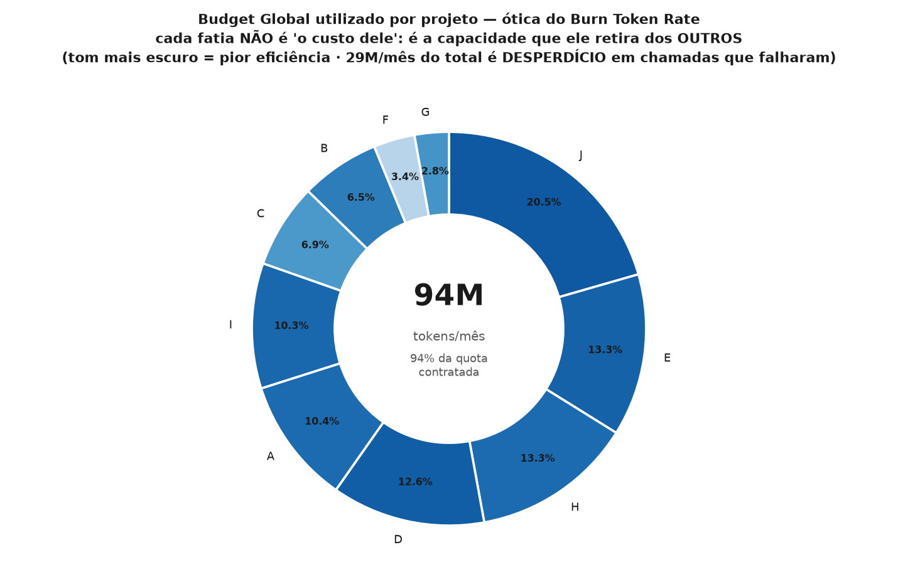

### ⚖️ Mukautuva jako ja RISTIINTUKI — kuka maksaa kenen puolesta

**Käsite.** **Kulutuksen mukaan** jakaminen on markkinastandardi, ja se on **itsensä oikeuttava**: eniten polttava saa suurimman kiintiön, mikä **oikeuttaa hukan**. Rehellinen jako perustuu **tuotettuun arvoon (EV)**.

**Menetelmä.** Kunkin kustannuspaikan kiintiö on `tasapohja (50 %) + tuotettu arvo (50 %)`, **mitoitettu uudelleen aina kun N muuttuu** — uudella projektilla on EV = 0 ja ilman pohjaa se saisi **nolla tokenia** eikä voisi koskaan tuottaa arvoa. **Ristiintuki** on erotus sen kiintiön, jonka se saisi **kulutuksensa** perusteella, ja sen, jonka se saisi **tuotoksensa** perusteella. Tukien summa on **täsmälleen nolla**: se on siirto, ei arvon luontia.

**Soveltaminen.** Tehokkuuden vaihteluväli on **68×**: Project F tuottaa **642** arvoa miljoonaa tokenia kohden; Project J, **10**. Ja jako paljastaa laskun: **R$ 3 431/kk — 40 % TCO:sta — siirtyy tehokkailta tehottomille, joka kuukausi, pimeässä.** Project F, salkun halvin, **maksaa Project J:n laskun**.

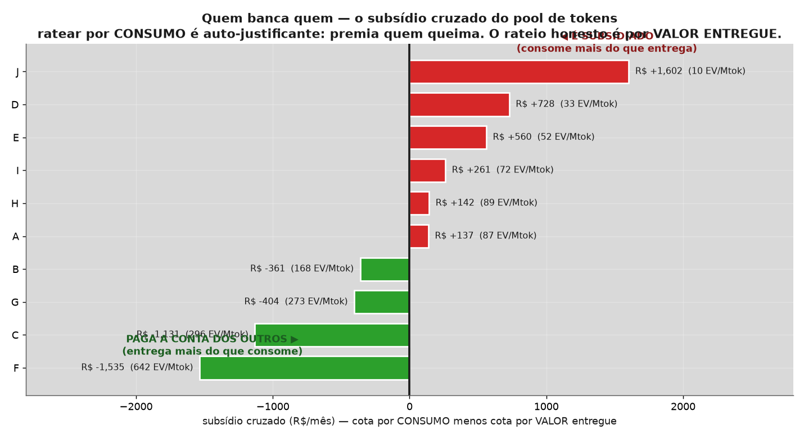

### 🔒 HINNOITELTU kilpailu resurssista — kausaaliketju sovellettuna SALKKUUN

**Käsite.** Kausaaliketju yhdistää **projektin sisällä**: `ajautunut token → riski → aikataulu (P80) → raha`. Tämä yhdistää **projektien VÄLILLÄ**: `yhden ylikulutus → poolin loppuminen → MUIDEN kuristaminen → HEIDÄN P80 luisuu → HEIDÄN viivästyskustannuksensa lähettää laskun`.

**Menetelmä.** Se vaatii **samanaikaisesti** FinOpsin (kiintiö), EVM:n (tuotettu arvo), riskin (altistuminen) ja simuloidun aikataulun (P80). Siksi **mikään markkinoiden työkalu ei tee tätä** — yhdelläkään ei ole neljää moottoria yhdessä. Langfuse näkee tokenin. Jira näkee tehtävän. CloudZero näkee laskun. **Yksikään ei osaa sanoa, että projekti J maksaa projektille F R$ X viivästystä.**

**Soveltaminen — ja rehellisyys, joka kannattelee lukua.** Kuristusskenaariossa **Project J aiheuttaa R$ 3 730 vahinkoa muille ja kärsii itse vain R$ 853** — saldo +2 877: se on **PAHANTEKIJÄ**. **Project C, 30× tehokkaampi, kärsii R$ 867 eikä aiheuta mitään** — se on **UHRI**. Saldojen summa on **nolla**: jokaisella pahantekijällä on uhri.

> ⚠️ **Mutta tänään pooli RIITTÄÄ** (94 % kiintiöstä). **Fyysistä kuristusta ei ole** — kukaan ei pysähdy, kukaan ei myöhästy. Vahinko on **allokatiivinen**, ei **operatiivinen**. Sanoa *"J viivästyttää C:tä"*, kun poolissa on pelivaraa, olisi **valhe tarkkuuden naamiossa**. Siksi moduuli on **skenaariopohjainen** ja **merkitty ennusteeksi**: se näyttää *mistä pisteestä* pooli kääntyy (+10 % kulutusta → koko salkku pysähtyy 0,9 päiväksi, R$ 1 497) ja *mitä se maksaa kun kääntyy*.

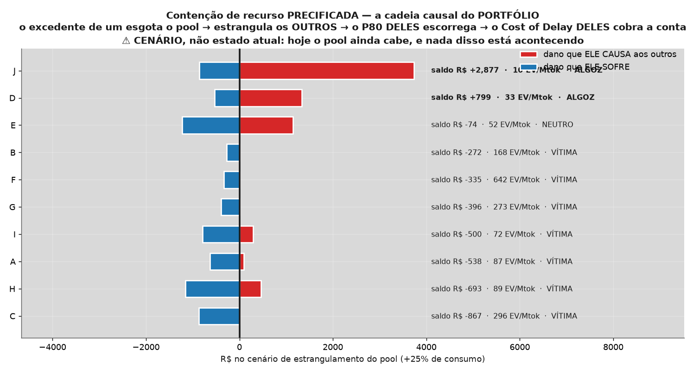

### 🪓 Leikkauspolitiikka — jos salkku tarvitsee tilaa, KUKA lähtee?

**Käsite.** Tämä on kysymys, johon salkkukomitea **ei koskaan osaa vastata**. Rajallisessa poolissa projektin N+1 hyväksyminen **ottaa tokeneita kaikilta N:ltä, jotka olivat jo siellä** — yhden projektin hyväksyminen **laimentaa kaikkia 9,1 %**.

**Menetelmä.** Rehellinen vastaus **ei ole "se joka kuluttaa eniten"** — raakakulutuksen mukaan leikkaaminen rankaisisi **suurta ja tuottavaa** projektia. Vastaus on **"se joka tuottaa vähiten TOKENIA KOHDEN"**: järjestäminen **tehokkuuden** mukaan (EV ÷ miljoona tokenia) vapauttaa eniten poolia **pienimmällä arvon menetyksellä**. Lävistäjä `y = x` erottaa leikkauksen joka **kannattaa** siitä joka **tuhoaa enemmän kuin vapauttaa**.

**Soveltaminen.** Project J:n leikkaaminen vapauttaa **20,5 % poolista** uhraten **1,9 % arvosta** — se avaa lähes 2 uutta paikkaa laimentamatta ketään. Project F:n leikkaaminen vapauttaisi 3,4 % ja uhraisi **21,2 % arvosta**: se **tuhoaisi enemmän arvoa kuin vapauttaisi kapasiteettia**. **Tämä ei ole "leikatkaa kuluja" — tämä on eksplisiittinen vaihtokauppa, numeroilla.**

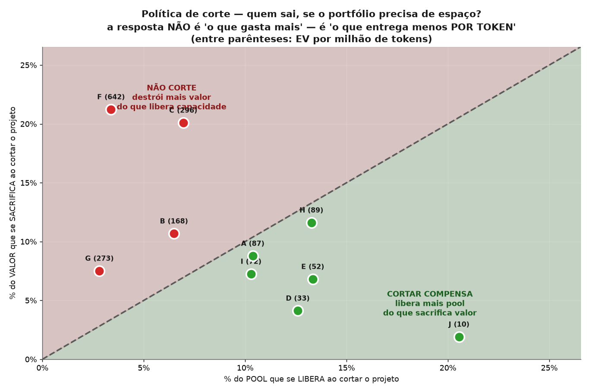

---
<!-- budget-loop-section -->

## 🔁 Budjetin uudelleenoppimissilmukka — agentti, joka **kehittyy ekosysteemin mukana**

**Terveellä ekosysteemillä on muisti.** Peto oppii, mikä saalis on jahdin arvoinen; kasvi oppii, minne kasvaa. Ilman tuota oppimista ei ole sopeutumista — vain sokeaa yritystä ja erehdystä, ikuisesti. Juuri se agentilta puuttui: se suositteli *hukan leikkaamista*, mutta **ei koskaan tarkistanut seuraavalla viikolla, vapauttiko sen itse määräämä leikkaus todella poolia.** Suositella tarkistamatta ei ole johtamista — se on kierrätettyä arvausta.

**Käsite.** PM Agent sulkee silmukan: se **tallentaa luvun** sillä viikolla, kun se suosittelee leikkausta, ja **vaatii itseltään tiliä** seuraavassa weeklyssä. Laskiko hukka? Suositus toimi. Eikö? Se epäonnistui. Se on sama **kontekstuaalinen bandiitti** kuin uudelleenoppimismoottori — nyt sovellettuna **token**-ulottuvuuteen, biosfäärin niukimpaan resurssiin.

**Menetelmä.** Vain toimintoa, jonka **se suositteli**, arvioidaan — se vastaa käskemästään eikä **ota kunniaa siitä, minkä sattuma vapautti**. Leikkaus toimi → sen luottamus tuohon suositukseen **nousee**. Ei toiminut → se **laskee**. Alle 2 %:n liike on kohinaa, eikä **se opi kohinasta**. Luottamus on **projektikohtainen**: agentti selvittää, mitkä leikkaukset vapauttavat poolia *siinä* ekosysteemissä.

**Suora hyöty.** Joka perjantai agentti saapuu weeklyyn tilityksen kanssa omasta neuvostaan: *"viime viikolla määräsin leikkaamaan HALLUSINAATIO_KOODIN; se vapautti R$ X poolia — nostan luottamustani"* tai *"ei purrut — lasken luottamustani ja harkitsen uudelleen"*. Ajan myötä se lakkaa toistamasta leikkausta, joka ei toimi sinun kontekstissasi, ja panostaa siihen, joka toimii. **Budjettisi ei enää toimi kiinteän säännön mukaan vaan agentin mukaan, joka oppi pelaamaan sinun laudallasi.**

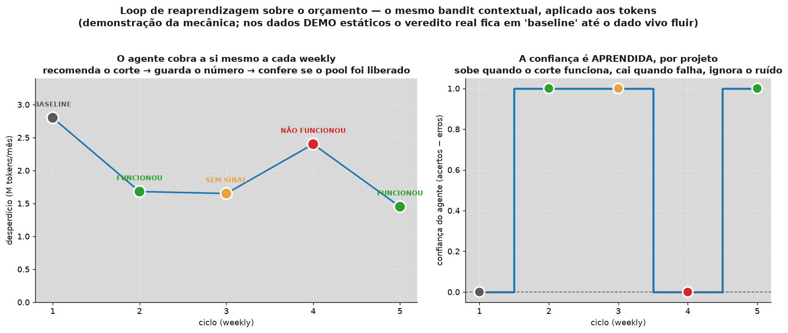

---
<!-- pm-agent-section -->

## 🤖 Project Manager Agent — lukee 10 ulottuvuutta, oppii ja **osaa vaieta**

Dashboard **diagnosoi**. Kausaaliketju **kvantifioi**. Agentti **päättää, mitä tehdä nyt** — ja oppii sykli syklin jälkeen, mikä vipu oikeasti liikuttaa neulaa *juuri siinä projektissa*. Se käy läpi **10 ulottuvuutta** (aikataulu, ROI, riski, tokenit, kustannus, mallin ajautuma, luotettavuus, laatu, virtaus ja hukka), muuntaa jokaisen **projektipäivä-ekvivalenteiksi × kyseisen projektin viivästyskustannus**, ja vastaa ainoaan kysymykseen, jolla on merkitystä: **mitä tehdä nyt ja mitä se on arvoinen.**

> **Heikkous, joka oli korjattava.** Agentti suositteli **aina** jotain: joka syklillä se otti suurimman vahingon ja huusi. **Agentti, joka huutaa joka viikko, muuttuu meluksi, ja melu ohitetaan** — se ei siis muuta mitään, olipa se kuinka oikeassa tahansa. **Siltä puuttui oikeus vaieta.** Juuri sen kolme alla olevaa menetelmää antavat.

### 🚦 PRINCE2 — *management by exception*: oikeus vaieta

**Käsite.** PRINCE2:n *management by exception* sanoo, ettei johtajaa **saa häiritä**, kun projekti pysyy sovituissa toleransseissa. Kun **ennuste** ylittää toleranssin — ei toteuma, vaan **ennuste** — laukeaa **Exception Report**.

**Menetelmä.** Toleranssi ulottuvuutta kohden (aika, kustannus, riski, laatu, hyöty). Eskalointi perustuu **ennusteeseen**: Monte Carlon P80 ja EVM:n EAC. Exception Reportissa on neljä pakollista osaa — **syy, vaikutus, VAIHTOEHDOT ja suositus**. Juuri *vaihtoehtojen* rivi erottaa poikkeamaraportin hälytyksestä: eskalointi ilman vaihtoehtoja on ongelman työntämistä ylöspäin, ei johtamista.

**Soveltaminen täällä.** Toleranssit **eivät ole keksimiämme lukuja** — ne tulevat siitä, minkä projekti **on jo ilmoittanut**: luvattu päivä (`prazo_alvo`), hyväksytty budjetti (`BAC`), **oman riskirekisterin** luokitus (`nivel='critico'`) ja **projektin oma laadun perustaso** (regressio itseään vastaan, DORA-tyyliin). Vain ROI-raja on eksplisiittinen linjaus — ja se on näkyvillä, jotta hallitus voi olla eri mieltä. Agentin tarjoamat vaihtoehdot ovat **absorboi** (polta johdon reservi), **palaudu** (tiivistä kriittinen polku) tai **neuvottele uudelleen** (siirrä päivää tai leikkaa laajuutta).

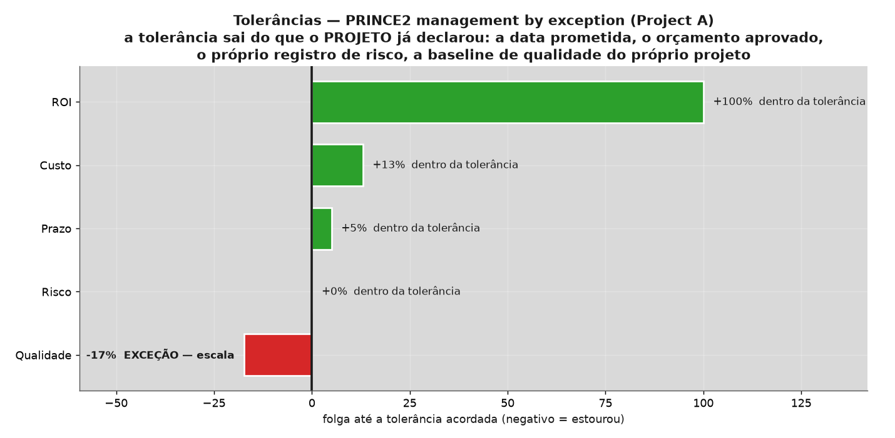

### 🌡️ CCPM (Goldratt) — *buffer management* ja kuumekäyrä

**Käsite.** Goldrattin *Critical Chainissa* puskuri ei ole jokaiseen tehtävään piilotettua rasvaa: se on **eksplisiittinen tyyny projektin lopussa**. **Kuumekäyrä** risteyttää *kuinka suuri osa ketjusta on valmis* ja *kuinka paljon puskuria on kulutettu*, ja kertoo, missä kolmesta vyöhykkeestä olet.

**Menetelmä.** Rajat ovat **diagonaalisia**, ja siinä on menetelmän ydin: puskurin polttaminen **lopussa** on normaalia — sen polttaminen **alussa** on vakavaa, koska edessä on vielä koko projekti. **VIHREÄ = älä tee mitään. KELTAINEN = suunnittele palautuminen. PUNAINEN = toimi nyt.**

```
verde/amarelo:    y = 1/3 + (1/3)·x
amarelo/vermelho: y = 2/3 + (1/3)·x
```

**Soveltaminen täällä.** Puskuri on `P80 − P50` **Monte Carlo -aikataulusta**, jota jo ajoimme. Kulutus on **Earned Schedule -viive** muunnettuna päiviksi. Ja juuri kuumekäyrä antaa agentille objektiivisen laukaisimen vaikenemiselle: **vihreä vyöhyke ja toleranssin sisällä = ei mitään eskaloitavaa.** Tänään **2 projektia 10:stä** saa juuri sen — ja vaikenemalla silloin kun ei ole sanottavaa, agentti ansaitsee oikeuden tulla kuulluksi silloin kun on.

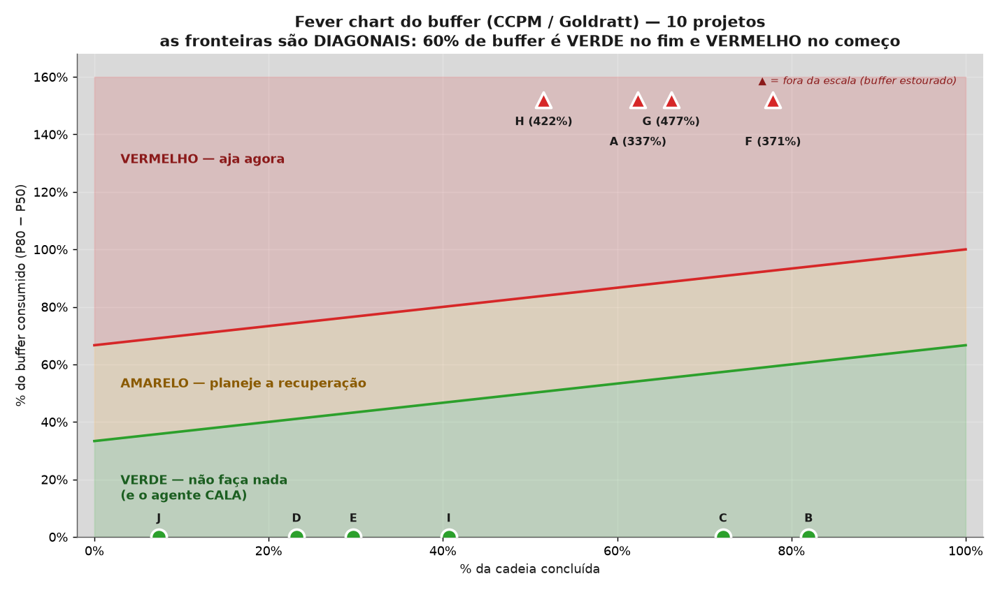

### 🏦 PMI — *reserve analysis*: varaus × johdon reservi

**Käsite.** PMI erottaa kaksi reserviä, jotka lähes kaikki sekoittavat: **varaus** kattaa *tunnetut tuntemattomat* (vaihtelun, jonka **mittasit**), ja **johdon reservi** kattaa *tuntemattomat tuntemattomat* (järkytyksen).

**Menetelmä.** `varaus = P80 − P50` ja `johdon reservi = P95 − P80`. Sekä vertailu, jota lähes kukaan ei tee: varaus, joka sinulla **on**, vastaan se, jonka **riskirekisterisi oikeuttaa** (EMV — *Integrated Cost-Schedule Risk Analysis*, Hulett). Kestopuskuri on **sokea riskitapahtumille**; juuri siinä lähes jokainen aikataulu huomaa olleensa optimistinen.

**Soveltaminen täällä — ja oppitunti rehellisyydestä.** ”Vaikutus 4” (asteikko 1–5) muuntaminen päiviksi vaatii kuvauksen, joka on **meidän, ei sinun**. Siksi **stressitestasimme oman oletuksemme**: puolittamalla oletetun vaikutuksen johtopäätös ”alivarattu” kääntyy **10/10:stä 1/10:een projektiin**. Se on **veitsenterällä**, eikä sitä siksi **myydä löydöksenä** — jokaisella projektilla on kenttä `robusto`, ja agentti **varoittaa, kun sen oma tulkinta ei kestä stressitestiä**. Se, mikä **jää ilman yhtäkään oletusta**, on puhdasta aritmetiikkaa, ja se on todellinen löydös: **puskuri on ~9 % ketjusta, kun CCPM työskentelee 25–50 %:lla.**

### 🏃 Sprintit ja perjantain weekly-keskustelu

**Käsite.** Perjantain *weeklyn* edistymiskeskustelu tarvitsee **lukuja**, ei mielipiteitä. Mielipide ei liikuta projektia.

**Menetelmä.** Kolme mittaria avaa keskustelun. **(1) Say-do-suhde** (`ΔEV ÷ ΔPV`): tiimi arvolla 0,7 **ei ole hidas** — se *lupaa 30 % enemmän kuin pystyy toimittamaan*. Kapasiteettia ei korjata painostamalla; sitoumus korjataan ennustettavuudella. Ja say-do **selvästi yli 1** ei myöskään ole sankaruutta: se on **rikkinäinen perustaso**. **(2) Sprintin paikallinen CPI**, erotettuna kumulatiivisesta **tarkoituksella** — kumulatiivinen on keskiarvo, ja keskiarvo **piilottaa** viimeisimmän huonon sprintin: kumulatiivinen CPI 1,05 voi kätkeä viimeisen sprintin arvolla 0,60. **Paikallinen syyttää; kumulatiivinen lohduttaa.** **(3) Nopeuteen perustuva ennuste**: jos tiimi tarvitsee 6 sprinttiä ja jäljellä on 4, **päivämäärä on jo kuollut** eikä kukaan huomannut, koska kumulatiivinen burndown *näyttää* yhä lähellä suunnitelmaa.

**Soveltaminen täällä.** Sprint **ei ole keksitty**: se on **EVM-jakso**, kadenssi, joka projektilla jo on, aidoilla PV/EV/AC-arvoilla. Aikataulun rinnalle rakennettu sprint-kalenteri loisi **toisen totuuden** samasta projektista — ja kaksi totuutta on sama kuin ei yhtään.

> **⚠️ Yhdenmukaisuus, suoraan sanottuna.** Tämä on **kadenssipohjainen edistymisraportti, joka perustuu EVM:ään (ANSI/EIA-748) ketterästä inspiroituneilla mittareilla** — **tämä ei ole Scrum**. *Scrum Guide 2020* **ei sisällä** ”velocitya” **eikä** ”burndown chartia” (ne ovat markkinakäytäntöä, eivät virallisia artefakteja), ja se korvasi Sprint Backlogin *commitmentin* **Sprint Goalilla**, kohdellen backlogia **ennusteena**. Näin ollen ”say-do-suhde (toimitettu ÷ sitoutunut)” on **teollisuuden** sanastoa, ei kanonista Scrumia. **Mittari on rehellinen; valehtelisi vasta etiketti.**

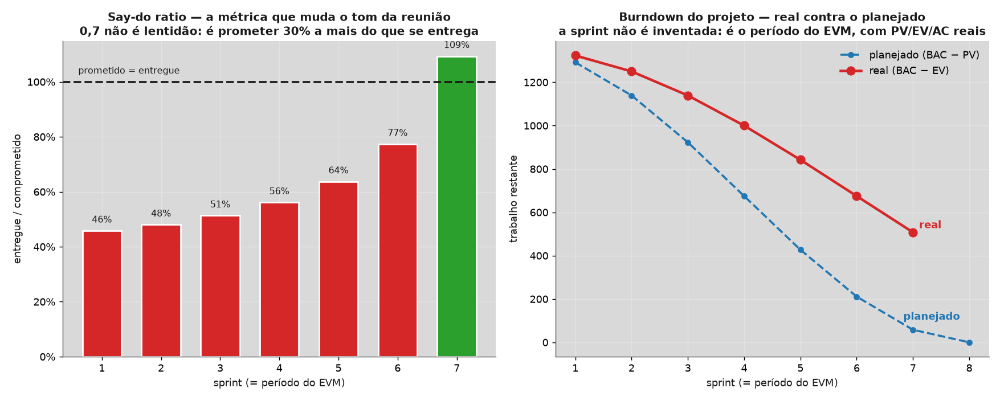

### 🎯 Tutka ja uudelleenoppimismoottori — miksi tämä ulottuvuus eikä toinen

Agentti **ei katso vain voittajaa** — se näyttää koko penkin. Jokainen ulottuvuus muuttuu **ekvivalenttipäiviksi**, päivät muuttuvat **rahaksi** *kyseisen* projektin viivästyskustannuksella, ja paino on se, mitä agentti **siellä oppi**. Prioriteetti on `vahinko × paino`.

**Uudelleenoppimismoottori** on *kontekstuaalinen bandiitti* — yksinkertainen ja auditoitava, ja sanomme sen suoraan: **tämä ei ole syväoppimista**. Joka syklillä agentti suosittelee vipua ja **tallentaa sen kohdemittarin**; seuraavalla syklillä se **vaatii itseltään tiliä**. Parani → paino **nousee**. Huononi → **laskee**. Alle 2 %:n liike on kohinaa, eikä **agentti opi kohinasta**. Vain **suosittelemansa** vipu arvioidaan: se vastaa siitä, mitä käski tehdä, **eikä ota kunniaa siitä, minkä sattuma paransi**. Tuloksena on profiili, joka **ei sovi naapuriprojektiin** — ja juuri se on pointti.

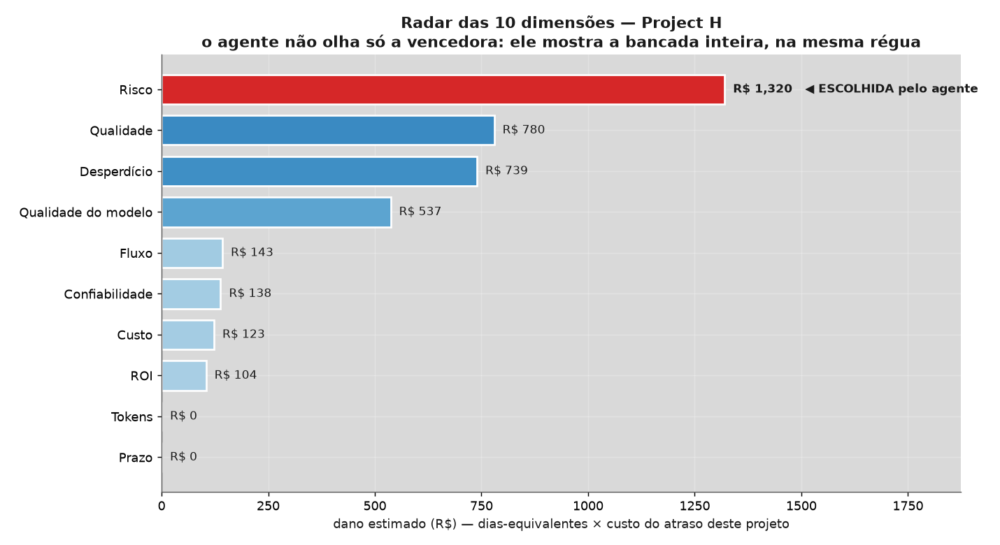

---
## 🌐 12 kieltä

Dashboard, projektikohtaiset sivut **ja kaavioiden kuvien sisäinen teksti** on lokalisoitu **12 kielelle**:
Português · English · Español · Français · Deutsch · 中文 · 한국어 · हिन्दी · עברית · Svenska · Русский · Suomi.
Kääntämistä ohjaa **Translation Memory** (SDL Trados -tyyliin), joka standardoi ja nopeuttaa uusia kieliä.

---

## 🙋 Vastaväitteet (kysymykset, joita kysyt itseltäsi juuri nyt)

- **"Minulla ei ole aikaa."** → Viisi minuuttia komennolla `./run_all.sh --mock`, ja dashboard pyörii näytölläsi.
  Mittaaminen **palauttaa** ne tunnit, jotka jo menetät uudelleentekemiseen ja hallusinaatioon.
- **"Se on liian monimutkaista."** → Yksi rivi. Kehys hoitaa ETL:n, laskennat, järjestyksen ja kuvat; **sinä vain
  luet tuomion.**
- **"Tekoälytoimintani on pieni."** → Juuri siksi jokainen dollari painaa enemmän. Pieni tänään, salkku huomenna —
  **mittaa ennen kuin skaalaat tuhlauksen.**
- **"En käytä Langfusea."** → Demo pyörii **100 % ilman Langfusea**. Kun haluat todellista dataa, kytket **oman**
  tilisi (et koskaan minun).
- **"Se on vain yksi kaunis dashboard lisää."** → Ei. Se on **Balanced Scorecard + investointianalyysi
  (NPV/IRR/MIRR/EAA) + monikriteeripäätös (AHP-TOPSIS)** — johtotason työkaluja, ei koristetta.
- **"Entä datani yksityisyys?"** → Demo on **100 % anonyymi** (Project A…J); todellinen data/nimet ja avaimet pysyvät
  **paketin ulkopuolella**. Ajat **paikallisesti**, **omalla** tililläsi.
- **"Paljonko se maksaa?"** → **Ei mitään.** Avoin lähdekoodi, omalla koneellasi. Ainoa hinta on jatkaa **mittaamatta
  jättämistä** — ja sitä maksat jo.

---

## 🧩 Mukana tulevat Skillit (*build & analyze your own*)

Tämä repositorio toimittaa uudelleenkäytettäviä **Skillejä** (Claude Code):

- **`measuring-ai-projects`** — määrittele/mittaa/raportoi tekoälyprojektien KPI:t (tämän kehyksen ydin).
- **`github-benchmark-analyzer`** — analysoi ja benchmarkkaa **mikä tahansa** GitHub-repositorio/-profiili (tähdet,
  forkit, seuraajat, hashtagit, README-tyyli, avainsanat, kielet) ja poimi, mikä johtajilla on yhteistä. **Rakenna ja
  analysoi oma salkkusi** — jopa markkinaa vastaan.

---

## 📚 Resurssit & viitteet (Awesome)

Jättiläisten hartiat, joilla tämä kehys seisoo:

- **Strategia & mittaus:** Kaplan & Norton — *The Balanced Scorecard* · Peter Drucker (tavoitejohtaminen).
- **Lean Six Sigma:** 8 hukan (Muda) taksonomia, PDCA/Kaizen, Ishikawa/RCA.
- **Yritysrahoitus:** Lawrence Gitman — *Principles of Managerial Finance* (NPV, IRR, MIRR, PI).
- **Monikriteeripäätös:** Thomas Saaty (**AHP**) · Hwang & Yoon (**TOPSIS**).
- **Tekninen pino:** [Langfuse](https://langfuse.com) (LLM observability) · [Evidence](https://evidence.dev)
  (BI as Code) · [Rust/PyO3](https://pyo3.rs) · [Tectonic](https://tectonic-typesetting.github.io) (LaTeX).

---

## 🗺️ Tiekartta

- [x] Putki Langfuse → SQLite → Evidence + Rust
- [x] 70+ KPI (BSC + API-talous + Lean) · EVM
- [x] Talous (NPV, IRR, MIRR, EAA, PI, takaisinmaksuaika, dollarisointi)
- [x] AHP-TOPSIS 2n + hallinnollinen dossier (6 työkalua)
- [x] Dashboard ja kuvat **12 kielellä**
- [ ] Lisää havainnoitavuuskonnektoreita (OpenTelemetry, Helicone)
- [ ] Monivuokralainen SaaS-tila + natiivi ajastus
- [ ] Staattisen dashboardin julkaisu (GitHub Pages)

---

## 🧰 Vaiheittainen asennus (paikallisesti, tyhjästä)

> Kaikki pyörii **omalla koneellasi**. Tekijän avaimet eivät tule paketin mukana eikä mikään data lähde koneeltasi.

### Vaihe 0 — Esivaatimukset

| Vaatimus | Versio | Pakollinen? | Mihin |
|---|---|---|---|
| **Python** | 3.10+ | ✅ | putki, KPI:t, Monte Carlo, MCDM |
| **Node.js + npm** | 18+ | ✅ | dashboard (Evidence) |
| **git** | mikä tahansa | ✅ | repositorion kloonaus |
| **Rust + maturin** | vakaa | ⬜ valinnainen | nopeuttaa lokien luokittelua |
| **tectonic** | mikä tahansa | ⬜ valinnainen | rakentaa PDF-pitch deckit |

*Windowsissa käytä **WSL:ää** tai **Git Bashia** — putki on `bash`-skripti.*

### Vaihe 1 — Kloonaa repositorio
```bash
git clone https://github.com/bpenedo/Gestao-de-Projetos-PM-IA-BSC-DashBoard.git
cd Gestao-de-Projetos-PM-IA-BSC-DashBoard
```

### Vaihe 2 — Eristetty Python-ympäristö
```bash
cd foundations/pipeline
python3 -m venv .venv
source .venv/bin/activate        # Windows (PowerShell): .venv\Scripts\Activate.ps1
pip install -r requirements.txt
```

### Vaihe 3 — Dashboardin riippuvuudet
```bash
cd ../evidence
npm install
```

### Vaihe 4 — Aja demo (anonyymi, ilman tunnuksia)
```bash
cd ../pipeline
./run_all.sh --mock
```

Järjestyksessä: anonyymi demodata → KPI:t → NPV/IRR/MIRR/EAA/PI → **jakaumien sovitus tokeneihin** →
**Monte Carlo (10 000 iteraatiota)** → AHP-TOPSIS 2n → **DEMATEL · ELECTRE · PROMETHEE · MAUT · MCDA-C** →
**rankingin robustius (Dirichlet)** → kuvaajat → hallinnollinen dossier → 5D-kartta → pitch deckit → dashboardin build.

### Vaihe 5 — Avaa dashboard
```bash
cd ../evidence
npm run dev          # http://localhost:3000
npm run preview      # (alternativa) serve o estático já compilado em build/
```

### Vaihe 6 — Vaihda OMIIN tietoihisi

**6.1 — Tunnukset ja parametrit** (kaikki valinnaisia; ilman `.env`-tiedostoa käytetään oletuksia):
```bash
cd ../pipeline
cp .env.example .env      # edite: LANGFUSE_PUBLIC_KEY, LANGFUSE_SECRET_KEY, SELIC_ANUAL, USD_BRL...
```

**6.2 — Oma kassavirtasi** (se ruokkii NPV:n, IRR:n ja Monte Carlon):
```bash
cp fluxo_caixa_template.csv fluxo_caixa.csv
```
Muoto: `periodo 0` on investointi (negatiivinen virta) ja `taxa` on jaksokohtainen diskonttokorko (`0.10` = 10 %).
```csv
project_name,periodo,fluxo,taxa
Project A,0,-12000,0.10
Project A,1,3000,0.10
Project A,2,4000,0.10
```

**6.3 — Aja oikealla datalla:**
```bash
./run_all.sh          # sem --mock: sincroniza do Langfuse e usa fluxo_caixa.csv
```

### Vaihe 7 (valinnainen) — Kiihdytys ja PDF:t
```bash
cd analise_rs && maturin develop --release && cd ..   # Rust (PyO3): classificação mais rápida
```
Pitch deckejä varten asenna **tectonic** (esim. `cargo install tectonic` tai jakelusi paketinhallinta).

### Vaihe 8 (valinnainen) — Ajasta päivitys
```bash
crontab -e
*/15 * * * * /CAMINHO/ABSOLUTO/foundations/pipeline/run_all.sh >> /tmp/bsc.log 2>&1
```

### 🩺 Yleiset ongelmat

| Oire | Todennäköinen syy | Ratkaisu |
|---|---|---|
| `no such table: ...` | tietokantaa ei alustettu | `python3 db.py` |
| Dashboardin build epäonnistuu | vanhat artefaktit | `rm -rf ../evidence/build && npm run build` |
| `findfont: Failed to find font weight` | matplotlibin varoitus | vaaraton, ohita |
| `Precisa de ≥2 projetos` | salkussa vain yksi projekti | MCDM vertailee vaihtoehtoja; lisää toinen |
| `KS p-arvo < 0,05` ruudulla | jakauma ei kuvaa dataasi hyvin | kerää lisää havaintoja; kehys varoittaa eikä piilota |
| Luvut muuttuvat ajokertojen välillä | siemen vaihdettu | pidä `MC_SEED` kiinteänä toistettavuuden vuoksi |

---

## 🤝 Osallistuminen

Kontribuutiot ovat **erittäin tervetulleita**! Avaa *issue*, joka kuvaa ehdotuksesi (uusi KPI, konnektori, kieli,
korjaus), ja lähetä *pull request*. Standardit: luettava, ympäristöönsä sopiva koodi, ei henkilötietoja paketissa
(demo on anonyymi). Uudet kielet: lisää kohteet Translation Memoryyn ja aja generaattori. Bugeja sattuu — osallistu ja raportoi niistä. Paras on hyvän vihollinen: valmis on parempi kuin täydellinen!

## 📄 Lisenssi & tekijyys

© **Bruno Penedo** — 2026. Käyttöä, opiskelua ja kontribuutioita kannustetaan; kaupallista käyttöä/uudelleenjakelua
varten ota yhteyttä tekijään. *(Muodollinen OSS-lisenssi voidaan lisätä — avaa issue mieltymyksesi kera.)*

## 🏷️ Topics
`awesome-list` · `education` · `resources` · `computer-science` · `python` · `business-intelligence` ·
`llmops` · `finops` · `aiops` · `programming` · `development` · `lists` · `free` · `unicorns` · `dashboard` ·
`balanced-scorecard` · `langfuse` · `llm-observability` · `kpi` · `project-management`

---

⭐ **Jos tämä kehys valaisee tekoälymenojasi, jätä tähti — ja ala ansaita sillä, mistä jo maksat.**

---

**Framework Gestão de Projetos (PM) IA com Painel BSC e DashBoard** · ©️ Bruno Penedo — 2026. https://linkedin.com/in/bpenedo - E-mail: bpenedo@gmail.com
