# 🧭 Gestão de Projetos PM IA BSC DashBoard (Build and Analyze Your Own AI Portfolio Projects)


🌐 **Português** · [English](README.en.md) · [Español](README.es.md) · [Français](README.fr.md) · [Deutsch](README.de.md) · [中文](README.zh.md) · [한국어](README.ko.md) · [हिन्दी](README.hi.md) · [עברית](README.he.md) · [Svenska](README.sv.md) · [Русский](README.ru.md) · [Suomi](README.fi.md)


### 💸 Você paga pela IA todo mês. Mas a IA está pagando **você**?

Toda vez que o cartão é debitado por **ChatGPT, Claude, Copilot, Gemini, Perplexity, DeepSeek, Kimi, Qwen…**,
uma pergunta de **milhões** fica sem resposta: **cadê o retorno?** Quantas horas-homem foram realmente
poupadas? Quanto do seu dinheiro **evaporou** em alucinação, retrabalho e espera? Qual projeto de IA **merece
escalar hoje** — e qual está **sangrando caixa** enquanto você aplaude a "inovação"?

Você não tem um custo de IA. Você tem um **vazamento silencioso** — e está de olhos vendados. Porque
*"o que não é medido não pode ser gerenciado nem melhorado"* — e o mercado mede por você, cobrando a conta.

**Este framework acende a luz.** Ele transforma o **gasto invisível** das suas assinaturas de IA em **retorno
mensurável, comparável e auditável** — sob o rigor do **Balanced Scorecard** (Kaplan & Norton), da **análise
de investimentos de nível Wall Street** e da **decisão multicritério**. É a diferença entre *torcer* e *saber*.
Entre pagar pela IA e **lucrar** com ela.

> *"O que não é medido não pode ser gerenciado nem melhorado."* — Kaplan & Norton

> *"Quem mede com precisão, constrói com excelência."* — Pierre Vernier

> *Quando você ora e estuda, não deixe [minhas palavras] te abandonarem. Com cada palavra e expressão que sai de seus lábios, tenha em mente trazer uma Unificação.* — Aryeh Kaplan

> *A metafísica pura, situando-se, por essência, acima e além de todas as formas e de todas as contingências, não é nem oriental nem ocidental: é universal.* — René Guénon

> *Conhecer a si mesmo é conhecer a própria linhagem e o próprio poder.* — Harvey Spencer Lewis

> *Scientia es Lux Lucis* ∞ Sapere Aude S∴A∴☬ ☿

> 🐺 **Pare de PAGAR por IA no escuro.** Enquanto o mercado assina IA na fé — e vira a estatística da
> **Gartner** (≥30% dos projetos de GenAI abandonados após o piloto) —, **você** vai medir cada token, eleger
> o projeto vencedor e converter gasto invisível em **retorno auditável**: VPL · TIR · MIRR · VUL · 70+ KPIs ·
> decisão multicritério · dashboard C-Level em **12 idiomas**. **A IA já é sua. Agora torne-a LUCRATIVA** —
> de graça, na sua máquina, em **5 minutos**: `./run_all.sh --mock && npm run dev` 🔥

> 📖 **Documentação principal:** **[`foundations/README.md`](foundations/README.md)** ·
> ⚙️ **Setup (traga suas chaves):** [`foundations/pipeline/SETUP.md`](foundations/pipeline/SETUP.md) ·
> 📊 **KPIs:** [`foundations/KPIs.md`](foundations/KPIs.md) / [`foundations/KPIs_README.md`](foundations/KPIs_README.md)

---

## 📑 Índice

- [🌅 Por que isto muda o jogo](#-por-que-isto-muda-o-jogo)
- [📈 A evidência (Gartner · IDC · PwC · McKinsey · MIT)](#-a-evidência-gartner--idc--pwc--mckinsey--mit)
- [💥 O custo da inação](#-o-custo-da-inação-faça-a-conta-que-ninguém-faz)
- [✨ Funcionalidades](#-funcionalidades)
- [📸 Telas (dashboard anônimo)](#-telas-dashboard-anônimo)
- [🚀 Início rápido](#-início-rápido-demo-sem-langfuse)
- [🏗️ Arquitetura](#️-arquitetura)
- [📊 Catálogo de KPIs](#-catálogo-de-kpis-70)
- [💰 Análise financeira de investimento](#-análise-financeira-de-investimento)
- [🏆 Decisão multicritério + Dossiê](#-decisão-multicritério-ahp-topsis-2n--dossiê-da-jóia-da-coroa)
- [🎲 Monte Carlo — o risco que a média esconde](#-monte-carlo--o-risco-que-a-média-esconde)
- [🧮 Cinco escolas de decisão. Um único veredito.](#-cinco-escolas-de-decisão-um-único-veredito)
- [🔬 O sinal está a montante — e é aí que mora a alavancagem](#-o-sinal-está-a-montante--e-é-aí-que-mora-a-alavancagem)
- [🎓 Fundamentos: o que é Monte Carlo e o que é a Decisão Multicritério](#-fundamentos-o-que-é-monte-carlo-e-o-que-é-a-decisão-multicritério)
- [🌐 12 idiomas](#-12-idiomas)
- [🙋 Objeções (as perguntas que você está se fazendo agora)](#-objeções-as-perguntas-que-você-está-se-fazendo-agora)
- [🧩 Skills incluídas](#-skills-incluídas-build--analyze-your-own)
- [📚 Recursos & referências](#-recursos--referências-awesome)
- [🗺️ Roadmap](#️-roadmap)
- [🧰 Setup passo a passo (local, do zero)](#-setup-passo-a-passo-local-do-zero)
- [🤝 Contribuindo](#-contribuindo)
- [📄 Licença & autoria](#-licença--autoria)

---

## 🌅 Por que isto muda o jogo

**Existem dois tipos de pessoas na era da IA.** As primeiras assinam tudo, gastam alto e **rezam** para dar
certo — e engrossam a estatística cruel dos projetos que morrem no piloto. As segundas fazem o que Wall Street
faz com qualquer ativo sério: **medem, comparam, priorizam e realocam** — e transformam cada dólar de assinatura
em **retorno composto**. A única diferença entre elas **não é talento nem orçamento. É instrumentação.**

A IA generativa criou uma nova classe de despesa recorrente — **assinaturas e tokens** — e, com ela, o
desperdício mais caro da década: **o invisível.** O que você não vê, você não corrige. O que você não mede,
você não escala. E o que você não prova, o board não aprova.

**Este projeto te move da primeira tribo para a segunda.** Ele instrumenta cada projeto de IA como um **ativo
financeiro** e o mede sob o **Balanced Scorecard**, a **análise de investimentos (VPL, TIR, MIRR, VUL, ILL,
Payback)** e o **Lean Six Sigma** — e ainda **elege o melhor projeto do seu portfólio** por um modelo
multicritério (**AHP-TOPSIS 2n**). O boleto mensal opaco vira uma **tese de investimento auditável**: você
descobre, com números, onde escalar, onde cortar, onde a assinatura se paga em **semanas** — e onde ela sangra
sem cobertura.

Somos **pioneiros** de um território novo — a **fronteira entre a inteligência artificial e a inteligência financeira de alto valor**. Como exploradores que cartografam terras ainda sem mapa, este framework é a **bússola** (🧭) que
converte a névoa das assinaturas em **rotas claras de retorno**: cada token, uma milha; cada projeto, uma
expedição rumo ao lucro. Onde havia custo cego, nasce **oportunidade mensurável**; onde havia planilha morta,
floresce uma **tese de investimento viva**.

### 🚀 Para Micro-SaaS, SaaS, Startups e Solopreneurs

Há uma coisa que ninguém te contou quando você embutiu IA no seu produto: **você acabou de mover a IA do seu
orçamento de marketing para o seu COGS.** E COGS que cresce com o uso não é despesa — é uma **hipoteca sobre a
sua margem bruta**. Cada usuário novo passa a custar tokens. Cada retry por alucinação é margem queimada duas
vezes. E a conta só aparece no fim do mês, quando já não dá para desfazer.

| Você é… | A dor que ninguém mede | O que este framework devolve |
|---|---|---|
| **Solopreneur** | você *é* o time; sua hora é o ativo mais caro que existe | o **tornado** aponta a variável que move o resultado — logo, **onde investir a sua próxima hora** |
| **Micro-SaaS** | o custo de token cresce com o uso e come a margem em silêncio | distribuição **ajustada aos seus tokens reais** + **CVaR**: o mês ruim tem preço *antes* de chegar |
| **SaaS em escala** | cada feature de IA é um projeto disputando o mesmo roadmap | **cinco métodos** elegem qual entra — e a **robustez** diz se o 1º lugar sobrevive a um erro de 2 pontos no peso |
| **Startup levantando** | o investidor não compra *"usamos IA"* | ele compra **VPL, TIR, payback e `P(VPL<0)`** — e o **pitch deck sai pronto**, em LaTeX |

**O que isso muda na prática.** Sua margem bruta deixa de ser uma estimativa e vira uma **distribuição com
cauda precificada**. O seu *runway* deixa de ser uma divisão simples e passa a ter **VaR**: *"em 19 de cada 20
cenários, meu caixa dura pelo menos N meses."* E na hora do *board deck* ou da *due diligence*, você não abre
uma planilha que ninguém consegue reproduzir — você abre um número com **semente fixa**, que qualquer sócio,
investidor ou auditor reroda e obtém **exatamente igual**.

> **Reposicionamento brutal:** o solopreneur passa a decidir como um CFO. E o CFO passa a decidir com a
> velocidade de um solopreneur.

> **A promessa:** transformar quem *paga por IA* em quem *lucra com IA* — e quem *usa IA* em quem
> **pioneiramente a domina, mede e multiplica**. Com números, não com fé.

---

## 📈 A evidência (Gartner · IDC · PwC · McKinsey · MIT)

Não peça para acreditar em mim. **Acredite nos institutos que estudam isso há décadas** — e cujo veredito é
unânime: **a IA cria um valor imenso, mas só entrega para quem mede e governa.** Quem "usa IA sem dominar"
vira estatística de abandono; quem instrumenta o retorno **fica com o prêmio**.

- 🧭 **Gartner** — previu que **≥ 30% dos projetos de IA generativa seriam abandonados após a prova de conceito
  até o fim de 2025**, tendo como causa central o **valor de negócio pouco claro** (além de dados ruins, custos
  crescentes e controles frágeis). *→ sem medição, o projeto morre no piloto.*
- 🔬 **MIT** (relatório *"The GenAI Divide / State of AI in Business 2025"*, iniciativa NANDA) — amplamente
  noticiado que a **grande maioria dos pilotos corporativos de GenAI não gera impacto mensurável no P&L**; a
  minoria que entrega valor combina IA com **processo e medição**. *→ a diferença é medir, não adotar.*
- 💵 **IDC** (estudo *"The Business Opportunity of AI"*, patrocinado pela Microsoft) — organizações que **medem
  e otimizam** reportaram retorno na ordem de **vários dólares para cada US$ 1** investido em IA, com forte
  dispersão entre líderes e retardatários. *→ o ROI existe — e favorece quem instrumenta.*
- 🌍 **PwC** (*"Sizing the Prize"*) — estima que a IA pode adicionar até **~US$ 15,7 trilhões** à economia
  global até 2030; mas o prêmio vai para quem **captura** o valor, não para quem apenas o consome. *→ o bolo é
  gigante; a fatia é de quem mensura.*
- 🏆 **McKinsey** (*"The State of AI"*) e **BCG × MIT Sloan** — um grupo minoritário de **"AI high performers"**
  captura retorno desproporcional; a virada acontece quando a IA é acoplada a **métricas, governança e
  reinvestimento** onde há retorno comprovado. *→ vencedores medem, priorizam e realocam.*

> **É exatamente esse fosso que este framework atravessa:** ele te tira do lado que *abandona no piloto* e te
> coloca no lado que tem **resultado propriamente dito e provado** — com BSC, análise de investimento e decisão
> multicritério.

> ⚠️ **Nota de honestidade (leia):** os números acima refletem manchetes reais desses institutos, mas
> **relatórios e percentuais são atualizados** — confirme os valores exatos e o ano nas **fontes primárias**
> (Gartner Newsroom; IDC/Microsoft *Business Opportunity of AI*; PwC *Sizing the Prize*; McKinsey *State of AI*;
> MIT *State of AI in Business*) antes de citar em material oficial. Aqui eles servem como **fundamentação
> direcional**, não como garantia numérica.

---

## 💥 O custo da inação (faça a conta que ninguém faz)

Uma assinatura **PRO de IA** custa entre **US$ 20 e US$ 200 por mês, por assento**. Multiplique pelo número de
pessoas do seu time. Multiplique por 12 meses. Agora aplique o que os institutos **já provaram**: a **Gartner**
projeta **≥ 30% de abandono** e o **MIT** mostra que a **maioria dos pilotos não retorna**. Uma fatia enorme
desse total não é investimento — é **sangria pura**.

> **Exemplo direto (troque pelos seus números):** 10 assentos × US$ 30/mês × 12 = **US$ 3.600/ano**. Se ~30%
> viram desperdício invisível, são **~US$ 1.080/ano evaporando** — de UM time pequeno, em UM ano. No seu número
> real, o susto é maior.

E aqui está a parte que dói: **esse custo é composto e não espera.** Cada mês sem medir é um mês de vazamento
que **não volta** — enquanto o concorrente que instrumentou já está **realocando capital para o que rende**.
Vantagem de pioneiro se constrói cedo: **quem mede primeiro, escala primeiro.**

O momento de menor custo para começar foi ontem. O segundo melhor é **agora** — e custa **US$ 0** e **5
minutos**. A pergunta não é *"posso pagar para medir?"*. É ***"quanto tempo mais posso pagar para NÃO medir?"***

---

## ✨ Funcionalidades

- **📊 KPIs (4 perspectivas BSC) + economia de APIs:** maturidade, capital humano, financeiro e eficiência de
  tokens — `IEET`, `IOLI`, `ITR`, `IITA`, `PEUC`, `ICCA`, `IDLS`, `IBMT` — mais **EVM** (CPI/SPI/EAC).
- **🪙 Conceitos de fronteira:** **VRT/kTR** (unidade de recuperação de custo tokenizável — *"o m² de Gitman"*)
  e **PSR** (Project Score 0–5 ⭐) para ranquear a saúde de cada projeto.
- **🔬 Diagnóstico operacional:** **VRT em 5 blocos**, **HCI** (horário crítico de interrupção), **Wastes Lean
  Six Sigma** (tokens ponderados) e **RCA de alucinação por taxonomia de prompt** (gargalo por projeto + interseção).
- **💰 Financeiro completo:** **VPL/NPV, TIR/IRR, TIRM (TIR Modificada/MIRR), VUL (Valor Uniforme Líquido),
  ILL (PI), Payback** simples e descontado, **dolarização** e comparação com **SELIC** e os **juros dos EUA**.
- **🏆 Decisão multicritério (5 métodos):** **DEMATEL** (estrutura causal + pesos por influência) alimentando
  **ELECTRE I · PROMETHEE II · MAUT · MCDA-C · AHP-TOPSIS 2n**, com **consenso de Borda** e **dossiê administrativo**
  (SWOT, PESTELC, 5W4H, Pareto, GUT, Radar).
- **🎲 Risco (Monte Carlo):** **10.000 iterações** por projeto, **20 distribuições**, matriz de
  correlação (Iman-Conover), **P(VPL<0)**, **VaR/CVaR 5%**, percentis 1–99% e **tornado** (regressão + correlação).
- **🗺️ Visual C-Level:** **mapa 5D interativo**, donuts com profundidade, quadrante de sustentabilidade,
  tendências e **pitch decks** em LaTeX dos projetos elegíveis.
- **⚙️ Pipeline real:** **Langfuse → SQLite → Evidence**, com sync **assíncrono concorrente** e classificação
  acelerada em **Rust (PyO3)**.
- **💳 FinOps de IA:** catálogo de **planos de assinatura** (OpenAI, Anthropic, Google, Perplexity, xAI,
  Mistral, DeepSeek, Kimi, Qwen…) com **câmbio + IOF** e base de **rateio** (burn rate).
- **🌐 12 idiomas** no dashboard **e nas imagens dos gráficos** (incl. Devanagari, Hebraico e CJK).

---

## 📸 Telas (dashboard anônimo)

> Demonstração 100% anônima (projetos exibidos como *Project A…J*). Os dados/nomes reais nunca acompanham o pacote.

**🌐 Mapa 5D do portfólio** — 5 dimensões por projeto: **X**=tokens · **Y**=PEUC (qualidade) · **Z**=PSR (saúde)
· **tamanho**=Burn Rate · **cor**=ICCA (sustentabilidade). *Onde escalar? Direita/fundo, alto e verde. Onde
cortar? Grande e vermelho.*

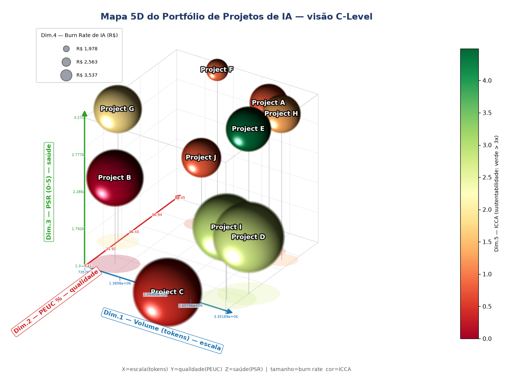

**🏆 Dossiê da "Jóia da Coroa"** (projeto eleito pelo AHP-TOPSIS) — gerado por pipeline Python concorrente:

| SWOT | Radar competitivo |
|---|---|
| 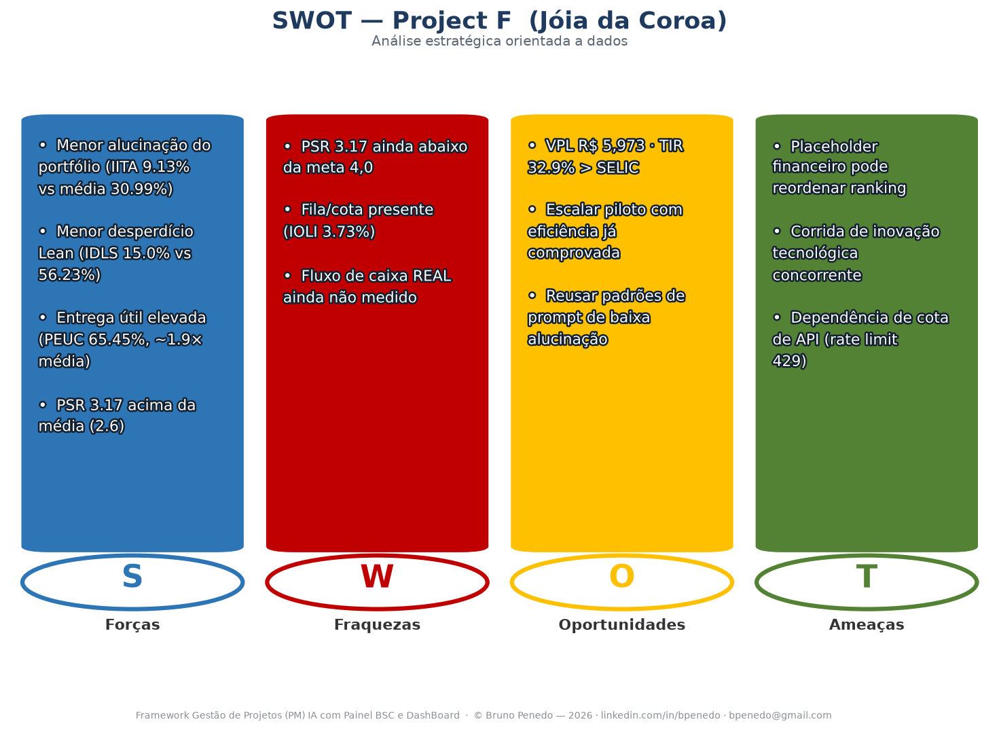 | 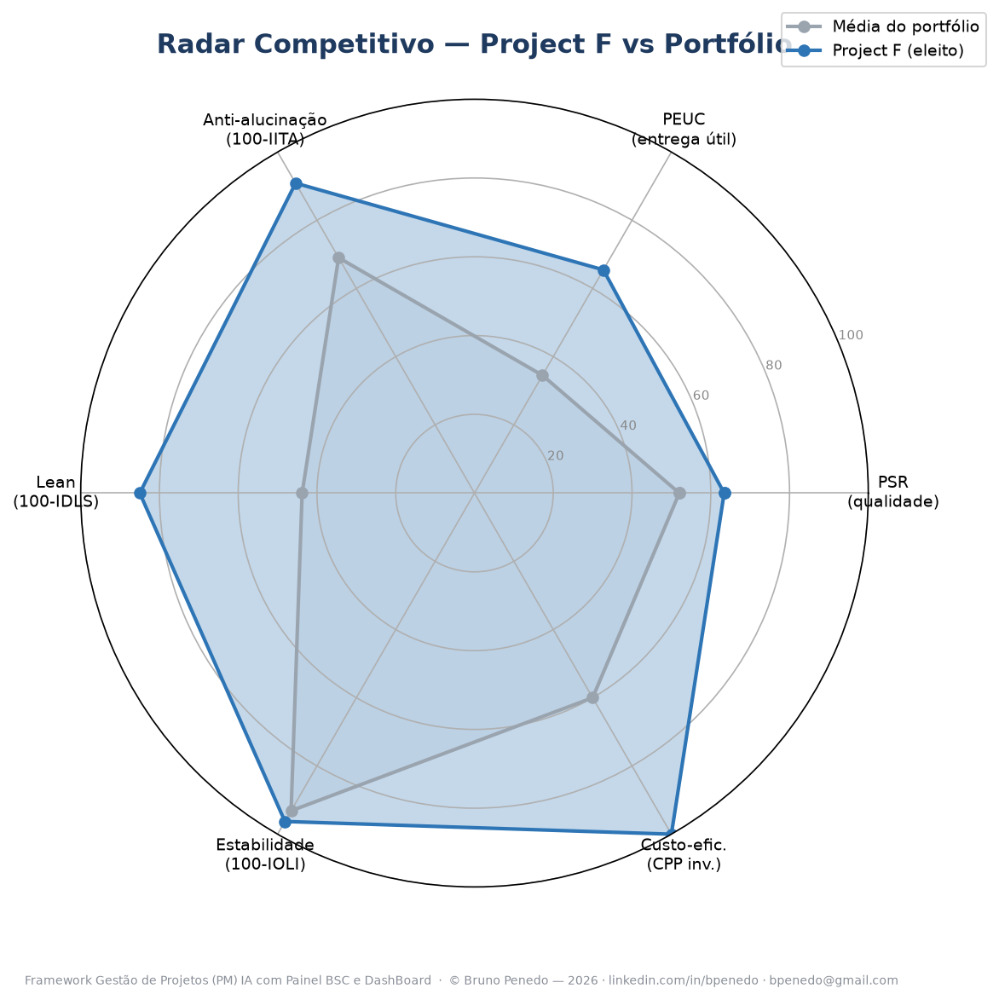 |

| PESTELC (macroambiente) | Matriz GUT (priorização) |
|---|---|
| 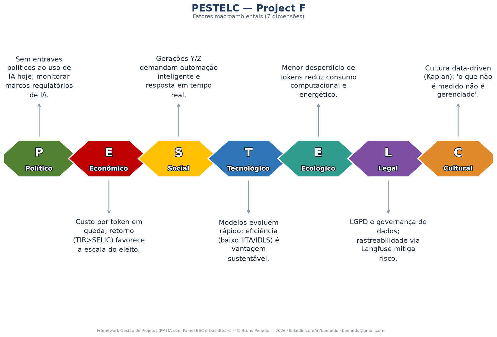 | 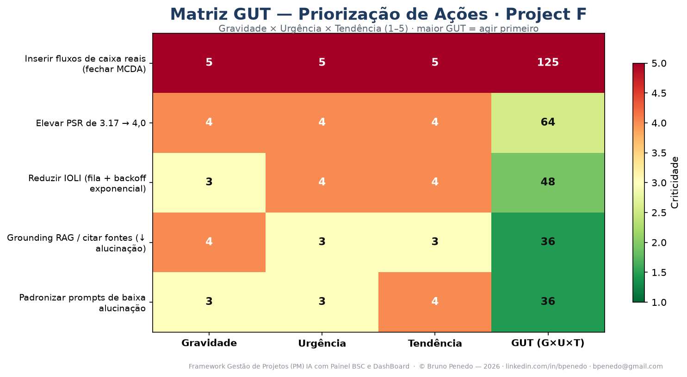 |

| 5W4H (plano de ação) | Pareto de falhas (80/20) |
|---|---|
| 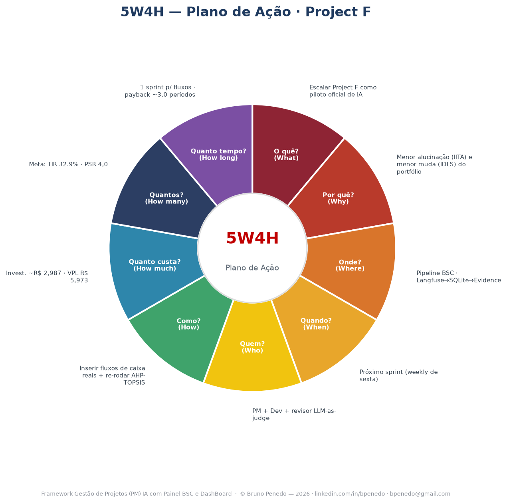 | 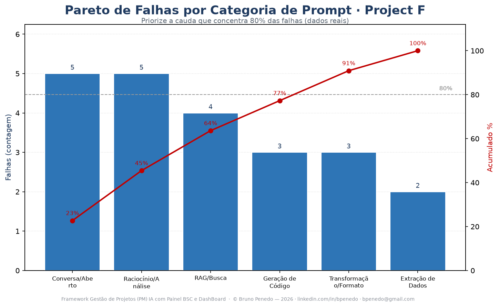 |

---

## 🚀 Início rápido (demo, sem Langfuse)

**Zero risco. Zero custo. 5 minutos.** Rode na sua máquina e veja o dashboard completo com dados anônimos:

```bash
cd foundations/pipeline
pip install -r requirements.txt
cd ../evidence && npm install && cd ../pipeline
./run_all.sh --mock          # dados anônimos (Project A..J) -> KPIs -> VPL/TIRM/VUL -> 5D -> pitch decks -> dashboard
cd ../evidence && npm run dev # http://localhost:3000
```

Para **dados reais**, preencha `foundations/pipeline/.env` com **as suas chaves** do Langfuse
(ver [`SETUP.md`](foundations/pipeline/SETUP.md)) e rode `./run_all.sh`. Cada usuário usa a **própria conta** —
nenhuma chave do autor acompanha o pacote.

---

## 🏗️ Arquitetura

```
   As suas apps de IA            Observabilidade        Analytics-as-Code           Você
 (ChatGPT, Claude, API…)   ┌──────────────┐   ┌──────────────────┐   ┌──────────────────────┐
        │ traces           │   Langfuse   │   │  SQLite (schema  │   │  Evidence (BI as     │
        └─────────────────▶│  (SDK v4)    │──▶│  + queries KPI)  │──▶│  Code) · 12 idiomas  │
                           └──────────────┘   └──────────────────┘   └──────────┬───────────┘
   sync assíncrono concorrente        classificação em Rust (PyO3)              │
                                                                    ┌───────────┴───────────┐
                                                                    │ AHP-TOPSIS · Dossiê   │
                                                                    │ 5D · Pitch decks (TeX)│
                                                                    └───────────────────────┘
```

**Stack:** Python 3.13 · SQLite/DuckDB · Evidence.dev (SvelteKit) · Rust + PyO3 + maturin · matplotlib ·
tectonic (LaTeX) · fontes Noto/WenQuanYi para i18n de imagem.

---

## 📊 Catálogo de KPIs (70+)

Amostra (catálogo completo em [`foundations/KPIs_Lean6s_BSC.md`](foundations/KPIs_Lean6s_BSC.md)):

| Sigla | Nome | O que responde |
|---|---|---|
| **PSR** | Project Score Rating (0–5) | Saúde geral do projeto de IA |
| **PEUC** | % de Entrega Útil por Consumo | Quanto do gasto virou entrega útil |
| **IITA** | Índice de Incidência de Tokens Alucinados | % de alucinação/retrabalho |
| **IDLS** | Índice de Desperdício Lean | Muda (tokens ponderados por severidade) |
| **VRT/kTR** | Valor de Recuperação Tokenizável | "m² de Gitman" — custo por 1k tokens |
| **ICCA** | Índice de Cobertura de Custo por Assinatura | Cobre o custo? (>3× saudável) |
| **CPP** | Custo por Ponto de Progresso | Indicador-mestre (quanto menor, melhor) |

---

## 💰 Análise financeira de investimento

Cada projeto vira uma **tese de investimento**: a partir do seu fluxo de caixa (CSV), o framework calcula
**VPL/NPV**, **TIR/IRR**, **TIRM (MIRR — reinveste ao custo do projeto)**, **VUL (anuidade equivalente do
VPL)**, **ILL (índice de lucratividade)** e **Payback** simples/descontado — **dolarizando** o fluxo e
comparando com a **SELIC** e os **juros dos EUA**. Gera **pitch deck** em LaTeX para todo projeto com **VPL > 0
e ILL > 1** em BRL **e** USD. O objetivo é brutalmente prático: **descobrir se a sua assinatura de IA se paga —
e em quanto tempo.**

---

## 🏆 Decisão multicritério (AHP-TOPSIS 2n) + Dossiê da Jóia da Coroa

Quando há vários projetos, qual escalar primeiro? O modelo **AHP-TOPSIS 2n** pondera os indicadores como
critérios (pesos por **AHP** com razão de consistência **CR ≤ 0,10**) e ranqueia por **TOPSIS** em **duas
normalizações** (vetorial + min-max), reportando a **robustez** (concordância entre normalizações). O vencedor
— a **"Jóia da Coroa"** — recebe um **dossiê administrativo** completo (SWOT · PESTELC · 5W4H · Pareto · GUT ·
Radar) gerado do zero por código, com um **Bottom-Line executivo** e **insights C-Level** honestos. **Você não
apresenta uma planilha. Você apresenta um veredito.**

---

## 🎲 Monte Carlo — o risco que a média esconde

Um VPL positivo **na média** não protege ninguém. A média é a mentira mais confortável das finanças: descreve
um cenário que talvez nunca aconteça. Quem decide o seu destino é a **cauda** — o dia ruim.

Este framework simula **10.000 futuros** para cada projeto: cada fluxo de caixa vira uma **variável aleatória** e o portfólio é reprocessado iteração
a iteração. No fim você não tem um número — você tem **a distribuição inteira do seu dinheiro**:

- **`P(VPL < 0)`** — a probabilidade real de prejuízo. O número que ninguém te mostra.
- **VaR 5%** — o pior cenário plausível: *"em 19 de cada 20 futuros, eu ganho pelo menos isto."*
- **CVaR 5%** — quando o desastre acontece, quanto ele custa em média.
- **Tornado de sensibilidade** — regressão múltipla e correlação de Pearson: qual variável realmente move o seu VPL.
- **20 distribuições** de entrada, **matriz de correlação** validada (Iman-Conover, que preserva as marginais exatas)
  e **percentis de 1% a 99%**, com histograma de 100 classes.

Semente fixa: rodar de novo dá **exatamente** o mesmo resultado. Auditável — não "mágico".

> **A virada:** você para de escolher o projeto de maior VPL e passa a escolher **o que sobrevive ao cenário ruim**.
> Isso é gestão de risco — é o que separa o investidor do apostador.

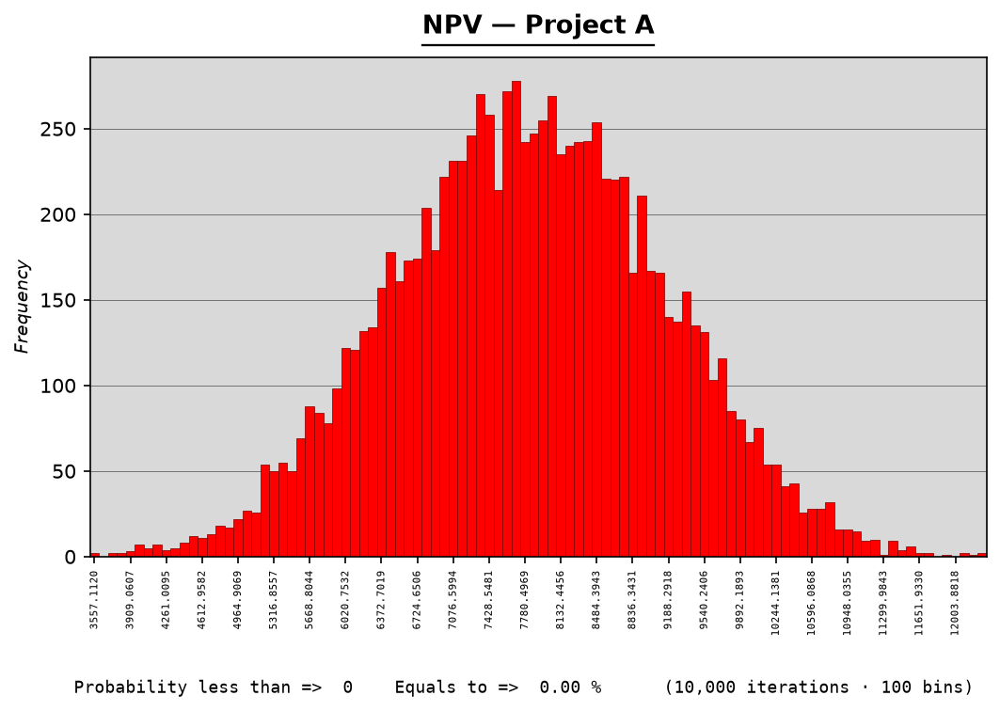

| Distribuição acumulada do VPL | Tornado de sensibilidade |
|---|---|
| 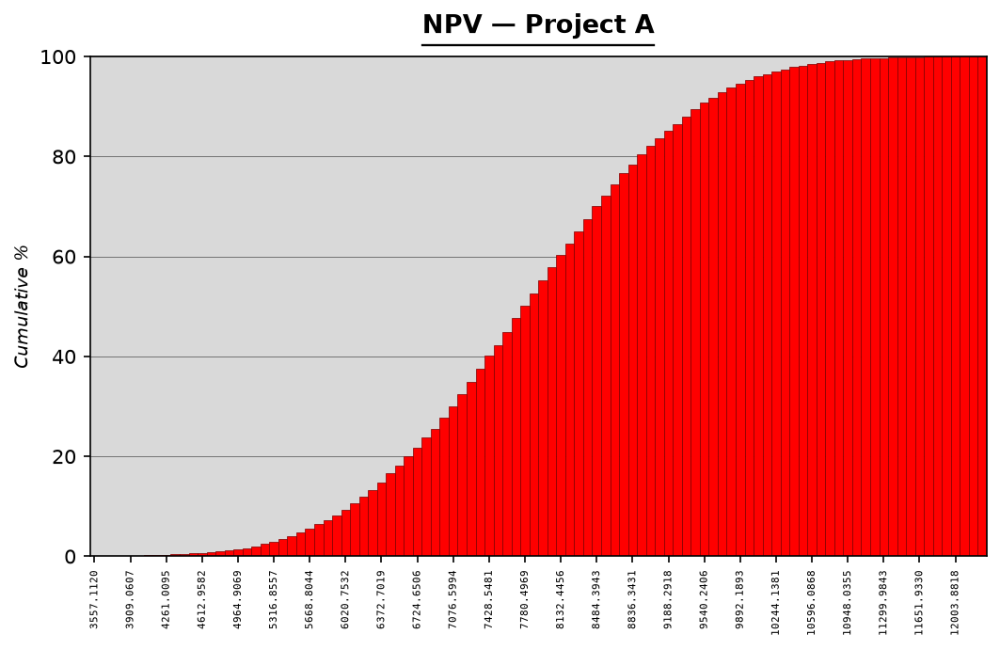 | 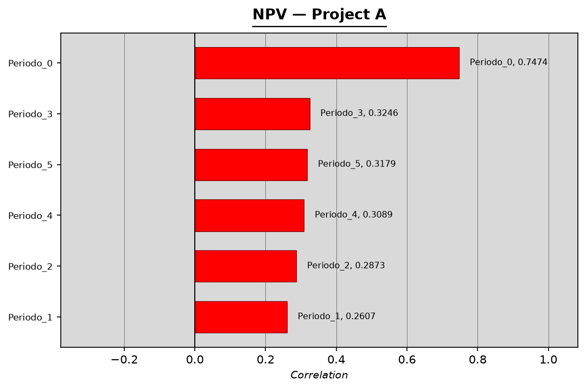 |

---

## 🧮 Cinco escolas de decisão. Um único veredito.

Um método pode errar. Cinco métodos concordando, não.

Seguindo a arquitetura de **John (2025)** — *Integration of DEMATEL with Other MCDM Methods* —, o **DEMATEL** mapeia
a estrutura causal entre os critérios e separa **causas** (alavancas onde agir) de **efeitos** (termômetros do que já
foi feito). Desses laços de influência nascem os **pesos**: não arbitrados, mas **derivados da estrutura do problema**.
Eles alimentam quatro escolas rivais:

| Método | Escola | O que pergunta |
|---|---|---|
| **ELECTRE I** | Sobreclassificação | "Quem domina quem — e quem sobrevive sem ser dominado?" |
| **PROMETHEE II** | Sobreclassificação | "Qual o fluxo líquido de preferência de cada projeto?" |
| **MAUT** | Utilidade | "Qual maximiza a utilidade de um decisor avesso a risco?" |
| **MCDA-C** | Construtivista | "Quem está acima do nível *Bom* — e quem está abaixo do *Neutro*?" |
| **AHP-TOPSIS 2n** | Distância ao ideal | "Quem está mais perto da solução ideal nas duas normalizações?" |

O vencedor sai do **consenso de Borda** entre os cinco, já **ajustado ao risco** do Monte Carlo. E quando os métodos
**discordam**, o dashboard mostra a discordância — porque isso é informação: a escolha é sensível à escola de decisão
e merece o olho do decisor.

| DEMATEL — causas × efeitos | Posição por método |
|---|---|
| 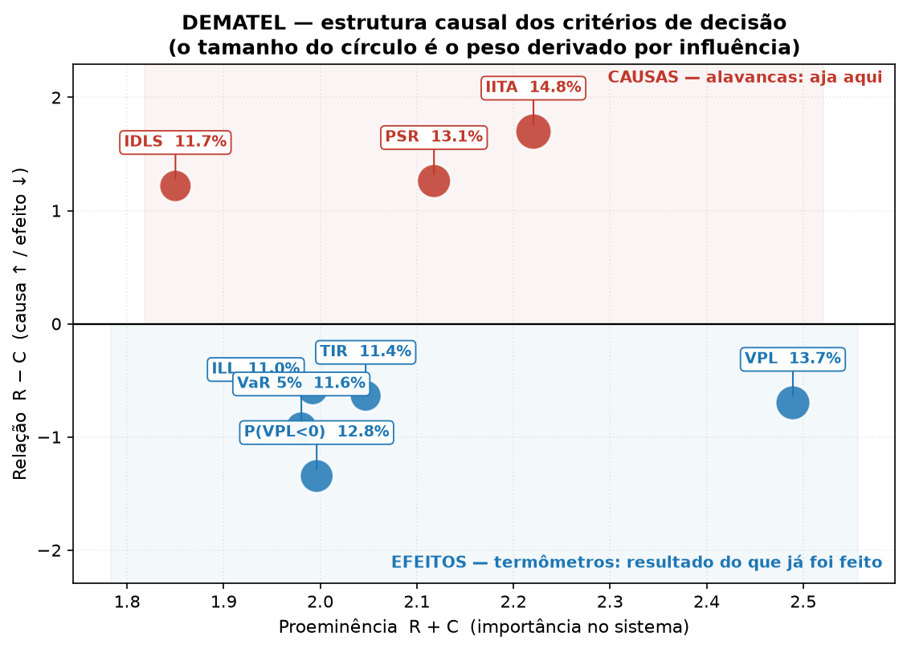 | 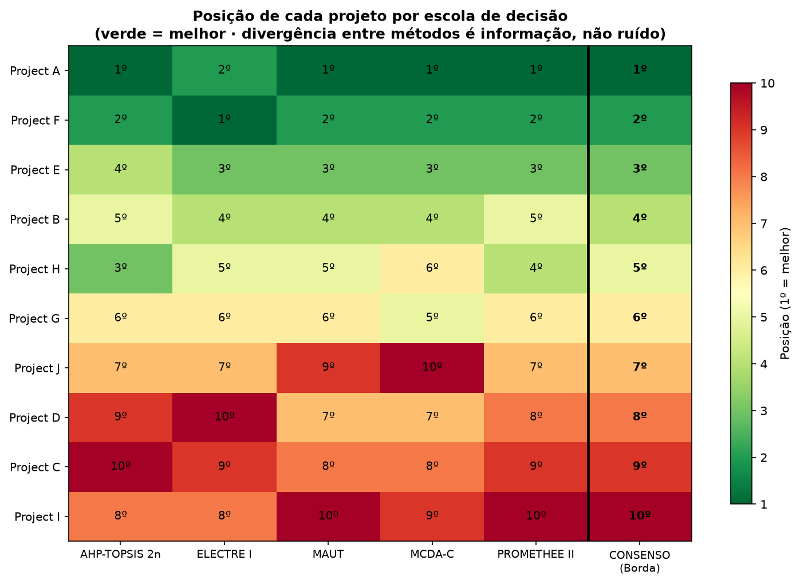 |

### 💼 O que isso muda no seu dia — do autônomo à corporação

Não importa se você paga **US$ 20 num plano PRO** ou **US$ 200 mil em contratos enterprise**: a matemática do
desperdício é a mesma — só muda o número de zeros.

| | **SMB / autônomo** | **Grande empresa** |
|---|---|---|
| **A dor real** | 3 assinaturas, zero visibilidade, caixa curto | 40 pilotos de IA, nenhum com P&L atribuído |
| **O Monte Carlo entrega** | *"este projeto tem 12% de chance de dar prejuízo, e o mês ruim custa R$ 3,4 mil"* | VaR/CVaR por unidade de negócio: risco agregado e auditável, não anedota |
| **O MCDM entrega** | qual dos 3 projetos escalar **primeiro**, com o dinheiro que existe | qual dos 40 pilotos vira produto — defensável em comitê, com o método explícito |
| **O ganho no dia seguinte** | cancela a assinatura que não se paga, ainda nesta semana | realoca orçamento por **evidência**, não por política interna |

**Na prática:** o **tornado** aponta a variável que move o resultado — ou seja, **onde investir a sua próxima hora de
trabalho**. O **DEMATEL** revela que reduzir alucinação (IITA) é **causa**, não sintoma: você mexe ali e VPL, TIR e
risco melhoram *juntos*. É a gestão de IA deixando de ser opinião e virando **engenharia**.


---

## 🔬 O sinal está a montante — e é aí que mora a alavancagem

Descobri isto medindo o próprio framework: o tornado de sensibilidade do VPL devolvia **exatamente**
`1,0 · 0,9091 · 0,8264 · 0,7513…` — os fatores de desconto `1/(1+i)ᵗ`. Como o VPL é **linear** nos fluxos de caixa,
simular só os fluxos não informa nada além da taxa. **O sinal estocástico de verdade está a montante: nos tokens.**

### 1️⃣ Pare de arbitrar a distribuição. Ajuste-a aos seus dados.

Onze distribuições candidatas são ajustadas por **máxima verossimilhança** à sua série real de consumo de tokens
(`logs_langfuse`). Vence a de **menor AIC** — que penaliza parâmetro a mais e evita sobreajuste — e o teste de
**Kolmogorov-Smirnov** mede a aderência. É o clássico *ajuste de distribuições a dados*, e é o que revela a **cauda
pesada** do consumo: alguns prompts custam 10× o típico, e é essa cauda que estoura o orçamento — invisível para
quem usa a média.

**E quando o ajuste é ruim, o framework grita.** Se o p-valor do KS cai abaixo de 0,05, a tela avisa
`ADERÊNCIA FRACA` em vermelho, em vez de fingir precisão. Um número honesto vale mais que um número bonito.

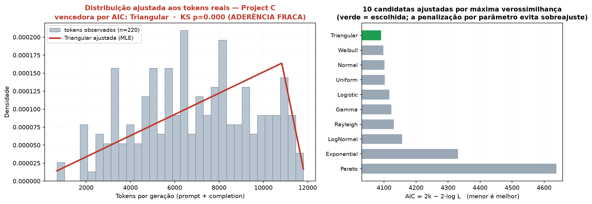

### 2️⃣ Seu ranking sobrevive a um erro de 2 pontos no peso?

Todo método multicritério devolve um vencedor com **confiança implícita de 100%**. Mas os pesos dos critérios são
estimativas, não verdades reveladas. Se dois pontos percentuais no peso do IITA trocam o 1º com o 2º lugar, o
"vencedor" é um artefato da calibração.

Então perturbamos os pesos do DEMATEL com uma **Dirichlet** — `w' ~ Dir(κ·w)`, que vive exatamente no simplex e
preserva `E[w'] = w`, perturbando **sem enviesar** — e reranqueamos **2.000 vezes**. O veredito muda de natureza:

> *"Project C é o melhor"* ⟶ **"Project C vence em 99,9% dos universos de preferência plausíveis"**

É um **intervalo de confiança sobre a própria decisão**. E ele expõe o que o consenso escondia: na tela abaixo,
**o PROMETHEE II elege o líder em apenas 25,4% dos universos**. As outras quatro escolas concordam; uma discorda
frontalmente. Isso não é ruído — é o aviso de que a escolha depende de você preferir *sobreclassificação* a
*utilidade*. Nenhum ranking sozinho te contaria isso.

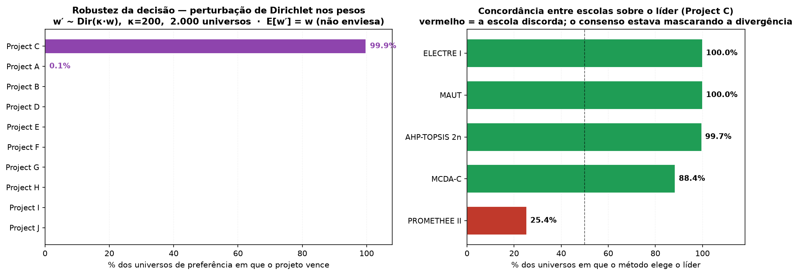

### ⚡ A alavancagem concreta

| Recurso | Antes | Depois |
|---|---|---|
| **Tempo** | semanas discutindo qual projeto escalar | o veredito vem com probabilidade — a discussão acaba em uma reunião |
| **Processamento** | 10.000 iterações × 10 projetos, vetorizado em NumPy | segundos, na sua máquina, sem nuvem e sem custo |
| **Capital** | orçamento alocado por convicção | alocado por `P(vitória)` e `VaR` — com o pior caso já precificado |
| **Reputação** | *"acho que este é o melhor"* | *"vence em 99,9% dos cenários; e o método que discorda é este, pelo motivo tal"* |
| **Auditoria** | planilha impossível de reproduzir | semente fixa: qualquer pessoa reroda e obtém **exatamente** o mesmo número |

### 💼 Do plano de US$ 20 ao contrato de US$ 200 mil

**Se você é autônomo ou SMB:** o ajuste de distribuição diz **quanto o mês ruim de tokens vai custar** antes que ele
chegue — e a robustez diz se vale mesmo migrar o esforço para o outro projeto, ou se os dois estão empatados dentro
da margem de erro. Você para de otimizar no escuro com o caixa curto.

**Se você é uma grande empresa:** o `P(vitória)` é a peça que falta no comitê de investimento. Ele transforma
*"o time A defende o projeto X"* em **"o projeto X vence em 99,9% das calibrações de peso defensáveis, e a única
escola que discorda é a de sobreclassificação, pelo critério Y"**. Discussão política vira **discussão técnica** — e
o CFO ganha um número que sobrevive à auditoria.

> **A virada final:** o framework deixa de medir o risco do **dinheiro** e passa a medir o risco da **própria
> decisão**. Poucos lugares no mundo fazem isso.

---

## 🎓 Fundamentos: o que é Monte Carlo e o que é a Decisão Multicritério

### 🎲 Simulação Matemática de Monte Carlo

#### 📖 O conceito

Monte Carlo é um método numérico que responde a perguntas sobre sistemas incertos **por amostragem aleatória**. A
ideia inverte o instinto do matemático: em vez de deduzir a resposta em **forma fechada** — resolver a integral, a
combinatória, a equação diferencial —, você constrói um **modelo**, sorteia milhares de realizações das variáveis
incertas e simplesmente **conta o que aconteceu**. O que se obtém no fim não é um número: é a **distribuição de
probabilidade do resultado**.

Duas leis o sustentam. A **Lei dos Grandes Números** garante que a média das simulações converge para o valor
verdadeiro. O **Teorema Central do Limite** informa a que velocidade: o erro-padrão cai com `1/√N`. A consequência é
honesta e um pouco cruel — **para dobrar a precisão é preciso quadruplicar as iterações**. Monte Carlo não é rápido.
A sua virtude é outra: o erro **não depende da dimensão do problema**. Métodos determinísticos de quadratura sofrem
da *maldição da dimensionalidade* e colapsam com dezenas de variáveis; Monte Carlo, não. Ele vence exatamente onde a
matemática analítica morre.

#### 📖 Onde e quando surgiu

**Los Alamos, Novo México, 1946.** O matemático polonês **Stanisław Ulam** convalescia de uma encefalite e passava os
dias jogando paciência. Perguntou-se qual seria a probabilidade de uma partida sair vencedora. Tentou a combinatória
e desistiu: era intratável. Então lhe ocorreu algo simples a ponto de parecer trapaça — **jogar cem partidas, contar
quantas venceu e dividir**. Percebeu no mesmo instante que aquilo não era um truque de carteado: era um **método
geral de integração** para problemas que ninguém sabia resolver.

Levou a ideia a **John von Neumann**, que viu de imediato a aplicação no problema que os consumia no Projeto
Manhattan: a **difusão de nêutrons** em material físsil. Simular a trajetória aleatória de milhares de nêutrons —
espalhamento, absorção, fissão — era viável; resolver a equação de transporte não era. **Nicholas Metropolis** propôs
o nome **"Monte Carlo"**, em referência ao cassino de Mônaco onde um tio de Ulam costumava pedir dinheiro emprestado
para apostar. O **ENIAC** tornou os primeiros cálculos possíveis, e em **1949** Metropolis e Ulam publicaram
*"The Monte Carlo Method"* no *Journal of the American Statistical Association*.

O método nasceu, literalmente, do encontro entre um **jogo de cartas** e a **bomba atômica**. Poucas ideias
científicas têm certidão de nascimento tão desconcertante.

#### 📖 A metodologia, em cinco passos

1. **Modelar.** Escreva a saída como função das entradas: `y = f(x₁, …, xₙ)`.
2. **Atribuir distribuições.** Cada entrada incerta recebe uma distribuição. Havendo **dados históricos**, ela é
   *ajustada* a eles; não havendo, é arbitrada — e isso deve ser **declarado**.
3. **Amostrar.** Sorteie `N` cenários. Se as variáveis forem **correlacionadas**, a amostragem precisa respeitar essa
   estrutura: sortear de forma independente onde há dependência real é o erro mais comum do método.
4. **Propagar.** Calcule `f` em cada cenário. É aqui que a incerteza das entradas **se transforma** na incerteza da
   saída, sem nenhuma aproximação linear.
5. **Analisar.** Estude a distribuição: média e desvio, **percentis**, probabilidade de eventos (`P(y < 0)`), a
   **cauda** (VaR, CVaR) e a **sensibilidade** (qual `xᵢ` move `y`).

#### 📖 Usos e aplicações no mundo

- **Finanças:** precificação de opções exóticas (onde não há forma fechada), **VaR** e **CVaR** de carteiras, testes
  de estresse regulatórios (Basileia), risco de crédito.
- **Engenharia:** confiabilidade estrutural, tolerâncias de fabricação, análise de falhas em sistemas complexos.
- **Gestão de projetos:** risco de prazo e custo (a evolução probabilística do PERT), curvas-S de conclusão.
- **Física e química:** transporte de partículas, blindagem de radiação, mecânica estatística.
- **Operações e cadeias de suprimentos:** filas, estoques, capacidade sob demanda incerta.
- **Epidemiologia:** propagação de doenças e avaliação de políticas sob incerteza.
- **Dentro da própria IA:** **MCMC** (inferência bayesiana), **MCTS** — a busca em árvore que levou o AlphaGo a
  vencer Lee Sedol — e o *Monte Carlo dropout* para estimar incerteza em redes neurais.

#### 🔒 Metodologia, uso e aplicação EXCLUSIVOS neste projeto

Aqui o Monte Carlo não é enfeite acadêmico: é o **motor de risco** do portfólio.

- **As entradas.** Cada fluxo de caixa periódico vira uma variável **Triangular** (`mín`, `moda`, `máx`), com moda no
  valor determinístico e caudas a ±30%. Já o **consumo de tokens** — a única variável verdadeiramente de cauda pesada
  — **não é arbitrado**: onze distribuições candidatas são **ajustadas por máxima verossimilhança** à sua série real
  de `logs_langfuse`, vence a de **menor AIC**, e a aderência é medida por **Kolmogorov-Smirnov**. Se o p-valor cai
  abaixo de 0,05, a tela estampa `ADERÊNCIA FRACA` em vermelho, em vez de fingir precisão.
- **A correlação.** Quando os fluxos são dependentes, a amostragem usa **Iman-Conover**, que impõe a correlação de
  postos **preservando exatamente as distribuições marginais**. A matriz é validada antes: simétrica, diagonal 1,
  positiva definida.
- **A propagação.** **10.000 iterações** por projeto, com **semente fixa (42)**: rodar de novo devolve exatamente o
  mesmo número. Não é detalhe — é o que torna o resultado **auditável** por um sócio, um investidor ou um auditor.
- **As saídas.** Não apenas o VPL: simulamos **VPL, TIR, TIRM, VUL, ILL** e o **custo de tokens**, cada um com as dez
  estatísticas descritivas clássicas (assimetria e curtose nas definições do Excel), **percentis de 1% a 99%** e
  **histograma de 100 classes**.
- **O risco que importa.** `P(VPL < 0)` é a probabilidade real de prejuízo. O **VaR 5%** é o pior cenário plausível —
  *"em 19 de cada 20 futuros, eu ganho pelo menos isto"*. O **CVaR 5%** responde o que ninguém pergunta: quando o
  desastre acontece, **quanto custa em média**.
- **A sensibilidade.** O **tornado** é calculado nas duas formas clássicas: os **betas de uma regressão múltipla** (o
  efeito de +R$ 1 numa entrada sobre o VPL) e a **correlação de Pearson** (o quanto a incerteza daquela entrada dita
  a incerteza do VPL). São leituras complementares; o dashboard mostra as duas.
- **Uma descoberta do próprio framework.** Ao medir a si mesmo, o tornado devolveu betas **exatamente iguais aos
  fatores de desconto** `1/(1+i)ᵗ` — porque o VPL é *linear* nos fluxos. Simular apenas os fluxos, portanto, não
  informa nada além da taxa. **O sinal estocástico de verdade está a montante, nos tokens.** Foi essa constatação que
  motivou o ajuste de distribuições aos dados reais.
- **O risco alimenta a decisão.** Duas saídas do Monte Carlo entram como **critérios** no modelo multicritério:
  `P(VPL<0)` como critério de **custo** e o **VaR 5%** como critério de **benefício**. A escolha final já nasce
  **ajustada a risco**, e não apenas ao valor esperado.


**O que é.** Um método que responde perguntas difíceis **sorteando**. Em vez de resolver em forma fechada a
matemática de um sistema incerto — o que muitas vezes é impossível —, você atribui **distribuições de
probabilidade** às variáveis de entrada, sorteia milhares de cenários, calcula o resultado em cada um e observa
a **distribuição inteira** das saídas. A Lei dos Grandes Números garante a convergência; o erro cai com `1/√N`,
ou seja, **quadruplicar as iterações reduz o erro pela metade**.

**Como surgiu.** Los Alamos, 1946. **Stanisław Ulam**, convalescendo de uma doença, jogava paciência e se
perguntou qual seria a probabilidade de vencer. Percebeu que resolver a combinatória era brutal — mas **simular**
centenas de partidas e simplesmente contar era trivial. Levou a ideia a **John von Neumann**, e os dois a
aplicaram ao problema que os ocupava no Projeto Manhattan: a **difusão de nêutrons** em material físsil.
**Nicholas Metropolis** batizou o método de "Monte Carlo", em referência ao cassino de Mônaco onde um tio de
Ulam costumava apostar. O **ENIAC** tornou os primeiros cálculos viáveis. O método nasceu, literalmente, do
encontro entre um jogo de cartas e a bomba atômica.

**Onde se usa hoje.** Precificação de opções e cálculo de **VaR** em finanças; confiabilidade estrutural em
engenharia; risco de prazo e custo em gestão de projetos; física de partículas; cadeias de suprimentos;
epidemiologia. E dentro da própria IA: **MCMC** (inferência bayesiana) e **MCTS** — a busca em árvore que levou
o AlphaGo a vencer Lee Sedol.

**Como nos atende aqui.** Cada fluxo de caixa do seu projeto vira uma variável aleatória, e o consumo de tokens
recebe a distribuição **ajustada aos seus dados reais**. Rodamos 10.000 cenários e, no fim, você não tem um VPL
— tem a **distribuição do seu dinheiro**: `P(VPL < 0)` (a chance real de prejuízo), **VaR 5%** (o pior cenário
plausível), **CVaR 5%** (quanto custa quando o desastre acontece) e o **tornado** (qual variável realmente move o
resultado). A média mente; a cauda decide.

### 🧮 Análise de Decisão Multicritério (MCDA)

#### 📖 O conceito e para que serve

Escolher entre projetos é difícil por duas razões que nenhuma planilha resolve. Primeiro, os critérios **conflitam**:
o projeto de maior VPL costuma ser o de maior risco. Segundo, eles são **incomensuráveis**: não existe operação
aritmética honesta que some reais com percentual de alucinação e horas de retrabalho.

A MCDA (*Multi-Criteria Decision Analysis*) é o campo — nascido nos anos 1960-70, na fronteira entre a pesquisa
operacional e a teoria da decisão — que enfrenta exatamente isso. Ela **não promete a resposta certa**. Promete algo
mais útil: tornar a escolha **explícita, auditável e defensável**.

Sua tese fundadora é desconfortável e libertadora ao mesmo tempo: **não existe "melhor" no vácuo.** Existe melhor
*dado um sistema de preferências que alguém tornou explícito*. Todo decisor já opera com um sistema de preferências —
a diferença é que, sem MCDA, ele é **implícito, inconsistente e não auditável**. Trocar a opinião tácita por um modelo
explícito: aí está o ganho inteiro.

#### 📖 Usos e aplicações no mundo

Seleção de fornecedores e priorização de portfólio; escolha de tecnologias de energia (solar × eólica × biomassa);
localização de plantas, hospitais e aterros; avaliação de impacto ambiental; políticas públicas e alocação
orçamentária; seleção de pessoal; priorização de manutenção; e — cada vez mais — **avaliação tecno-econômica** de
tecnologias emergentes, que é exatamente o caso de um portfólio de projetos de IA.

#### 📖 As três escolas de decisão

- **Escola americana (valor e utilidade).** Agrega tudo num **único número**. Assume que uma nota ruim num critério
  pode ser **compensada** por notas ótimas em outros. Simples, poderosa — e, às vezes, perigosa. `AHP`, `MAUT`.
- **Escola europeia (sobreclassificação).** Fundada por **Bernard Roy**. Aceita que duas alternativas possam ser
  **incomparáveis** e admite o **veto**: um desempenho catastrófico num critério **não se compra** com excelência nos
  demais. Modela a hesitação real do decisor por meio de **limiares**. `ELECTRE`, `PROMETHEE`.
- **Escola construtivista.** O modelo não é *descoberto*, é **construído junto com o decisor**, pela estruturação do
  problema e por escalas ancoradas em níveis de referência. `MCDA-C`.

#### 📖 1. DEMATEL — *Decision-Making Trial and Evaluation Laboratory*

**O que é.** Criado por **Gabus & Fontela** no **Battelle Memorial Institute** (Genebra, 1972-73) para estudar
problemas mundiais complexos e emaranhados. **Não ranqueia alternativas**: mapeia a **estrutura causal entre os
critérios**.

**Como funciona.** Especialistas preenchem uma **matriz de relação direta** `Z` (quanto o critério *i* influencia o
*j*, de 0 a 4). Normaliza-se por `s = max(maior soma de linha, maior soma de coluna)` e obtém-se a **matriz de relação
total** `T = X(I − X)⁻¹`, que soma a influência direta **e todas as indiretas**, por qualquer caminho. Daí saem `R`
(somas das linhas) e `C` (somas das colunas): **`R+C` é a proeminência** (importância no sistema) e **`R−C` é a
relação** (positivo = **causa**; negativo = **efeito**).

**Uso geral.** Cadeias de suprimentos sustentáveis, barreiras à adoção de tecnologia, análise de riscos sistêmicos.

**🔒 Neste projeto.** O DEMATEL responde à pergunta que **antecede** o ranking: *"onde eu devo agir?"*. Ele revela que
**IITA (alucinação), PSR (saúde) e IDLS (desperdício Lean) são CAUSAS**, enquanto **VPL, TIR, ILL e as métricas de
risco são EFEITOS**. É contraintuitivo e libertador: não adianta perseguir o VPL — ele é um **termômetro**. Mexa na
alucinação, e VPL, TIR e risco melhoram *juntos*. Além disso, os **pesos** dos critérios não são arbitrados: são
**derivados da estrutura de influência**, via `wᵢ ∝ √((R+C)ᵢ² + (R−C)ᵢ²)`. Esses pesos alimentam os **outros cinco
métodos** — é o padrão de integração descrito por John (2025).

#### 📖 2. AHP-TOPSIS 2n — *Analytic Hierarchy Process* + *Technique for Order Preference by Similarity to Ideal Solution*

**O que é.** **Saaty (1977)** propôs o AHP: derivar pesos de **comparações par a par** entre critérios, com um **teste
de consistência** que denuncia julgamentos contraditórios (`CR ≤ 0,10`). **Hwang & Yoon (1981)** propuseram o TOPSIS: a
melhor alternativa é a que está **mais perto da solução ideal** e **mais longe da anti-ideal**.

**Como funciona.** Normaliza-se a matriz de decisão, multiplicam-se as colunas pelos pesos, calculam-se as distâncias
euclidianas às soluções ideal e anti-ideal, e o **coeficiente de proximidade** `Ci = d⁻/(d⁺+d⁻)` ordena tudo.

**Uso geral.** É a dupla mais usada do mundo em MCDM — de seleção de fornecedores a avaliação de desempenho.

**🔒 Neste projeto.** Rodamos o TOPSIS em **duas normalizações** — vetorial (euclidiana) e min-max (linear) —, daí o
**"2n"**. Cada projeto recebe dois coeficientes e o ranking final é a média. O que se ganha é uma medida que quase
ninguém reporta: a **concordância entre as normalizações**. Quando as duas discordam da posição de um projeto, o
resultado dele é **frágil a uma escolha técnica arbitrária** — e o dashboard mostra isso. A matriz de Saaty deste
projeto tem `CR = 0,0119`, bem abaixo do limite de 0,10.

#### 📖 3. ELECTRE I — *ÉLimination Et Choix Traduisant la REalité*

**O que é.** **Bernard Roy (1968)**, na consultoria SEMA, em Paris. É o marco zero da escola europeia de
sobreclassificação. A pergunta não é *"qual a nota de cada um?"*, e sim *"**a** é ao menos tão bom quanto **b**?"*.

**Como funciona.** Para cada par `(a, b)` calculam-se dois índices. A **concordância** `C(a,b)` soma os pesos dos
critérios em que `a` é ao menos tão bom quanto `b`. A **discordância** `D(a,b)` mede a **maior desvantagem** de `a`
frente a `b`. Diz-se que `a` **sobreclassifica** `b` se a concordância for alta **e** a discordância for baixa. O
conjunto de alternativas que **ninguém sobreclassifica** é o **núcleo** (*kernel*) — o menu de escolhas defensáveis.

**Uso geral.** Decisões públicas e ambientais, onde compensar um critério catastrófico com outros seria inaceitável.

**🔒 Neste projeto.** O ELECTRE é o método que **se recusa a mentir por conveniência**. Um projeto com VPL
estratosférico e alucinação escandalosa **não compra** o seu lugar: a **discordância** o barra. O framework reporta o
**núcleo** — os projetos que nenhum outro domina — e usa como score o **grau de sobreclassificação líquido** (quantos
ele domina, menos quantos o dominam). É também o único dos seis que admite dizer: *"estes dois projetos são
simplesmente **incomparáveis**"*.

#### 📖 4. PROMETHEE II — *Preference Ranking Organization METHod for Enrichment Evaluation*

**O que é.** **Jean-Pierre Brans (1982)**, refinado com **Bernard Mareschal e Philippe Vincke (1985)**. Também é
sobreclassificação, mas com uma virada elegante: em vez de um limiar binário, mede-se **o quanto** `a` é preferido a
`b`.

**Como funciona.** Para cada critério, a diferença `d = g(a) − g(b)` passa por uma **função de preferência** que a
converte num grau entre 0 e 1. Brans propôs **seis funções generalizadas** (usual, quase-critério, limiar de
preferência, nível, linear com indiferença, gaussiana), parametrizadas por um **limiar de indiferença `q`** (abaixo do
qual a diferença é irrelevante) e um **limiar de preferência `p`** (acima do qual a preferência é total). Somam-se os
graus ponderados: `φ⁺` é o quanto `a` domina os outros, `φ⁻` o quanto é dominado, e o **fluxo líquido** `φ = φ⁺ − φ⁻`
produz uma **pré-ordem completa** (PROMETHEE II).

**Uso geral.** Energia, logística, saúde — sempre que graduar a **intensidade** da preferência importa.

**🔒 Neste projeto.** Usamos a função **linear com indiferença**, com `q` e `p` estimados dos quantis 10% e 90% dos
desvios observados em cada critério. O PROMETHEE responde *"o quanto o vencedor é melhor?"*, e não apenas *"ele é
melhor?"*. E foi justamente ele que produziu o achado mais interessante do portfólio: na análise de robustez, o
**PROMETHEE II elege o líder do consenso em apenas 25,4% dos universos de preferência** — enquanto as outras quatro
escolas concordam. O consenso estava **mascarando uma divergência de escola**.

#### 📖 5. MAUT — *Multi-Attribute Utility Theory*

**O que é.** **Ralph Keeney & Howard Raiffa (1976)**, herdeiros diretos de von Neumann e Morgenstern. É a escola
americana em sua forma axiomática: se as suas preferências obedecem a certos axiomas de racionalidade, então existe uma
**função utilidade** que as representa, e decidir é **maximizar a utilidade esperada**.

**Como funciona.** Cada critério recebe uma **função utilidade** `uⱼ`, que mapeia desempenho em satisfação. A utilidade
global é aditiva: `U(a) = Σ wⱼ · uⱼ(a)` — válida sob **independência aditiva** em preferência. O ponto crucial é a
**forma** da função: uma `u` **côncava** representa **aversão a risco** (o segundo milhão vale menos que o primeiro);
linear é neutralidade; convexa é propensão.

**Uso geral.** Decisões médicas, políticas energéticas, negociação — qualquer contexto em que a atitude perante o risco
precise ser **explicitada e defendida**.

**🔒 Neste projeto.** Usamos utilidade **exponencial** `u(z) = (1 − e^(−r·z)) / (1 − e^(−r))`, com coeficiente de
aversão `r = 2`. Isso é uma **escolha ética declarada**: o framework é **conservador**. Um ganho incerto vale menos do
que um ganho certo de mesma média — exatamente como um CFO prudente avaliaria. Enquanto o TOPSIS trata todos os ganhos
como fungíveis, o MAUT **penaliza a promessa alta e incerta**.

#### 📖 6. MCDA-C — *Multicritério de Apoio à Decisão — Construtivista*

**O que é.** Formalizado por **Leonardo Ensslin, Gilberto Montibeller e Sandra Noronha (2001)**, com raízes em Roy e em
Bana e Costa. A premissa é filosófica: o modelo **não preexiste** ao decisor. Ele é **construído com ele**, em três
fases — **estruturação** (mapas cognitivos, descritores), **avaliação** (funções de valor, taxas de substituição) e
**recomendações**.

**Como funciona.** Cada critério recebe um **descritor** com níveis, e dois deles são âncoras: o nível **Neutro**
(abaixo do qual o desempenho compromete) e o nível **Bom** (acima do qual há excelência). A função de valor é ancorada:
`V = 0` no Neutro, `V = 100` no Bom, e **extrapola** livremente fora do intervalo.

**Uso geral.** Avaliação de desempenho organizacional, gestão pública, contextos em que o decisor precisa **aprender**
sobre o próprio problema.

**🔒 Neste projeto.** Na ausência de uma sessão de estruturação com o decisor, ancoramos os níveis nos **quartis
observados** do portfólio: `Neutro = Q1`, `Bom = Q3`. Isso preserva o que o MCDA-C tem de único — ele não apenas
**ordena**, ele **classifica**: `V < 0` é **comprometedor**, `0 ≤ V ≤ 100` é **competitivo**, `V > 100` é
**excelência**. Um projeto pode ser o primeiro do ranking e ainda assim estar na faixa comprometedora. Nenhum outro
método deste conjunto lhe diria isso.

#### 📖 Por que cinco métodos, e não um

Porque **cada escola erra de um jeito diferente**, e um método sozinho devolve um vencedor com **confiança implícita de
100%** — o que é sempre mentira. O AHP-TOPSIS compensa demais; o ELECTRE às vezes não decide; o MAUT depende da forma da
utilidade; o MCDA-C depende das âncoras.

Rodamos os cinco com os **mesmos pesos** (os do DEMATEL) e fechamos por **consenso de Borda**. Aí a divergência entre
eles deixa de ser estorvo e vira **informação**: quando quatro concordam e um discorda frontalmente, isso não é ruído —
é o aviso de que a sua escolha **depende da escola de decisão** que você implicitamente adotou.

#### 📖 A pergunta final: o veredito sobrevive?

Todo o edifício acima repousa sobre **pesos**, e pesos são **estimativas**. Se dois pontos percentuais no peso do IITA
trocam o 1º com o 2º lugar, o "vencedor" é um **artefato da calibração**, não um fato do portfólio.

Por isso perturbamos os pesos do DEMATEL com uma **Dirichlet** — `w' ~ Dir(κ·w)`, que vive exatamente no simplex e
preserva `E[w'] = w`, perturbando **sem enviesar** — e reranqueamos **2.000 vezes**. O veredito muda de natureza:

> *"Project C é o melhor"* ⟶ **"Project C vence em 99,9% dos universos de preferência plausíveis"**

É um **intervalo de confiança sobre a própria decisão**. Com isso, o framework deixa de medir apenas o risco do
**dinheiro** e passa a medir o risco da **decisão**.


**O que é e para que serve.** Quando você escolhe entre projetos, os critérios **conflitam** (VPL alto costuma
vir com risco alto) e são **incomensuráveis** (como somar reais com percentual de alucinação?). A MCDA é o campo
que torna essa escolha explícita, auditável e defensável. Sua tese fundadora é desconfortável e libertadora: **não
existe "melhor" no vácuo.** Existe melhor *dado um sistema de preferências que você tornou explícito*. Trocar a
opinião implícita por um modelo explícito é o ganho.

**As três escolas.** A **americana**, de valor e utilidade (AHP, MAUT): agrega tudo num único número.
A **europeia**, de sobreclassificação (ELECTRE, PROMETHEE), de Bernard Roy: aceita que duas alternativas possam
ser **incomparáveis** e permite **veto** — uma nota péssima num critério não se compensa com notas ótimas nos
outros. A **construtivista** (MCDA-C): o modelo não é descoberto, é **construído junto com o decisor**.

| Método | Origem | Pergunta central | O que só ele traz | No portfólio de IA |
|---|---|---|---|---|
| **DEMATEL** | Gabus & Fontela, Battelle (1972-73) | *"Quem influencia quem?"* | separa **causa** de **efeito** e deriva os **pesos** da própria estrutura de influência | mostra que reduzir alucinação (IITA) é **causa** — mexa ali e VPL, TIR e risco melhoram juntos |
| **AHP-TOPSIS 2n** | Saaty (1977) · Hwang & Yoon (1981) | *"Quem está mais perto da solução ideal?"* | pesos por comparação par a par com **teste de consistência** (CR ≤ 0,10) | ranqueia em **duas normalizações** e reporta a concordância entre elas |
| **ELECTRE I** | Bernard Roy (1968) | *"Quem domina quem — e quem sobrevive sem ser dominado?"* | **incomparabilidade** e **veto**: um critério péssimo não é comprado por outros ótimos | isola o **núcleo** de projetos que nenhum outro domina |
| **PROMETHEE II** | Brans & Vincke (1985) | *"Qual o fluxo líquido de preferência?"* | **seis funções de preferência** com limiares de indiferença e preferência | gradua *o quanto* um projeto é melhor, não apenas *se* é |
| **MAUT** | Keeney & Raiffa (1976) | *"O que maximiza a utilidade de quem decide?"* | modela **aversão a risco** por utilidade côncava | penaliza ganhos incertos — um decisor prudente não paga o mesmo por eles |
| **MCDA-C** | Ensslin, Montibeller & Noronha (2001) | *"Onde está o nível Bom e onde está o Neutro?"* | **função de valor ancorada**: `V=0` no Neutro, `V=100` no Bom, com extrapolação | classifica em **comprometedor / competitivo / excelência** em vez de só ordenar |

**Por que cinco, e não um.** Cada escola erra de um jeito diferente. Um método sozinho devolve um vencedor com
**confiança implícita de 100%** — o que é sempre mentira. Rodando os cinco e fechando por **consenso de Borda**,
a divergência entre eles vira **informação**: quando quatro concordam e um discorda frontalmente, isso não é
ruído — é o aviso de que a sua escolha depende de você preferir *sobreclassificação* a *utilidade*. E a
**perturbação de Dirichlet** nos pesos ainda responde a pergunta final: *"o 1º lugar sobrevive a um erro de dois
pontos percentuais na calibração?"*


### 🧪 As quatro engrenagens: Iman-Conover, Kolmogorov-Smirnov, Dirichlet e o tornado

Os dois grandes métodos acima repousam sobre quatro peças menores — e é nelas que mora a diferença entre uma simulação
honesta e um número bonito. Vale conhecê-las.

#### 🔗 Iman-Conover — impor correlação **sem destruir as distribuições**

**O que é.** Proposto por **Ronald Iman e William Conover (1982)**. Ele resolve um problema que parece trivial e não é:
*como sortear variáveis correlacionadas quando as marginais não são normais?* O caminho ingênuo — gerar normais
correlacionadas por Cholesky e transformá-las — **deforma as marginais**. E se você acabou de ajustar uma LogNormal aos
seus dados, deformá-la joga fora exatamente o trabalho que você fez.

**Como funciona.** É uma **reordenação por postos**, não uma transformação de valores. Constrói-se uma referência com
os **escores de van der Waerden** `Φ⁻¹(i/(n+1))`, embaralhados por coluna; calcula-se `P = chol(R)` (alvo) e
`Q = chol(corr(M))` (a correlação acidental da referência); forma-se `S = M·(Q⁻¹P)ᵀ`. Então cada coluna da amostra
original é **reordenada segundo os postos de `S`**. Como só se troca a *ordem* dos valores já sorteados, as
**distribuições marginais permanecem exatas** — bit a bit.

**Um detalhe fino, e honesto.** `R` é a correlação da *referência normal*, não a de Pearson do resultado. A correlação
de postos induzida segue a cópula normal: `ρ_S = (6/π)·arcsin(R/2)`. Para `R = 0,80` isso dá **0,7859** — e é
exatamente o que medimos ao testar (0,786). Não é um erro do método; é a matemática dele.

**Usos gerais.** Risco financeiro (ativos correlacionados), confiabilidade estrutural, amostragem por hipercubo latino.

**🔒 Neste projeto.** É o que permite correlacionar os fluxos de caixa **sem sacrificar** a distribuição ajustada aos
seus tokens. Antes de usar, a matriz é validada: simétrica, diagonal 1 e **positiva definida** (via Cholesky). Uma
matriz de correlação inconsistente é rejeitada com a mensagem do menor autovalor — em vez de produzir números sem
sentido silenciosamente.

#### 📏 Kolmogorov-Smirnov — a distância entre o que você **supõe** e o que os dados **dizem**

**O que é.** Um teste **não paramétrico** de aderência. A estatística é simples e bonita: `D = sup |Fₙ(x) − F(x)|`, o
maior afastamento vertical entre a **função de distribuição empírica** dos seus dados e a **teórica** que você
propôs. Sob a hipótese nula, a distribuição de `D` **não depende de qual seja `F`** — daí o nome *distribution-free*.

**Uma ressalva de honestidade metodológica.** O p-valor clássico do KS pressupõe que os parâmetros de `F` foram
fixados **antes** de ver os dados. Quando eles são **estimados dos mesmos dados** (como aqui, por máxima
verossimilhança), o teste torna-se **otimista**: tende a aceitar demais. O rigor pediria a correção de **Lilliefors**
ou um **bootstrap paramétrico**. Por isso tratamos o KS como **diagnóstico**, não como prova — e o usamos apenas para
**rejeitar** ajustes ruins, nunca para declarar um ajuste "correto".

**Usos gerais.** Qualidade de ajuste; comparação de duas amostras (KS bi-amostral); detecção de *drift* de dados em
sistemas de aprendizado de máquina em produção.

**🔒 Neste projeto.** Ele mede o quanto a distribuição vencedora por AIC realmente descreve a sua série de tokens.
Quando o p-valor cai abaixo de 0,05, a tela estampa **`ADERÊNCIA FRACA` em vermelho** — no portfólio de demonstração
isso acontece com um dos projetos, e o framework **mostra** em vez de esconder. Um número honesto vale mais que um
número bonito.

#### 🎲 Perturbação de Dirichlet — o **intervalo de confiança da decisão**

**O que é.** A distribuição **Dirichlet** é a distribuição natural sobre o **simplex**: vetores de números positivos
que somam 1 — exatamente o que é um vetor de pesos. É a conjugada da multinomial e a generalização da Beta.

**Por que ela, e não ruído gaussiano.** Somar ruído normal a pesos produz valores negativos e quebra a soma unitária.
A Dirichlet vive *dentro* do espaço válido. E, parametrizada como `w' ~ Dir(κ·w)`, tem duas propriedades que a fazem
perfeita para o trabalho: `E[w'] = w` (perturba **sem enviesar**) e `Var(w'ᵢ) = wᵢ(1−wᵢ)/(κ+1)` (a dispersão é
controlada por um único botão). Quando `κ → ∞`, ela colapsa nos pesos originais.

**Usos gerais.** *Prior* bayesiano para proporções; alocação latente de Dirichlet (**LDA**) em modelagem de tópicos;
o **bootstrap bayesiano** de Rubin (1981); e análise de sensibilidade de pesos em decisão multicritério.

**🔒 Neste projeto.** Com `κ = 200`, um peso de 13% oscila cerca de **±2,37 pontos percentuais** — a margem de erro
plausível de um julgamento de especialista. Reranqueamos **2.000 vezes** e obtemos `P(vitória)` para cada projeto.
Foi essa engrenagem que revelou o achado mais desconfortável do portfólio: o consenso é robusto (99,9%), mas o
**PROMETHEE II elege o líder em apenas 25,4% dos universos**. Sem a Dirichlet, essa divergência ficaria invisível.

#### 🌪️ Tornado de sensibilidade — qual variável **realmente** move o resultado

**O que é.** Um gráfico de barras horizontais, ordenado pelo efeito absoluto, que responde: *entre todas as entradas
incertas, quais movem a saída?* O nome vem do formato — barras largas no topo, estreitas embaixo.

**Duas medidas que parecem a mesma coisa e não são.**
- O **beta** de uma regressão múltipla responde: *"se esta entrada subir 1 unidade, quanto sobe a saída?"* É um efeito
  **unitário**, indiferente ao quanto aquela entrada de fato varia.
- A **correlação de Pearson** responde: *"quanto da incerteza da saída é ditada por esta entrada?"* Ela já incorpora a
  **escala da incerteza** (aproximadamente `β·σᵢ/σ_y`).

Uma variável pode ter beta enorme e correlação zero: ela *moveria* muito o resultado, mas na prática **quase não
varia**. Reportar só uma das duas é meia verdade.

**Usos gerais.** Risco de projeto, modelos financeiros, engenharia de confiabilidade, calibração de simuladores.

**🔒 Neste projeto.** Aqui o tornado fez algo raro: **denunciou uma limitação do próprio modelo**. Ao rodá-lo sobre o
VPL, os betas vieram **exatamente iguais a `1/(1+i)ᵗ`** — os fatores de desconto — porque o VPL é *linear* nos fluxos.
O tornado de regressão, nesse caso, é **degenerado**: não informa nada além da taxa. É a **correlação** que carrega o
sinal. E quando o custo de tokens entrou como variável, seu beta deu `−1/(1+i)ᵗ` (o custo entra com sinal negativo) e
sua correlação ficou próxima de zero. A leitura conjunta é precisa e honesta: *"cada R$ 1 a mais em tokens tira R$ 0,91
do VPL — mas, neste projeto, a incerteza do VPL não vem dos tokens."* Nenhuma das duas medidas, sozinha, diria isso.

---

## 🌐 12 idiomas

Dashboard, páginas por projeto **e o texto interno das imagens** dos gráficos estão localizados em **12
idiomas**: Português · English · Español · Français · Deutsch · 中文 · 한국어 · हिन्दी · עברית · Svenska · Русский · Suomi.
A tradução é dirigida por uma **Translation Memory** (estilo SDL Trados) que padroniza e agiliza novas línguas.

---

## 🙋 Objeções (as perguntas que você está se fazendo agora)

- **"Não tenho tempo."** → Cinco minutos com `./run_all.sh --mock` e o dashboard está rodando na sua tela.
  Medir **devolve** as horas que você já perde em retrabalho e alucinação.
- **"É complexo demais."** → Uma linha. O framework faz o ETL, os cálculos, o ranking e as imagens; **você só
  lê o veredito.**
- **"Minha operação de IA é pequena."** → Por isso mesmo cada dólar pesa mais. Pequeno hoje, portfólio amanhã —
  **meça antes de escalar o desperdício.**
- **"Não uso Langfuse."** → A demo roda **100% sem Langfuse**. Quando quiser dados reais, você pluga a **sua**
  conta (nunca a minha).
- **"É só mais um dashboard bonito."** → Não. É **Balanced Scorecard + análise de investimento (VPL/TIR/MIRR/VUL)
  + decisão multicritério (AHP-TOPSIS)** — instrumentos de board, não enfeite.
- **"E a privacidade dos meus dados?"** → A demo é **100% anônima** (Project A…J); dados/nomes reais e chaves
  ficam **fora do pacote**. Você roda **local**, com a **sua** conta.
- **"Quanto custa?"** → **Nada.** Open source, na sua máquina. O único preço é continuar **sem medir** — e esse,
  você já está pagando.

---

## 🧩 Skills incluídas (*build & analyze your own*)

Este repositório embute **Skills** reutilizáveis (Claude Code):

- **`measuring-ai-projects`** — definir/medir/reportar KPIs de projetos de IA (o núcleo deste framework).
- **`github-benchmark-analyzer`** — analisar e fazer benchmark de **qualquer** repositório/perfil do GitHub
  (estrelas, forks, seguidores, hashtags, estilo de README, palavras-chave, linguagens) e extrair o que os
  líderes têm em comum. **Construa e analise o seu próprio portfólio** — inclusive contra o mercado.

---

## 📚 Recursos & referências (Awesome)

Ombros de gigantes sobre os quais este framework se apoia:

- **Estratégia & medição:** Kaplan & Norton — *The Balanced Scorecard* · Peter Drucker (gestão por objetivos).
- **Lean Six Sigma:** taxonomia dos 8 desperdícios (Muda), PDCA/Kaizen, Ishikawa/RCA.
- **Finanças corporativas:** Lawrence Gitman — *Princípios de Administração Financeira* (VPL, TIR, MIRR, PI).
- **Decisão multicritério:** Thomas Saaty (**AHP**) · Hwang & Yoon (**TOPSIS**).
- **Stack técnico:** [Langfuse](https://langfuse.com) (LLM observability) · [Evidence](https://evidence.dev)
  (BI as Code) · [Rust/PyO3](https://pyo3.rs) · [Tectonic](https://tectonic-typesetting.github.io) (LaTeX).

---

## 🗺️ Roadmap

- [x] Pipeline Langfuse → SQLite → Evidence + Rust
- [x] 70+ KPIs (BSC + economia de APIs + Lean) · EVM
- [x] Financeiro (VPL, TIR, TIRM, VUL, ILL, Payback, dolarização)
- [x] AHP-TOPSIS 2n + Dossiê administrativo (6 ferramentas)
- [x] Dashboard e imagens em **12 idiomas**
- [ ] Conectores extras de observabilidade (OpenTelemetry, Helicone)
- [ ] Modo SaaS multi-tenant + agendamento nativo
- [ ] Publicação do dashboard estático (GitHub Pages)

---

## 🧰 Setup passo a passo (local, do zero)

> Tudo roda **na sua máquina**. Nenhuma chave do autor acompanha o pacote e nenhum dado sai do seu computador.

### Passo 0 — Pré-requisitos

| Requisito | Versão | Obrigatório? | Para quê |
|---|---|---|---|
| **Python** | 3.10+ | ✅ | pipeline, KPIs, Monte Carlo, MCDM |
| **Node.js + npm** | 18+ | ✅ | dashboard (Evidence) |
| **git** | qualquer | ✅ | clonar o repositório |
| **Rust + maturin** | estável | ⬜ opcional | acelera a classificação de logs |
| **tectonic** | qualquer | ⬜ opcional | gera os pitch decks em PDF |

*No Windows, use **WSL** ou **Git Bash** — a esteira é um script `bash`.*

### Passo 1 — Clonar o repositório
```bash
git clone https://github.com/bpenedo/Gestao-de-Projetos-PM-IA-BSC-DashBoard.git
cd Gestao-de-Projetos-PM-IA-BSC-DashBoard
```

### Passo 2 — Ambiente Python isolado
```bash
cd foundations/pipeline
python3 -m venv .venv
source .venv/bin/activate        # Windows (PowerShell): .venv\Scripts\Activate.ps1
pip install -r requirements.txt
```

### Passo 3 — Dependências do dashboard
```bash
cd ../evidence
npm install
```

### Passo 4 — Rodar a demo (anônima, sem credenciais)
```bash
cd ../pipeline
./run_all.sh --mock
```

Em ordem, a esteira executa: dados demo anônimos → KPIs → VPL/TIR/TIRM/VUL/ILL → **ajuste de distribuições aos
tokens** → **Monte Carlo (10.000 iterações)** → AHP-TOPSIS 2n → **DEMATEL · ELECTRE · PROMETHEE · MAUT · MCDA-C** →
**robustez do ranking (Dirichlet)** → gráficos → dossiê administrativo → mapa 5D → pitch decks → build do dashboard.

### Passo 5 — Abrir o dashboard
```bash
cd ../evidence
npm run dev          # http://localhost:3000
npm run preview      # (alternativa) serve o estático já compilado em build/
```

### Passo 6 — Trocar para os SEUS dados

**6.1 — Credenciais e parâmetros** (todos opcionais; sem `.env` o pipeline usa os defaults):
```bash
cd ../pipeline
cp .env.example .env      # edite: LANGFUSE_PUBLIC_KEY, LANGFUSE_SECRET_KEY, SELIC_ANUAL, USD_BRL...
```

**6.2 — Seu fluxo de caixa** (é o que alimenta VPL, TIR e o Monte Carlo):
```bash
cp fluxo_caixa_template.csv fluxo_caixa.csv
```
Formato: `periodo 0` é o investimento (fluxo negativo) e `taxa` é o desconto por período (`0.10` = 10%).
```csv
project_name,periodo,fluxo,taxa
Project A,0,-12000,0.10
Project A,1,3000,0.10
Project A,2,4000,0.10
```

**6.3 — Rodar com dados reais:**
```bash
./run_all.sh          # sem --mock: sincroniza do Langfuse e usa fluxo_caixa.csv
```

### Passo 7 (opcional) — Aceleração e PDFs
```bash
cd analise_rs && maturin develop --release && cd ..   # Rust (PyO3): classificação mais rápida
```
Para os pitch decks, instale o **tectonic** (ex.: `cargo install tectonic` ou o gerenciador da sua distro).

### Passo 8 (opcional) — Agendar a atualização
```bash
crontab -e
*/15 * * * * /CAMINHO/ABSOLUTO/foundations/pipeline/run_all.sh >> /tmp/bsc.log 2>&1
```

### 🩺 Problemas comuns

| Sintoma | Causa provável | Solução |
|---|---|---|
| `no such table: ...` | banco não inicializado | `python3 db.py` |
| O build do dashboard falha | artefatos antigos | `rm -rf ../evidence/build && npm run build` |
| `findfont: Failed to find font weight` | aviso do matplotlib | inofensivo, pode ignorar |
| `Precisa de ≥2 projetos` | portfólio com um projeto só | o MCDM compara alternativas; adicione outra |
| `KS p-valor < 0,05` na tela | a distribuição não descreve bem seus dados | colete mais amostras; o framework avisa em vez de esconder |
| Números mudam entre execuções | semente alterada | mantenha `MC_SEED` fixo para reprodutibilidade |

---

## 🤝 Contribuindo

Contribuições são **muito bem-vindas**! Abra uma *issue* descrevendo a proposta (novo KPI, conector, idioma,
correção) e envie um *pull request*. Padrões: código legível e consistente com o entorno, sem dados pessoais
no pacote (a demo é anônima). Novos idiomas: acrescente os alvos na Translation Memory e rode o gerador.

## 📄 Licença & autoria

© **Bruno Penedo** — 2026. Uso, estudo e contribuição encorajados; para uso comercial/redistribuição,
consulte o autor. *(Uma licença OSS formal pode ser adicionada — abra uma issue com a sua preferência.)*

## 🏷️ Topics
`awesome-list` · `education` · `resources` · `computer-science` · `python` · `business-intelligence` ·
`llmops` · `finops` · `aiops` · `programming` · `development` · `lists` · `free` · `unicorns` · `dashboard` ·
`balanced-scorecard` · `langfuse` · `llm-observability` · `kpi` · `project-management`

---

⭐ **Se este framework acende uma luz sobre o seu gasto com IA, deixe uma estrela — e comece a lucrar com o que já paga.**

---

**Framework Gestão de Projetos (PM) IA com Painel BSC e DashBoard** · ©️ Bruno Penedo — 2026. https://linkedin.com/in/bpenedo - E-mail: bpenedo@gmail.com
