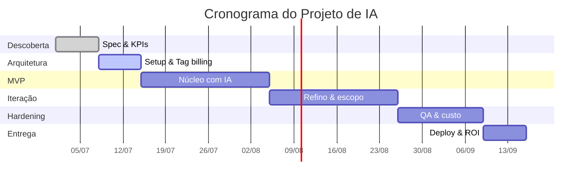

# Projeto Main — Diretrizes de Cronograma, Stages e Sprints

> Documento-base de planejamento temporal do projeto. Define **stages**, **sprints**,
> **cronologia** e o **gráfico de Gantt**. Funciona em conjunto com [`KPIs.md`](KPIs.md):
> cada stage/sprint alimenta o `%` de progresso e, com ele, o **Custo por Ponto de Progresso (CPP)**.

---

## 1. Estrutura Hierárquica do Projeto

```
PROJETO
 └── STAGES (etapas macro / fases)
       └── SPRINTS (ciclos de execução, 1–2 semanas)
             └── TAREFAS (entregáveis atômicos)
                   └── PROMPTS/INTERAÇÕES (unidade de trabalho com IA)
```

- **Stage:** fase macro com objetivo e critério de saída próprios (ex.: *Descoberta*, *MVP*, *Hardening*).
- **Sprint:** ciclo fixo de execução (recomendado **1 a 2 semanas**) com meta e Definition of Done.
- **Tarefa:** entregável verificável; é o nível em que se mede Scope Fidelity e Prompt Yield.

---

## 2. Stages Padrão (template — ajuste por projeto)

| # | Stage | Objetivo | Critério de Saída (DoD) | Peso no Progresso |
|---|---|---|---|---|
| 1 | Descoberta & Spec | Definir escopo, requisitos e métricas | Spec aprovada + KPIs definidos | 10% |
| 2 | Arquitetura & Setup | Base técnica, pipelines, tag de billing | Ambiente + tag de tokens funcionando | 15% |
| 3 | MVP / Núcleo | Funcionalidade central com IA | Fluxo principal validado | 30% |
| 4 | Iteração & Refino | Ampliar escopo, reduzir retrabalho | Scope Fidelity ≥ 90% | 25% |
| 5 | Hardening & QA | Validação, testes, custo sob controle | Validação 100% + CPP estável/decrescente | 15% |
| 6 | Entrega & Retro | Deploy, medição de ROI, lições | ROI medido + retrospectiva | 5% |

> A coluna **Peso no Progresso** soma 100% e converte stages concluídos em `%` de progresso —
> o denominador do KPI-mestre (CPP).

---

## 3. Cadência de Sprints

| Parâmetro | Recomendação |
|---|---|
| Duração | 1–2 semanas (fixa dentro do projeto) |
| Planning | Início da sprint — define meta + tarefas |
| Daily/Check | Registro diário de **interrupções** e progresso |
| Review | Fim da sprint — mede Prompt Yield, Focus Ratio, progresso |
| Retro | Ajusta processo; alimenta Taxa de Retrabalho e Reuso de Prompt |

**Definition of Done (DoD) de uma sprint:**
- Tarefas planejadas concluídas e validadas (Cobertura de Validação = 100%).
- `%` de progresso atualizado no controle.
- KPIs da sprint registrados em [`KPIs.md`](KPIs.md).

---

## 4. Cronologia (Timeline)

Linha do tempo de marcos (milestones). Atualize as datas por projeto:

```
2026 ──┬── Stage 1: Descoberta & Spec        [Sprint 1]
       ├── Stage 2: Arquitetura & Setup       [Sprint 2]
       ├── Stage 3: MVP / Núcleo              [Sprints 3–5]
       ├── Stage 4: Iteração & Refino         [Sprints 6–8]
       ├── Stage 5: Hardening & QA            [Sprints 9–10]
       └── Stage 6: Entrega & Retro           [Sprint 11]
```

**Milestones-chave (M):**
- M1 — Spec + KPIs aprovados (fim Stage 1)
- M2 — Tag de billing ativa (fim Stage 2) ← *pré-requisito dos KPIs financeiros*
- M3 — MVP validado (fim Stage 3)
- M4 — Escopo completo, Scope Fidelity ≥ 90% (fim Stage 4)
- M5 — Pronto para produção, CPP estável (fim Stage 5)
- M6 — Entregue, ROI medido (fim Stage 6)

---

## 5. Gráfico de Gantt

### 5.1 Diretrizes
- **Eixo X = tempo** (semanas/sprints); **eixo Y = stages/tarefas**.
- Barras representam duração; **losangos (◆) = milestones**.
- Marque **dependências** (uma tarefa que só começa após outra).
- Sinalize o **caminho crítico** (sequência que define a data final).
- Revise o Gantt a cada Review de sprint — replaneje datas com base no progresso real.

### 5.2 Gantt textual (template)

```
Stage / Sprint        S1   S2   S3   S4   S5   S6   S7   S8   S9   S10  S11
─────────────────────────────────────────────────────────────────────────
1 Descoberta & Spec   ████                                              M1◆
2 Arquitetura & Setup      ████                                         M2◆
3 MVP / Núcleo                  ███████████                            M3◆
4 Iteração & Refino                        ███████████                 M4◆
5 Hardening & QA                                       ███████         M5◆
6 Entrega & Retro                                              ████    M6◆
─────────────────────────────────────────────────────────────────────────
Caminho crítico:      1 → 2 → 3 → 4 → 5 → 6
```

### 5.3 Versão Mermaid (renderizável)



---

## 6. Integração com os KPIs

| Evento de cronograma | KPI alimentado | Onde |
|---|---|---|
| Conclusão de stage | `%` de progresso → **CPP** | [`KPIs.md`](KPIs.md) |
| Review de sprint | Prompt Yield, Focus Ratio, Scope Fidelity | KPIs.md |
| Registro diário | Densidade de Interrupção | KPIs.md |
| Milestone M2 (tag billing) | habilita Gasto de Tokens, TCO-IA | KPIs.md |
| Entrega (M6) | ROI, Payback, VPL | KPIs.md |

> **Regra de ouro:** cada barra do Gantt que fecha deve atualizar o `%` de progresso —
> é assim que o cronograma e o custo conversam no **Custo por Ponto de Progresso**.
